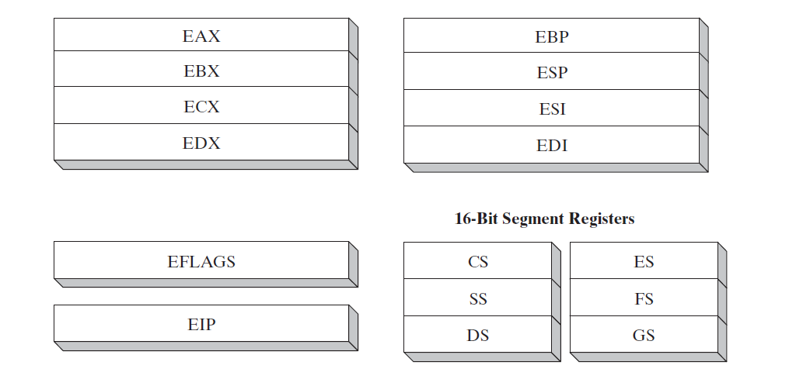
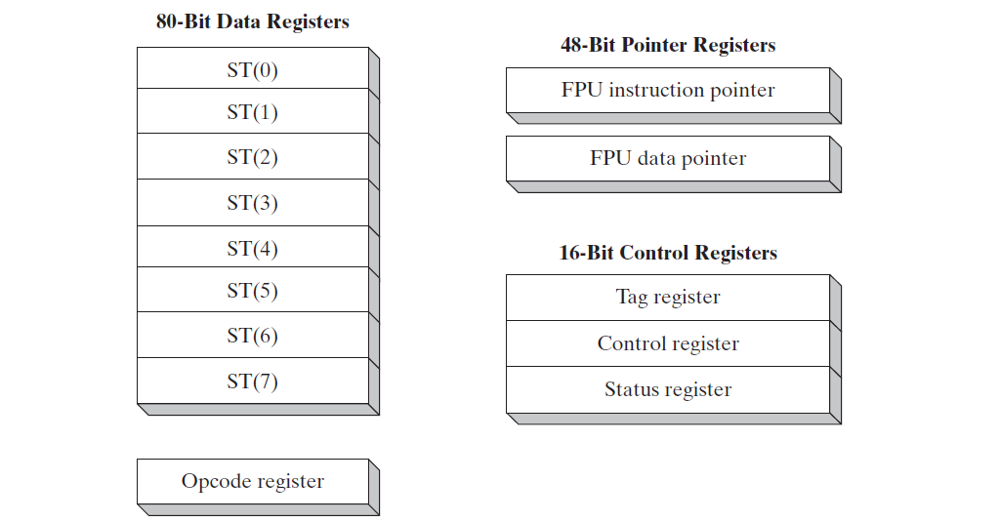
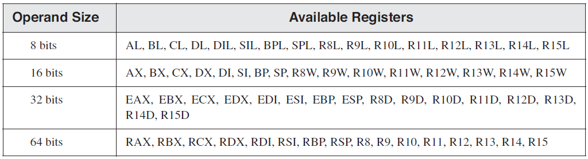

# Chapter 2: x86 架构
## 总览
本章重点介绍与x86汇编语言相关底层硬件。如果说汇编语言是机器最理想的沟通的工具，那么汇编语言程序员必须熟悉处理器内部架构和功能。我们将讨执行指令时发生在处理器内的基本操作。我们将讨论程序是如何被操作系统加载和执行。示例主板布局将提供对x86硬件环境的基本了解，本章结尾讨论应用程序和操作系统之间的分层输入输出如何工作。

## 2.1 通用概念
本章从程序员的角度描述x86处理器家族的架构以及它的宿主操作系统。

### 2.1.1 基本微机设计
微处理器基本设计图  

核心处理器（CPU）处理运算和逻辑操作，包含有限的几个存储位置称作寄存器，高频时钟，控制单元，和运算单元。

* 时钟结合其他系统组件同步CPU内部操作
* 控制单元（CU）协调执行机器指令所涉及的步骤和顺序
* 运算逻辑单元（ALU）执行算数运算（加法，减法 ）和逻辑运算（AND，OR， NOT）

CPU通过针脚连接到主板插槽来连接计算机其他部分。程序指令和数据都存储在内存里，只有把指令读取到CPU才可执行，指令可以单个复制到CPU，也可以按组复制到CPU。

总线（bus）是一组并列的电线用来电脑的各个部分传输数据。电脑系统有四种类型总线：数据，输入/输出（I/O），控制，寻址。

* 数据总线在CPU和内存之间传输指令和数据
* 输入/输出总线在CPU和系统输入/输出设备之间传输数据
* 控制总线使用二进制信号同步所有绑定在总线上的设备动作
* 当前正在运行的指令转移CPU和内存之间的数据时，地址总线保存当前指令地址和数据。

时钟（Clock），设计CPU和总线的每个操作由内部时钟以很定脉冲同步。机器指令的基础但与时间称作机器周期（时钟周期）。时钟周期长度是一个完整时钟脉冲所需时间。

时钟周期时间通过时钟速度的倒数来计算，速度对应到每秒振荡次数。比如每秒振荡十亿次(1 GHZ),每个时钟周期时间对应十亿次分之一秒(1 纳秒).

机器指令需要至少一个时钟周期执行，极少的需要超过50个时钟周期（8088处理器的乘法操作）。指令需要内存访问会导致空的时钟周期称作*等待状态*，因为CPU，系统总线，内存的电路访问速度不同。

### 2.1.2 指令执行周期
单条机器指令不是一次执行完，而是通过预定的的顺序队列执行机器指令，这个过程称作*指令执行周期*。假设指令指针寄存器记录我们将要执行的指令地址，以下是执行步骤：

1. CPU 从内存（指令队列）**获取指令**，执行完后，递增指令指针
2. CPU 通过二进制位**解码指令**，指令可能包含是否需要操作数
3. 如果需要操作数，CPU从寄存器和内存**获取操作数**，有时包含内存地址计算
4. CPU **执行** 指令，使用获取到的输入操作数。执行完后更新状态变量，比如 Zero，Carry，Overflow
5. 如果有输出操作数，CPU将执行结果**存入操作数**

如下图展示经典CPU数据流。

1. 内存地址通过地址总线传到内存控制器
2. 内存控制器读取对应地址的内容(执行代码)，通过数据总线传送到代码缓存
3. 指令指针递增到下个要执行的位置
4. 指令分析器分析指令后，产生信号通知控制单元协作对应的运算单元（ALU）和浮点运算单元（FPU）
5. 控制总线（不在图上）协调CPU不同组件之间的数据传输

### 2.1.3 从内存读取
从内存读取数据速度比起访问寄存器慢很多，从内存读取数据包括以下四步：

1. 将要读取的数据地址设置到地址总线
2. 修改处理器的读取引脚的值
3. 等待内存芯片回应需要一个时钟周期
4. 从数据总线复制数据到目标操作数

对应四个步骤，需要四个时钟周期，而从寄存器读取数据只需要一个时钟周期。

由于从内存读取数据缓慢，x86家族的CPU增加了两种类型缓存。一级（Level-1）缓存（主缓存），存储在CPU右边。二级（Level-2）缓存（次级缓存）速度慢一点，通过高速数据总线连接在CPU上。缓存比常规内存速度快的原因是缓存使用特殊的内存芯片称作“静态内存”，非常昂贵，不需要定时刷新来保持数据。而通用内存，又称作“动态内存”，需要定时刷新来保持数据，速度慢，但是价格便宜。

CPU在执行程序前，现将部分指令和数据加载到缓存了里，指令执行时，如果在缓存里找到，称作*缓存命中*，如果为找到，称作*缓存未命中*。

### 2.1.4 加载和执行程序
程序执行前，通过 *loader* 程序将程序加载到内存，操作系统设置CPU执行*入口点*。详细步骤如下：

1. 操作系统（os） 搜索程序文件名在当前目录，如果未找到，搜素预定义路径（paths），如果未找到，抛出错误
2. 如果程序文件找到，系统获取程序文件的基本信息，包括文件大小，存放在硬盘的物理位置
3. 系统确定下一个可用的内存位置，加载程序到内存。分配一块内存表（描述表）写入程序的大小和位置信息。并且系统会调整程序指针变量，使它包含程序数据地址。
4. 系统开始执行首条机器指令（入口点）。当程序运行起来，程序*进程*。系统给进程设置一个身份号（process ID），用来标识当前运行的进程。
5. 进程自己运行，系统的工作是跟踪进程的执行以及相应对系统资源（内存，硬盘，IO 设备）的请求。
6. 当进程结束执行，从内存里移除

## 2.2 32位 x86 处理器
### 2.2.1 操作模式
X86处理器有三种操作模式：保护模式（protected mode），实地址模式（real-address mode)，系统管理模式（system management mode）。保护模式有个特殊子模式8086虚拟模式（virtual-8086）。每种模式的简介如下：

* 保护模式是处理器的本地模式，所有的功能和指令可用。程序单独分配一块内存，称作段(segments),处理器阻止程序访问段以外的内存。
* 虚拟8086模式，在保护模式下，处理器可以直接执行真实地址模式吓的程序。换句话说，如果程序崩溃了或者尝试往系统内存里写数据，不影响其他同时运行的程序。
* 真实地址模式实现了编程模式，在早前的intel 处理器还是有少许的额外功能，比如切换到其他模式。这种模式用来直接访问系统内存和硬件设备
* 系统管理模式提供给操作系统实现列如电源管理，系统安全功能的实现机制。

### 2.2.2 基本执行环境
#### 地址空间
* 32位保护模式，程序可以索引4GB线性空间
* 从P6处理器开始，一种被称作*扩展物理地址*技术使得索引64GB的物理内存地址
* 真地址模式，只可以索引1MB空间
* 如果处理器在保护模式下，在虚拟-8086模式下运行程序，每个程序占有1MB内存空间

#### 基本程序运行寄存器
寄存器是直接包含在CPU里的高速存储空间，下图展示*基本程序运行寄存器*，有八个常用寄存器，六个段寄存器，一个处理器状态寄存器（EFLAGS），和一个指令指针（EIP）。

##### 常用寄存器
常用寄存器主要用来计算和数据转移。通用寄存器分为两类，第一类:`eax, ebx, ecx, edx`可以访问32-bit，16-bit，8-bit值。

|  32-bit   |   16-bit  |  8-bit(high)   |  8-bit(low)   |
|   ---     |   ---     |   ---          |  ---          |
| eax       |  ax       |       ah       |      al       |
| ebx       |  bx       |       bh       |      bl       |
| ecx       |  cx       |       ch       |      cl       |
| edx       |  dx       |       dh       |      dl       |

另外一类只可以访问32-bit和16-bit。

|   32-bit      |   16-bit      |
|   ---         |   ---         |
|   esi         |   si          |
|   edi         |   di          |
|   ebp         |   bp          |
|   esp         |   sp          |

##### 专门用途

* EAX(extended accumulator register)， 自动被乘法和除法指令使用
* ECX，CPU自动用作循环的计数器
* ESP(extended stack pointer register) 记录栈上的数据地址，极少用于运算或数据转移
* ESI(extended source index register) 和 EDI(extended destination index register) 用来高速数据转移
* EBP(extended frame pointer register) 被高级语言用来引用函数参数和栈上的局部变量

##### 段寄存器
* 在实地址模式下，16-bit段寄存器指向分配的段内存初始地址。
* 在保护模式下，段寄存器保存段描述表地址。

##### 指令指针
EIP寄存器，包含下条执行指令的地址。

##### EFLAGS 寄存器
EFLAGS(Flags) 寄存器包含独立的二进制位来控制CPU的操作或者是一些CPU操作的结果。

* 控制位，控制CPU的操作，比如方向（direction） 和 中断(Interrupt)位
* 状态标志，状态标志映射算数运算和逻辑运算的结果
  * Carry(CF)标志位会被设置，当无符号运算的结果大于要存放的目标
  * Overflow(OF)标志位会被设置，当有符号运算结果大于要存放的目标
  * Sign(SF)标志位会被设置，当算数运算或逻辑运算结果为负
  * Zero(ZF)标志位会被设置，当算数运算或逻辑运算结果为零
  * Auxiliary Carry(AC)标志位会被设置，当8位算数运算操作导致从3位进位到4位
  * Parity(PF)标志位被设置，如果结果中最低有效字位包含偶数个1

##### SIMD(Single-Instruction, Multiple-Data)
* 8个64位MMX寄存器，包含在MMX寄存器里的数据并行处理，提升运算速度
* 8个扩展128位XMM寄存器（X86架构）

##### 浮点运算单元
从Intel486开始，CPU包含独立的浮点运算芯片称作浮点运算单元（FPU),FPU有8个浮点寄存器

### 2.2.3 x86内存管理
* 实地址模式，只有1M内存（00000-fffff）。处理器一次只能运行一个程序，但是可以暂停该程序来处理外设请求（中断）。程序可以访问内存任何位置，MS-DOS在实地址模式运行，Win95，Win98 可以启动这种模式。
* 保护模式下，处理器同时可以运行多个程序。每个进程获得4GB运行内存。每个程序被限定在自己所属的内存区域，不可访问其他程序的代码和数据。MS-Windows 和 Linux运行在保护模式下。
* 虚拟-8086模式，计算机运行在保护模式下，创建一个1M内存的虚拟-8086机器来模拟80X86的实地址模式。但是如果程序直接访问计算机硬件是不被允许的（Windows NT， 2000， XP 下的虚拟模式）。

## 2.3 64位 X86-64 处理器
64位处理器重要功能：

1. 和x86指令集相兼容
2. 地址是64-bit长，虚拟地址最大空间为2^64 bytes，在当前的芯片实现上，只有低位的48-bit在使用
3. 可以使用64-bit的通用寄存器，指令可以有64-bit整数操作
4. 相比x86多了8个通用寄存器
5. 使用48-bit物理地址空间，最大支持256TB的内存

在64-bit模式下，处理器不支持16-bit实地址模式和虚拟-8086模式。

### 2.3.1 64位 操作模式

* 兼容模式，在兼容模式下，16-bit，32-bit的程序可不用编译可以正常使用。但是16-bit Windows和 DOS程序不可以运行。
* 64-bit模式，处理器在64-bit线性地址空间运行。这是64-bit Microsoft Windows默认模式。这种模式使用64-bit操作数。

### 2.3.2 64-bit 基本运行环境
相比32-bit处理器：

* 16个64位通用寄存器（32-bit模式下，只有8个通用寄存器）
* 8个80-bit浮点寄存器
* 1个64-bit状态寄存器，名称为`RFLAGS`（只有32-bit低位使用, 32-bit）
* 1个64-bit指令指针，名称为 `RIP`（32-bit `EIP`）
* 16个128-bit XMM寄存器

#### 通用寄存器
64-bit模式下增加了8个寄存器，从R8到R15

一些细节：

* 64-bit 模式下，单条指令不能访问高字节寄存器（AH，BH，CH，DH),也不能访问新寄存器的低字节（DIL）
* 32-bit `EFLAGS` 寄存器被64-bit `RFLAGS` 寄存器代替，共享32-bit低位，32位高位暂时没有用
* 32-bit 和 64-bit模式下状态变量一样

## 2.4 典型x86计算机组件

1. 主板
   1. CPU插槽
   2. 内存插槽
   3. BIOS（basic input-out system) 芯片
   4. CMOS RAM，带有电池保持供电
   5. 用于大容量设备的连接器比如硬盘和CD-ROMS
   6. USB 连接器
   7. 键盘鼠标端口
   8. 用于声卡，显卡，数据采集板的PCI总线连接器以及其他输入输出设备
2. 内存
   1. ROM 刻录在芯片里，不可清除
   2. EPROM 可以使用紫外线缓慢擦除，并重新编程
   3. DRAM，动态刷新来保持数据
   4. SRAM，静态内存，CPU缓存使用的这种类型内存
   5. VRAM，双端口内存，允许一个端口写数据，另一个端口读数据
   6. CMOS RAM，在主板上用来保存系统启动信息

## 2.5 输入输出系统
### 2.51  I/O 访问级别
* 高级语言函数，C++/Java输出输出函数，这些函数是可移植的
* 操作系统，调用操作系统的API（application programming interface)。操作体统提供高等级操作，例如写文件，读取键盘输入，分配内存
* BIOS，基础输入-输出系统是低等级函数的集合，用来直接和硬件通信。BIOS是电脑制造商安装的，用来匹配对应的电脑硬件。操作系统直接和BIOS通信。