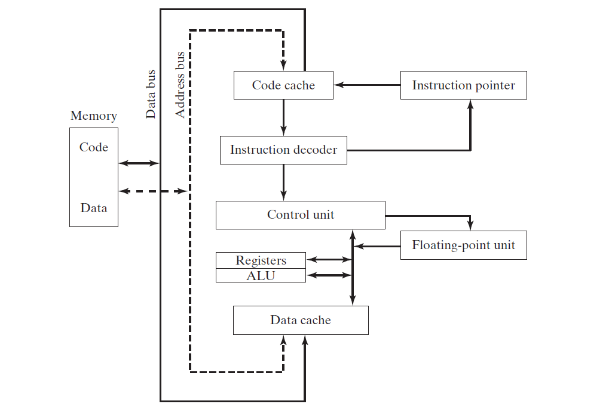

# x86 架构
## 总览
本章重点介绍与x86汇编语言相关底层硬件。如果说汇编语言是机器最理想的沟通的工具，那么汇编语言程序员必须熟悉处理器内部架构和功能。我们将讨执行指令时发生在处理器内的基本操作。我们将讨论程序是如何被操作系统加载和执行。示例主板布局将提供对x86硬件环境的基本了解，本章结尾讨论应用程序和操作系统之间的分层输入输出如何工作。

## 2.1 通用概念
本章从程序员的角度描述x86处理器家族的架构以及它的宿主操作系统。

### 2.1.1 基本微机设计
微处理器基本设计图  

核心处理器（CPU）处理运算和逻辑操作，包含有限的几个存储位置称作寄存器，高频时钟，控制单元，和运算单元。

* 时钟结合其他系统组件同步CPU内部操作
* 控制单元（CU）协调执行机器指令所涉及的步骤和顺序
* 运算逻辑单元（ALU）执行算数运算（加法，减法 ）和逻辑运算（AND，OR， NOT）

CPU通过针脚连接到主板插槽来连接计算机其他部分。程序指令和数据都存储在内存里，只有把指令读取到CPU才可执行，指令可以单个复制到CPU，也可以按组复制到CPU。

总线（bus）是一组并列的电线用来电脑的各个部分传输数据。电脑系统有四种类型总线：数据，输入/输出（I/O），控制，寻址。

* 数据总线在CPU和内存之间传输指令和数据
* 输入/输出总线在CPU和系统输入/输出设备之间传输数据
* 控制总线使用二进制信号同步所有绑定在总线上的设备动作
* 当前正在运行的指令转移CPU和内存之间的数据时，地址总线保存当前指令地址和数据。

时钟（Clock），设计CPU和总线的每个操作由内部时钟以很定脉冲同步。机器指令的基础但与时间称作机器周期（时钟周期）。时钟周期长度是一个完整时钟脉冲所需时间。

时钟周期时间通过时钟速度的倒数来计算，速度对应到每秒振荡次数。比如每秒振荡十亿次(1 GHZ),每个时钟周期时间对应十亿次分之一秒(1 纳秒).

机器指令需要至少一个时钟周期执行，极少的需要超过50个时钟周期（8088处理器的乘法操作）。指令需要内存访问会导致空的时钟周期称作*等待状态*，因为CPU，系统总线，内存的电路访问速度不同。

### 2.1.2 指令执行周期
单条机器指令不是一次执行完，而是通过预定的的顺序队列执行机器指令，这个过程称作*指令执行周期*。假设指令指针寄存器记录我们将要执行的指令地址，以下是执行步骤：

1. CPU 从内存（指令队列）**获取指令**，执行完后，递增指令指针
2. CPU 通过二进制位**解码指令**，指令可能包含是否需要操作数
3. 如果需要操作数，CPU从寄存器和内存**获取操作数**，有时包含内存地址计算
4. CPU **执行** 指令，使用获取到的输入操作数。执行完后更新状态变量，比如 Zero，Carry，Overflow
5. 如果有输出操作数，CPU将执行结果**存入操作数**

如下图展示经典CPU数据流。

1. 内存地址通过地址总线传到内存控制器
2. 内存控制器读取对应地址的内容(执行代码)，通过数据总线传送到代码缓存
3. 指令指针递增到下个要执行的位置
4. 指令分析器分析指令后，产生信号通知控制单元协作对应的运算单元（ALU）和浮点运算单元（FPU）
5. 控制总线（不在图上）协调CPU不同组件之间的数据传输

### 2.1.3 从内存读取
从内存读取数据速度比起访问寄存器慢很多，从内存读取数据包括以下四步：

1. 将要读取的数据地址设置到地址总线
2. 修改处理器的读取引脚的值
3. 等待内存芯片回应需要一个时钟周期
4. 从数据总线复制数据到目标操作数

对应四个步骤，需要四个时钟周期，而从寄存器读取数据只需要一个时钟周期。

由于从内存读取数据缓慢，x86家族的CPU增加了两种类型缓存。一级（Level-1）缓存（主缓存），存储在CPU右边。二级（Level-2）缓存（次级缓存）速度慢一点，通过高速数据总线连接在CPU上。缓存比常规内存速度快的原因是缓存使用特殊的内存芯片称作“静态内存”，非常昂贵，不需要定时刷新来保持数据。而通用内存，又称作“动态内存”，需要定时刷新来保持数据，速度慢，但是价格便宜。

CPU在执行程序前，现将部分指令和数据加载到缓存了里，指令执行时，如果在缓存里找到，称作*缓存命中*，如果为找到，称作*缓存未命中*。

### 2.1.4 加载和执行程序
程序执行前，通过 *loader* 程序将程序加载到内存，操作系统设置CPU执行*入口点*。详细步骤如下：

1. 操作系统（os） 搜索程序文件名在当前目录，如果未找到，搜素预定义路径（paths），如果未找到，抛出错误
2. 如果程序文件找到，系统获取程序文件的基本信息，包括文件大小，存放在硬盘的物理位置
3. 系统确定下一个可用的内存位置，加载程序到内存。分配一块内存表（描述表）写入程序的大小和位置信息。并且系统会调整程序指针变量，使它包含程序数据地址。
4. 系统开始执行首条机器指令（入口点）。当程序运行起来，程序*进程*。系统给进程设置一个身份号（process ID），用来标识当前运行的进程。
5. 进程自己运行，系统的工作是跟踪进程的执行以及相应对系统资源（内存，硬盘，IO 设备）的请求。
6. 当进程结束执行，从内存里移除

## 2.2 32位 x86 处理器