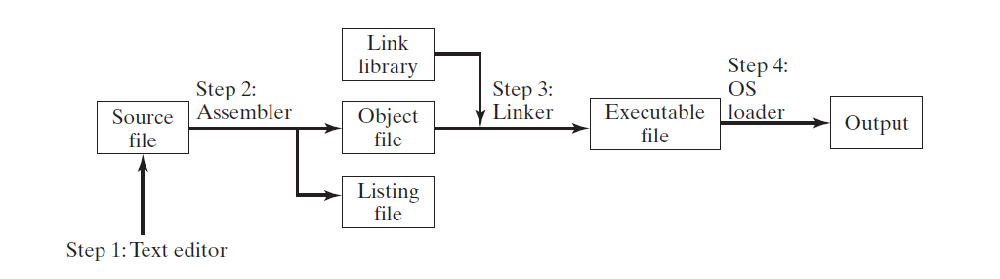

# 汇编语言基础
## 总览
本章重点介绍 Microsoft MASM 汇编程序基本构建块。主要介绍整数和变量如何定义，数字和字符的标准结构，以及如何组织运行程序。

## 3.1 语言基础元素
### 3.1.1 首个汇编程序
```asm
.data                               ; this is the data area
sum dword 0                         ; create a variable named sum

.code                               ; this is the code area
main proc                           
    mov eax, 5                      ; mov 5 to the eax register
    add eax, 6                      ; add 8 to the eax register
    mov sum, eax                    

    INVOKE ExitProcess, 0           ; end the program
main end
```

### 3.1.2 整数
整数表示形式为 ：`[{+ | -}] digits [radix]`，方括号中的内容可选。 
radix可以选择如下：

| 基数（radix） |   说明   | 基数（radix） |      说明      |
| :-----------: | :------: | :-----------: | :------------: |
|       h       | 十六进制 |       r       |      实数      |
|      q/o      |  八进制  |       t       | 十进制（备用） |
|       d       |  十进制  |       y       | 二进制 (备用)  |
|       b       |  二进制  |               |                |

16进制如果以字母开头，必须加`0`让汇编器将其解析为数字。

```asm
26                  ; 十进制
26d                 ; 十进制
1001b               ; 二进制
42q                 ; 八进制
42o                 ; 八进制
1Ah                 ; 十六进制
0A3h                ; 十六进制，但必须以0开头
```

### 3.1.3 常量整数表达式
包含整数字符和运算符号的表达式*称作常量表达式*，常量表达式必须产生一个值。操作符，以及优先级表如下：

| 操作符 |    名称     | 优先级 |
| :----: | :---------: | :----: |
|   ()   |    括号     |   1    |
|  +,-   | 一元 正，负 |   2    |
|  *,/   | 乘法，除法  |   3    |
|  MOD   |    求余     |   3    |
|  +,-   |   加，减    |   4    |

```asm
4 + 5 * 2
12 - 1 MOD 5
-5 + 2
(4 + 2) * 6
```
### 3.1.4 实数字符
实数字符（浮点数字符）结构为:`[sign]integer.[integer][exponent]`，sign和exponent结构如下：
 ```asm
 sign       {+, -}
 exponent   E[{+, -1}]integer
 ; 如下为正确的实数例子
 2.
 +3.0
 -44.2E+05
 26.E5
 ```

 ### 3.1.5 字符
字符为单个字符被包含在单引号或双引号里， 例如 ` 'a' "d" `。

 ### 3.1.6 字符串
 字符串为多个字符被包含在单引号或双引号里 ， 列如 ` 'abc', "4096" ` 。

### 3.1.7 保留关键字
保留字有特殊的意义，只能用在正确的语义里。保留字大小写不敏感，有如下几类保留字：

* 指令助记符，比如 `MOV, ADD, MUL`
* 寄存器名字
* 指令，注明汇编器如何组织程序
* 属性，变量大小和使用信息，例如 `BYTE 和 WORD`
* 操作符，用在常量表达式里
* 预定义符号，例如 `@data`

### 3.1.8 身份标识
*身份标识* 为程序员选择的名字，它可以标识变量，常量，函数，代码标签。规则如下：

* 长度为1到247个字符之间
* 大小写不敏感
* 首个字母必须是：`字符（A...Z, a...z)，下划线(_), @, ?, $` 或者是数字字符 
* 身份标识不能和汇编保留字相同

### 3.1.9 指令（Directives）
指令是嵌入在源代码里的命令，被汇编器识别和操作。指令（Directives）不是在运行时执行，而是用来定义变量，宏（macros）和函数。指令（Directives）大小写不敏感。

指令（Directives）和指令（Instruction）的区别如下：

```asm
myVar DWORD 26          ; 汇编时DWORD Directives告知汇编器保留大小为DWORD的空间
mov eax, myVar          ; 运行时将myVar 拷贝到eax，运行时指令Intel处理器之间兼容，指令和汇编器相关
```
指令的另一个作用是定义定义程序**段（segments）**，比如`.data`数据段，可以定义变量, `.code` 程序段，可以执行指令， `stack 100h`定义程序运行时的栈大小。

### 3.1.10 指令（Instructions)
*指令（instruction）* 在汇编时被汇编器转换为机器语言字节，然后在运行时被CPU加载执行，一条指令有如下四个部分：

* Label (optional)
* Instruction mnemonic (required)
* Operand(s) (usually required)
* Comment (optional)

语法如下：
> [label:] mnemonic [operands] [; commnet]

#### 标签（Label）
*标签（label）* 是一个标记符，用来标记数据和代码的位置，两种类型的标签：数据标签和代码标签，例子如下：

```asm
count DWORD 100             ; count 数据标签
array DWORD 1024, 2048
      DWORD 4096, 8192      ; 多行数据

target:                     ; 代码标签
    mov ax, bx
    ...
    jmp target      

L1: mov ax, bx              ; 同一行也可以    
```

#### 指令助记符（Instruction Mnemonic)
*指令助记符（instruction mnemonic）* 是一个简短单词来标识指令（instruction）。比如 `mov` 用来拷贝一个值到另一个变量。

#### 操作数（Operands）
*操作数（operand）* 是一个被指令（instruction）当做输入或输出的值。汇编语言的指令（instruction）可以有0到3个操作数，操作数可以是 **寄存器（register）， 内存变量（memory），数值表达式（integer expression），或输入输出端口（input-output port）**。下面是操作数例子：

```asm
stc                 ; set carry flag
inc eax             ; add 1 to eax
mov count, ebx      ; move ebx to count
imul eax, ebx, 5    ; exb multiplied by 5, and the product is stored to eax
```

#### 注释（comments）
注释是一种重要的途径，用来程序作者和阅读代码的人交流程序设计信息。通常情况下如下信息应给包含在程序的顶端：

* 程序目的描述
* 创建人或修改人的名字
* 创建以及版本日期
* 程序实现技术相关记录

注释两种方式：

* 单行注释，使用分号(;)。所有与分号同一行的将会被汇编器忽略
* 多行注释，使用 `COMMENT` 指令和用户自定义符号，所有的在自定义符号后的内容被忽略直到下一个自定义符号出现

以下为多行注释例子：
```asm
 COMMENT    !
    this line is a comment
    this line is also a comment
 !
```

#### 无操作（NOP-NO Operation)指令
*NOP* 占用一字节程序空间不做任何事情，它被用来代码对齐，x86处理器加载代码和数据在偶数倍双字节地址更加高效。

## 3.2 整数加减例子
首先来看 *AddTwo* 程序
```asm
1:  ; AddTwo.asm - adds two 32-bit integers
2:  ; chapter 3 example
3:  
4:  .386
5:  .model flat, stdcall
6:  .stack 4096
7:  ExitProcess PROTO, dwExitCode:DWORD
8:  
9:  .code
10: main PROC
11:     mov eax, 5
12:     add eax, 6
13:  
14:      INVOKE ExitProcess, 0
15: main ENDP
16: END main
```

* **.386** 指令指名这是32位程序，可以访问32寄存器和地址
* 第五行选择了程序内存模型（flat)，表明了函数调用方式（stdcall），使用stdcall是因为使用了windows服务需要这种调用方式
* 第六行设置了运行堆栈为4096 bytes 
* 第七行申明函数 `ExitProcess`，windows标准函数，原型包含函数名字，**PROTO**关键字，逗号，以及输入参数
* `.code`标记程序开始代码，紧接着定义程序入口，通常函数名字为 `main`
* `ENDP`标记函数结束
* `END`标记程序结束，后续的所有代码都将被汇编器忽略

## 3.3 汇编，链接，运行程序
### 3.3.1 汇编-链接-执行流程
整个程序从编码，到汇编，再到链接，最后运行，如下图所示：



**Step 1:** 使用编辑器（Text editor）创建源文件  
**Step 2:** 汇编器（assembler）读取源文件产生 *目标文件（object file）*，可以选择生成 *listing file*  
**Step 3:** 链接器（linker）读取目标文件并且检查程序是否包含在链接库里的函数，如果包含，链接器从链接库里拷贝包含的函数，最后节后目标文件输出可执行文件（executable file）  
**Step 4:** 操作系统加载器（loader）加载程序到内存，将CPU指向程序开始地址，程序开始执行。  

### 3.3.2 Listing file
*listing file* 包含程序的源代码，行号，指令地址，每个指令的机器码，还有符号表（symbol table）。符号表包含程序变量名，段，以及相关信息。AddTwo的listing file 如下：

```asm
1:  ; AddTwo.asm - adds two 32-bit integers.
2:  ; Chapter 3 example
3:
4:  .386
5:  .model flat,stdcall
6:  .stack 4096
7:  ExitProcess PROTO,dwExitCode:DWORD
8:
9:  00000000                    .code
10: 00000000                    main PROC
11: 00000000 B8 00000005            mov eax,5
12: 00000005 83 C0 06               add eax,6
13:
14:                                 invoke ExitProcess,0
15: 00000008 6A 00                  push +000000000h
16: 0000000A E8 00000000 E          call ExitProcess
17: 0000000F                    main ENDP
18:                             END main
```

> 由于直接在 Visual studio 里新建配置工程并不方便，所以建议使用 `ml`命令，使用`ml /c /Sn /Sa /Fl filename.asm` 可以输出list文件。`ml`在vs 2017（或对应的版本）开发人员命令提示符界面可以直接使用。
 
## 3.4 定义数据
### 3.4.1 固有数据类型
汇编器识别基础系列固有数据类型，通过数据类型的长度（byte， word， doubleword，and soone）来识别，和数据是否为有符号，或整数，浮点数无关。比如 `DWORD, SDWORD, REAL4`都是存储为32位整数。

表3-2

| 类型   | 说明                                   |
| ------ | -------------------------------------- |
| BTYE   | 8-bit 无符号整型，B代表byte            |
| SBYTE  | 8-bit 有符号整型，S代表signed          |
| WORD   | 16-bit 无符号整型                      |
| SWORD  | 16-bit 有符号整型                      |
| DWORD  | 32-bit  无符号整型，D代表doubl         |
| SDWORD | 32-bit 有符号整型，SD代表signed double |
| FWORD  | 48-bit 整型（保护模式下的远端指针）    |
| QWORD  | 64-bit 整型，Q代表quad                 |
| TBYTE  | 80-bit(10-byte)整型，T代表10-byte      |
| REAL4  | 32-bit(4-byte)IEEE 短实数              |
| REAL8  | 64-bit(8-byte)IEEE 长实数              |
| REAL10 | 80-bit(10-byte)IEEE 扩展实数           |

### 3.4.2 数据定义语句
*数据定义语句（data definition statement）* 在内存里为变量分配存储空间，使用可选名字。数据定义语句语法如下：  
> [name] directive initializer [,initializer] ...

* **Name** 符合命名规则即可
* **directive** 数据定义指令使用 `BYTE, WORD, DWORD, SBYTE, SWORD`，或表3-2的任意类型
* **Initializer** 至少要有一个初始化值，甚至为0时。如果有多个，使用逗号隔开。如果是随机初始值，使用 `?` 初始化。

表3-3 过时数据指令

| 指令 | 说明                    |
| ---- | ----------------------- |
| DB   | 8-bit 整型              |
| DW   | 16-bit 整型             |
| DD   | 32-bit 整型或实数       |
| DQ   | 64-bit 整型或实数       |
| DT   | 定义80-bit(10-byte)整数 |

### 3.4.3 为AddTwo程序添加变量
```asm
; AddTwoSum.asm - Chapter 3 example

.386
.model flat, stdcall
.stack 4096

ExitProcess PROTO, dwExitCode:DWORD

.data
sum DWORD 0

.code
main PROC
    mov eax, 5
    add eax, 6
    mov sum, eax

    INVOKE ExitProcess, 0
main ENDP
END main
```

### 3.4.4 定义BYTE和SBYTE数据
BYTE 和 SBYTE 指令分配一个或多个无符号或有符号值。每个初始值占用8-bit存储空间。比如：
```asm
value1 BYTE 'A'         ; 字符
value2 BYTE  0          ; 最小无符号
value3 BYTE 255         ; 最大无符号
value4 BYTE -128        ; 最小有符号
value5 BYTE +127        ; 最大有符号
value6 BYTE ?           ; 未初始化值
```

可选名称是一个标签，用来标记变量与封闭段开头的偏移量。假设`value1` 数据段 0000 位置，数据 `value2`的偏移量为 0001
```asm
value1 BYTE 10h
value2 BYTE 20h
```

也可以使用过时的指令定义8-bit变量
```asm
val1 DB 255         ; 无符号byte
val2 DB -128        ; 有符号byte
```

#### 多初始化值
如果多个初始化值用于同一个数据定义，它的名称指向第一个初始值的偏移量。在下面的例子，假设`list`位于0000，则变量10的偏移量为0000，20的偏移量0001,30偏移量0002,40偏移量0003：
> `list BYTE 10, 20, 30, 40`

并不是所有定义需要名字，定义数组可以通过多行定义，如下所示：

```asm
list BYTE 10, 20, 30, 40  
     BYTE 50, 60, 70, 80
     BYTE 81, 82, 83, 84
```

定义数据，初始值可以使用不同数据表现形式。字符和字符数值可以混用。下面的例子 `list1`和`list2`有相同的内容：

```asm
list1 BYTE 10, 32, 41h, 00100010b
list2 BYTE 0Ah, 20h, 'A', 22h
```
#### 定义字符串
将字符串使用单引号或双引号括起来用来定义字符串变量。最通用的字符串类型用空值（null）结尾。

```asm
greeting1 BYTE "Good afternoon", 0
greeting2 BYTE "Good night", 0
```

每个字符占用1byte空间，字符数组里的每个字符必须用逗号隔开，字符串的定义是一个特例。
```asm
greeting1 BYTE 'G', 'o', 'o', 'd' ....etc
```

字符串同样可以定义多行，不需要每行提供名字。
```asm
greeting1 BYTE "Welcome to the Encryption Demo program "
          BYTE "created by Kip Irvine.",0dh,0ah
          BYTE "If you wish to modify this program, please "
          BYTE "send me a copy.",0dh,0ah,0
```

十六进制代码`0Dh 和 0Ah` 交替称作 `CR/CF` （换行符）。

行连接符 `\` 将两行源代码连接为同一行，它必须在每行的最后一行，如下两句是等价的。
```asm
greeting1 BYTE "Welcome to the Encryption Demo program "

greeting1 \
BYTE "Welcome to the Encryption Demo program "
```
#### DUP 操作符
`DUP`操作符为多个变量分配空间，使用整数作为计数器，申明数组和字符串非常有用。
```asm
BYTE 20 DUP(0)              ; 20 bytes, 初始化为0
BYTE 20 DUP(?)              ; 20 bytes, 未初始化
BYTE  4 DUP("STACK")        ; 20 bytes: "STACKSTACKSTACKSTACKSTACK"
```

### 3.4.5 定义 WORD 和 SWORD 变量
`WORD 和 SWORD` 指令创建一个或多个16-bit整型。
```asm
word1 WORD 65535            ; 最大无符号值
word2 WORD  -32768          ; 最小有符号值
word3 WORD  ?               ; 未初始化，无符号
; 过时的 DW 指令
val1 DW 65535               ; 无符号
var2 DW -32768              ; 有符号
; 16-bit word 数组，每个值占用两位地址
myList WORD 1,2,3,4,5
; 使用DUP 申明数组
array WORD 5 DUP(?)         ; 5个未初始化值
```

### 3.4.6 定义 DWORD 和 SDWORD 变量
`DWORD 和 SDWORD`指令创建一个或多个32-bit 整型。
```asm
val1 DWORD  12345678h       ; 无符号
val2 SDWORD -2147483648     ; 有符号
val3 DWORD  20  DUP(?)      ; 未初始化数组

; 过时DD指令
val1 DD 12345678h           ; 无符号
val2 DD -12345678h          ; 有符号

; DWORD 可以用来申明32-bit变量的步长(地址)
pVal DWORD  val3

; 32-bit DWORD数组，每个值占用四位地址
myList DWORD 1, 2, 3, 4, 5
```

### 3.4.7 定义 QWORD 变量
`QWORD`指令创建占用64-bit空间值。
```asm
quad1 QWORD 1234567812345678h
; 过时的DQ指令
quad2 DQ 1234567812345678h
```

### 3.4.8 定义打包BCD（TBYTE）数据
Intel打包*2进制编码的十进制*（*binary coded decimal*-BCD）整数存储在10-byte包里。除了最高字节，每个字节包含两个十进制数，在低位9字节，每个字节的一半个含一个十进制数，在最高byte的最高位标明数据的正负，当最高byte为`80h`时为负数，当最高byte为`00h`是为正数。显然整数范围为 `-999,999,999,999,999,999,999,999,999 到 999,999,999,999,999,999,999,999,999`。

MASM 使用 `TBYTE`定义BCD变量，常量初始化变量必须使用十六进制。
```asm
intVal TBYTE 80000000000000001234h      ; 正确 
intVal TBYTE -1234                      ; 错误的初始化，转换为2进制赋值给变量 
```

### 3.4.9 定义浮点类型
`REAL4` 定义4-byte单精度浮点变量，`REAL8`定义8-byte双精度浮点，`REAL10` 定义10-byte扩展精度变量。每个都支持数组定义。
```asm
rVal1       REAL4  -1.2
rVal2       REAL8  3.2E-260
rVal3       REAL10 4.6E+4096
shortArray  REAL4  20 DUP(0.0)

; 过时 DD，DQ和DT指令定义实数
rVal1   DD -1.2
rVal2   DQ 3.2E-260
rVval3  DT 4.6E+4096
```
### 3.4.10 两数相加程序
简单的程序，略过...
### 3.4.11 小端顺序
X86处理器从内存读取和存储数据使用小端（*little-endian*），从低到高的顺序。最低有效位字节存储在数据内存的最开始，剩余字节存储在后续连续内存。假设双字节 `12345678h`，如果放置在内存`0000`处，`78`将存储在第一位，`56, 34, 12` 存储在后续，如下图所示：


如果是大端存储，如下图所示:


### 3.4.12 申明未初始化数据
`.DATA?` 指令定义未初始化数据，当定义大块的未初始化值，`.DATA?`减少编译程序的大小。如下例子：
```asm
.data?
bigArray DWORD 5000 DUP(?)      ; 20, 000 bytes, 未初始化

; 如果直接初始化，导致编译程序增大 20000 bytes
.data
bigArray DWORD 5000 DUP(?)      ; 20, 000 bytes
```
 
 `.code` 和 `.data`指令可以混用，但是不建议混用，降低代码的可读性。
## 3.5 符号常量
*符号常量（symbolic constant）* 用来关联整数表达式或文本。符号（Symbols）不占用内存空间，在汇编阶段将符号替换为对应的常量，在运行时不可改变。

使用等号创建符号代表整数表达式，使用`EQU` 和 `TEXTEQU` 指令创建符号代表文本。

### 3.5.1 等号指令
*等号指令（equal-sign directive）* 关联一个符号名和整数表达式，语法为：
> name = expression

使用常量的原因：

* 增强代码的可读性，通过常量名可以知道用途
* 整体替换，增强代码的可维护性

等号指令的特殊用途：
```asm
; 使用 $ 代表当前内存地址
selfPtr DWROD $

; DUP 操作符使用常量
COUNT = 10
array dword COUNT DUP(0)

; 常量可以重定义
COUNT = 5
mov al, COUNT
COUNT = 10
mov al, COUNT
COUNT = 100
mov al, COUNT
```

### 3.5.2 计算数组和字符串长度
利用常量 `$` 和变量地址计算出占用长度byte，根据变量元素所占空间得出变量个数，字符串是字符数组，同样的方法计算长度。
```asm
; byte array
list BYTE 10, 20, 30, 40
ListSize = ($ - list)

; word array
list WORD 1000h, 2000h, 3000h, 4000h
ListSize = ($ = list) / 2
```

### 3.5.3 EQU 指令
*EQU* 指令使用常量名关联整数表达式，文本，常量名，格式如下：
> name EQU expression  
> name EQU symbol  
> name EQU \<text>  

`EQU` 和 等号的区别是，`EQU` 使用`<...>`括号后，指令不求值，直接原样复制过去。并且`EQU`指令不允许重定义。
```asm
matrix1 EQU 10 * 10
matrix2 EQU <10 * 10>
.data
M1 WORD matrix1         ; M1 WORD 100
M2 WORD matrix2         ; M2 WORD 10 * 10
```

### 3.5.4 TEXTEQU 指令
*TEXTEQU* 类似于 `EQU`，创建文本宏（text macro）。但是可以重定义。语法格式如下：
> name TEXTEQU \<text>  
> name TEXTEQU textmacro  
> name TEXTEQU %constExpr

例子如下：
```asm
rowSize = 5
count   TEXTEQU %(rowSize * 2)
move    TEXTEQU <mov>               ; move 等价于mov
setupAL TEXTEQU <move al, count>    ; mvo al, 10
```
## 3.6 64-bit 编程
首先来看AddTwoSum程序64-bit版本：
```asm
; AddTwoSum_64.asm -Chapter 3 example
ExitProcess PROTO

.data
sum DWORD 0

.code

main PROC
    mov eax, 5
    add eax, 6
    mov sum, eax
    mov ecx, 0

    call ExitProcess
main ENDP
END
```
和32-bit相比有以下区别：
* 不在使用指令 `.386`， `model flat, stdcall`， `.stack 4096`
* 64-bit的函数申明不需要参数 `ExitProcess PROTO`， 32-bit为`ExitProcess PROTO, dwExitCode:DWORD`
* 64-bit 不支持`INVOKE`指令，使用`call`调用函数
* 64-bit 结束程序使用 `END`， 32位使用 `END main`
* 64-bit 程序可以使用64-bit 寄存器