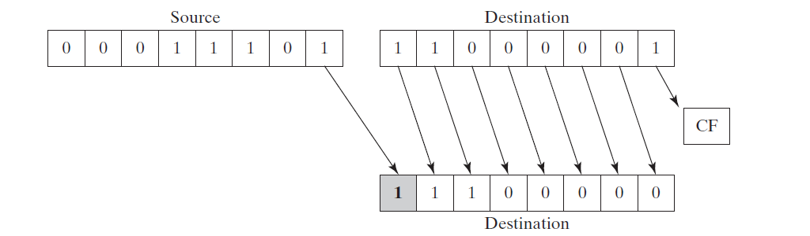

# Chapter 7: 整数运算
本章介绍二进制的移动和旋转技术，这是汇编语言的强项。事实上，位操作是计算机图形学，数据加密，硬件操作中不可或缺的部分。这部分的指令在这些领域非常有用，高级语言只实现了部分，或者是平台相关的。
## 7.1 移动和旋转指令
移动bit位意味着在操作数内部向左或向右移动bit。x86处理器提供了丰富的指令集，如下：

| 指令 | 说明            |
| ---- | --------------- |
| SHL  | 向左移动位      |
| SHR  | 向右移动位      |
| SAL  | 向左算数移动位  |
| SAR  | 向右算数移动位  |
| ROL  | 向左旋转        |
| ROR  | 向右旋转        |
| RCL  | 旋转carry位向左 |
| RCR  | 旋转carry为向右 |
| SHLD | 双精度向左移位  |
| SHRD | 双精度向右移位  |

### 7.1.1 逻辑移动和算数移动
逻辑移动，空留出的位，值为零


算数移动，空留出的位，值为符号位对应值


### 7.1.2 SHL 指令
`SHL`(shift left) 指令对操作数执行逻辑向左移位，最低位置置为零。最高位移动到Carry标志位，在Carry 标志位的值被覆盖。


`SHL` 指令语法如下：
> SHL destination, count

`SHL` 指令操作数组合如下：
> SHL reg, imm8  
> SHL mem, imm8  
> SHL reg, CL  
> SHL mem, CL

x86 处理器将imm8值按照 [0, 255]范围处理，CL 寄存器可以包含转移数量。以上格式对 `SHR, SAL, SAR, ROR, ROL, RCR, RCL` 指令都适用。

`SHL` 指令使得操作数执行按位乘法，向左移动操作位n，等价于让操作数乘以 2^n。
### 7.1.3 SHR 指令
`SHR`(shift right) 指令对操作数执行向右移位，最高位置置为零。最低位移动到Carry标志位，在Carry 标志位的值被覆盖。


`SHR` 指令使得操作数执行按位除法，向右移动操作位n，等价于让操作数除以 2^n。

### 7.1.4 SAL 和 SAR 指令
`SAL`指令和 `SHL` 执行结果一致。


`SAR` 保留符号位，然后向右移位。


### 7.1.5 ROL 指令
`ROL`(rotate left) 指令向左移动位，最高位拷贝到Carry标志位和最低位。


### 7.1.6 ROR 指令
`ROR`(rotate right) 指令向右移动位，最低位拷贝到Carry标志位和最高位。


### 7.1.7 RCL 和 RCR 指令
`RCL` (rotate carry left) 指令向左移动位，将Carry标志位拷贝到LSB（最低有效位），将MSB （最高有效位）拷贝到Carry标志位。


`RCR` (roate carry right) 指令向右移动位，将Carry标志位拷贝到MSB（最高有效位），将LSB（最低有效位）拷贝到Carry 标志位。


可以将Carry为看做多出来的一位。

### 7.1.8 有符号溢出
执行指令后产生的数，超出操作数的范围，Overflow 标志位设置为1。

```asm
    mov al, +127        ; AL = 01111111b
    rol al, 1           ; OF = 1, AL = 11111110b

    mov al, -128        ; AL = 10000000b
    shr al, 1           ; OF = 1, AL = 0100000b
```
### 7.1.9 SHLD/SHRD 指令
`SHLD` (shift left double) 指令将目标操作数向左移动指定位数，然后将这些空出的位使用源操作数最大有效位做为起始位，填充对应长度。源操作数不受影响，但是 Sign, Zero, Auxiliary, Parity, Carry 标志位受影响。


`SHLD` 指令语法如下：
> SHLD   dest, source, count

`SHRD` (shift right double) 指令将目标操作数向右移动指定位数，然后将这些空出的位使用源操作数最小有效位作为起始位，填充对应长度。源操作数不受影响。



`SHLD` 和 `SHLD` 操作数组合相同，如下：
> SHLD reg16, reg16, CL/imm8  
> SHLD mem16, reg16, CL/imm8  
> SHLD reg32, reg32, CL/imm8  
> SHLD mem32, reg32, CL/imm8  


## 7.2 Shift 和 Rotate 应用
### 7.2.1 移动多个双字节
通过使用carry flag当零时变量来实现所有字节位向右移动一位

```asm
.data
ARRAY_SIZE = 3
array BYTE ARRAY_SIZE dup(99h)
.code
main proc
    mov esi, 0 
    shr array[esi + 2], 1
    rcr array[esi + 1], 1
    rcr array[esi], 1 
exit
main endp
```
### 7.2.2 二进制乘法
使用向右移动位来实现乘2的算法，对于不是2的幂次被乘数，可以使用拆分的方式来实现。
```asm
; use shift right perform multiply
; 123 * 36 = 123 * (2^5 + 2^2)
.code
main proc
    mov eax, 123
    mov ebx, eax            ; eax = 123, ebx = 123
    shl eax, 5              ; eax = 123 * 2^5
    shl ebx, 2              ; ebx = 123 * 2^2
    add eax, ebx            ; eax = 123 * (2^5 + 2^2)
    call WriteDe            
exit
main endp
```
### 7.2.3 显示二进制位
将整数转换为二进制，通过左移操作，判断carry 标志位的值，来得到每个位的char值。

```asm
BinToAsc proc
    push ecx
    push esi
    mov ecx, 32
L1: shl eax, 1
    mov byte ptr[esi], '0'
    jnc L2
    mov byte ptr[esi], '1'
L2: inc esi
    loop L1

    pop esi
    pop ecx
    ret
BinToAsc endp
```
### 7.2.4 解开文件日期字段
MS-DOS返回文件日期到DX里，0-4位代表天，5-8为代表月，9-15代表年。


使用位移和掩码来解开日期。

```asm
    mov al, dl
    add al, 00011111b           ; clear bits 5-7
    mov day, al

    mov ax, dx                  
    shr ax, 5                   ; shift right 5 bits
    and al, 00001111b           ; clear bits 4-7
    mov month, al

    mov al, dh
    shr al, 1                   ; shift right one position
    mov ah, 0                   ; clear ah to zero
    add ax, 1980                ; year is relative to 1980
    mov year, ax                
```

## 7.3 乘法和除法指令
在32-bit模式下，可以进行32-bit，16-bit，或8-bit的乘法操作。在64-bit模式下，还可以进行64-bit操作。`MUL`和 `IMUL` 指令分别执行无符号和有符号整数乘法。`DIV` 和 `IDIV` 指令执行无符号和有符号整数除法。
### 7.3.1 MUL 指令
在32-bit模式下，`MUL`(无符号乘法) 指令三个版本：

* 8-bit 操作数乘 AL 寄存器
* 16-bit 操作数乘 AX 寄存器
* 32-bit 操作数乘 EAX 寄存器

乘数和被乘数要求长度一致，结果是它们两倍长度。操作数只能是寄存器或内存变量。语法如下：

> MUL reg/mem8  
> MUL reg/mem16  
> MUL reg/mem32

以下是乘法对应表：

| 被乘数 | 乘数      | 结果    |
| ------ | --------- | ------- |
| AL     | reg/mem8  | AX      |
| AX     | reg/mem16 | DX:AX   |
| EAX    | reg/mem32 | EDX:EAX |
| RAX    | reg/mem64 | RDX:RAX |

 当结果的高位有值时，carry 标志位被设置。

### 7.3.2 IMUL 指令
`IMUL`(有符号乘法) 指令执行有符号整数乘法。和`MUL` 不同的是， `IMUL` 维护乘法结果的符号。通过扩展低位结果的最高位扩展到高位结果。x86支持三种格式的 `IMUL` 指令：一个操作数，两个操作数，和三个操作数。

单操作数格式为：
```asm
IMUL    reg/mem8                    ; AX = AL * reg/mem8
IMUL    reg/mem16                   ; EAX = AX * reg/mem16
IMUL    reg/mem32                   ; EDX:EAX = EAX * rege/mem32  
``` 

如果结果的高位结果不是低位结果的符号位扩展，那么Carry和Overflow标志位会被设置。

双操作数的 `IMUL` 版本指令在32-bit模式下将执行结果保存到第一个操作数中，第一个操作数必须为寄存器。第二个操作数可以是寄存器，内存变量，立即数。

```asm
; 16 bit 格式
IMUL reg16, reg/mem16
IMUL reg16, imm8
IMUL reg16, imm16

; 32 bit 格式
IMUL reg32, reg/mem32
IMUL reg32, imm8
IMUL reg32, imm32
```

双操作数的结果将会根据乘法目标的长度被截断。如果有效位丢失，Overflow和Carry 标志位会被设置。

三操作数在32-bit模式下将乘法结果存储在第一个操作数里。第二个操作数作为被乘数可以是16-bit寄存器或内存操作数。第三个操作数作为乘数，为8bit or 16bit 立即数。

```asm
; 16 bit 
IMUL reg16, reg/mem16, imm8
IMUL reg16, reg/mem16, imm16

; 32 bit
IMUL reg32, reg/mem32, imm8
IMUL reg32, reg/mem32, imm32
``` 
同样乘法结果将会根据目标长度截断，Overflow和Carry 标志会被设置。

### 7.3.3 估量程序执行时间
估量程序运行时间思路如下：

* 调用当前时间为：startTime
* 调用要测试的函数为：testFunction
* 调用当前时间：endTime
* 得出函数使用时间为：useTime = endTime - startTime

### 7.3.4 DIV 指令
32-bit模式下，`DIV` (unsigned divide)指令执行 8-bit，16-bit，32-bit无符号整数除法。独立寄存器或内存变量是除数，格式为：

> DIV reg/mem8  
> DIV reg/mem16
> DIV reg/mem32

下表为除法操作变量表：

| 被除数  | 除数      | 商  | 余数 |
| ------- | --------- | --- | ---- |
| AX      | reg/mem8  | AL  | AH   |
| DX:AX   | reg/mem16 | AX  | DX   |
| EDX:EAX | reg/mem32 | EAX | EDX  |
| RDX:RAX | reg/mem64 | RAX | RDX  |

### 7.3.5 有符号整数除法
有符号除法指令`IDIV`和无符号除法`DIV`基本一致，但是被除数初始化时，对于负数需要自己维护符号位。可以使用`MOV`和 `MOVSX`的组合来初始化被除数。Intel提供了符号位扩展指令更加便捷：

* `CBW` (convert byte to word) 将AL的符号位扩展到AH
* `CWD` (convert word to doubleword) 将AX的符号位扩展到DX
* `CDQ` (convert doubleword to quadword) 将EAX的符号位扩展到EDX

除法溢出，当除法的商的长度超过寄存器长度，将会溢出，程序出错。

```asm
mov ax, 1000h
mov bl, 10h
div bl              ; al can no hold 100h
```

建议除数使用64-bit长度，被除数32-bit长度，另外就是除零的检测。
### 7.3.6 实现算数表达式
将高级语言表达式翻译为汇编两个用处：

* 学习编译器如何编译优化代码
* 可以更底层的检测乘法结果是否溢出

三个实例如下：
```asm
; 无符号32位整数表达式
; var3 = (var1 + var2) * var3
mov eax, var1
add eax, var2           
mul var3                ; EAX = EAX * var3
jc tooBig               ; unsigned overflow?
mov var4, eax
tooBig:                 ; display error message

; 无符号32位表达式
; var4 = (var1 * 5) / (var2 - 3)
mov eax, var1
mov ebx, 5
mul ebx                 ; edx:eax = var1 * 5
mov ebx, var2
sub ebx, 3              ; ebx = var2 - 3
div ebx                 ; final division
mov var4, eax

; 有符号3位整数
; var4 = (var1 * -5) / (-var2 % var3)
mov eax, var2
neg eax
cdq
idiv var3
mov ebx, edx
mov eax, -5
imul var1
idiv ebx
mov var4, eax
```
## 7.4 扩展加法和减法
*扩展精度加法和减法是一种几乎无限位加减法的技术* 。汇编语言提供了指令`ADC` (add with carry)， 以及 `SBB` (subtract with borror) 指令来实现这种技术。
### 7.4.1 ADC 指令
`ADC`(add with carry) 指令将源操作数和Carry标志位加到目标操作数里。指令格式和`ADD`一样，要求操作数相同长度：

> ADC reg, reg  
> ADC mem, reg  
> ADC reg, mem 
> ADC mem, imm 
> ADC reg, reg  

### 7.4.2 扩展加法例子

[示例代码](Extended_Add.asm)

### 7.4.3 SBB 指令
`SBB`(subract with borrow) 指令从源操作数里减去Carry标志位和目标操作数。指令格式和 `ADC` 一致。

## 7.5 ASCLL 和 松散十进制运算
(在这节讨论的指令只适用于32-bit模式指令)算数运算是通过二进制来计算。CPU其实不关心字符还是二进制，都是按照二进制计算。汇编语言提供了指令帮助从字符运算转换到十进制计算。

ASCII每个字符占用一个字节，松散格式舍弃高四位，只用低四位。虽然ASCII运算速度慢，但也有以下优点：

* 不必从字符串转换为数字
* 浮点数计算没有精度问题

### 7.5.1 AAA 指令
在32位模式下，`AAA`(ASCII adjust after addition)指令校正`ADD` 或 `ADC`指令结果。假设AL包含两个ASCII数字之和，`AAA` 将AL转换为两个松散十进制数，分别存储在AH和AL里。松散格式下，通过`OR` 0x30h 转换为ASCII。

如果是字符串数字相加，步骤如下：

* 加数先与进位C相加，相加之和假设为A，并且保存进位为C1
* A再和被加数相加，保存相加之和为B，进位为C2
* 进位C为C1 加 C2，但是C1和C2只有一个为1，所以使用or效率也可以

### 7.5.2 AAS 指令
在32位模式下， `AAS`(ASCII adjust after subtraction)指令校正 `SUB` 或 `SBB` 指令结果。只有在结果为负数时才有必要使用此指令。

### 7.5.3 AAM 指令
在32位模式下， `AAM`(ASCII adjust after multiplication)指令将`MUL`指令产生的二进制结果转为未展开十进制。`MUL`的参数必须是二进制字节。

```asm
.data
ascVal BYTE 05h, 06h
.code
mov bl, ascVal                  ; first operand
mov bl, [ascVal + 1]            ; second operand
mul bl                          ; ax = 001Eh
aam                             ; ax = 0300h
```
### 7.5.4 AAD 指令
在32位模式下，`AAD`(ASCII adjust before division)指令将未展开十进制被除数转换为二进制。

## 7.6 非松散十进制运算
(在这节讨论的指令只适用于32-bit模式指令)非松散十进制是一个BYTE表示两位十进制，高四位和低四位分别表示一个数字。如果是奇数个数字，则最高位为零。以下存储方式都可行:

```asm
bcd1 QWORD  12345673928737285h
bcd2 QWORD  12345678h
bcd3 QWORD  08723654h
bcd4 WORD   9345h
bcd5 WORD   0237h
bcd6 BYTE   34h
```
非松散十进制存储有以下两个优点：

* 数字可以有几乎任何位的有效位。这对金融类的计算非常关键
* 从十进制转换为ASCII非常简单


###  7.6.1 DAA 指令
在32-bit模式下，`DAA` (decimal adjust after addition)指令将 `ADD` 或 `ADC` 运算结果AL转换为非松散十进制格式。

```asm
mov al, 35h
mov al, 48h     ; al = 7dh
daa             ; al = 83h
```
### 7.6.2 DAS 指令
在32-bit模式下，`DAS`(decimal adjust after subtraction) 指令将 `SUB` 或 `SBB` 指令运算结果AL转换为非松散十进制格式。