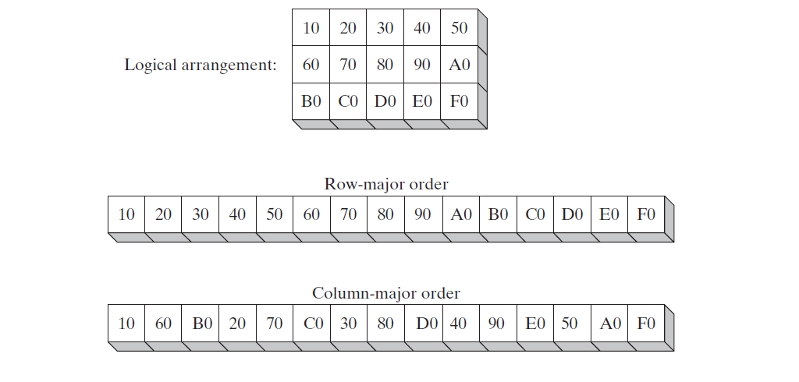
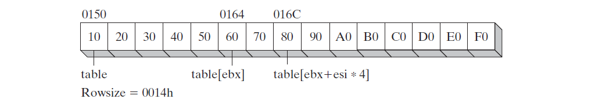
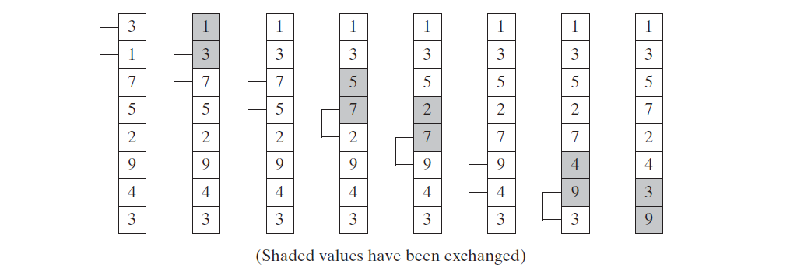

# Chapter 09 字符串和数组
## 9.1 简介
如果你学会高效的处理字符串和数组，你可以驾驭大多数领域的代码优化。研究证明大多数程序耗费90%的运行时间执行10%的代码。毫无疑问10%大多数是循环里的代码，通常循环用来处理字符串和数组。在这章里，我们将展示处理字符串和数组的技术，最终目标是写高效代码。

## 9.2 基础字符串指令
x86 指令集有五组指令用来处理bytes，words，和doublewords数组。尽管被称作基础字符串指令，但不限于处理字符数组。字符串基础指令执行高效的原因是自动循环以及增加数组索引。

| 指令              | 描述                                     |
| :---------------- | :--------------------------------------- |
| MOVSB,MOVSW,MOVSD | 拷贝ESI指向的内存数据到EDI指向的内存     |
| CMPSB,CMPSW,CMPSD | 比较ESI和EDI指向的内存数据               |
| SCASB,SCASW,SCASD | 比较累加器(AL,AX,EAX)和EDI指向的内存数据 |
| STOSB,STOSW,STOSD | 将累加器内容写入EDI指向的内存            |
| LODSB,LODSW,LODSD | 将EDI指向的内存数据写入累加器            |

使用循环前缀，字符基础指令仅仅能处理单个或一对内存数据。如果加上*循环前缀(repeat prefix)*，指令使用ECX作为计数器循环。循环前缀允许你使用单个指令处理整个字符串。

| 循环前缀    | 描述                                     |
| :---------- | :--------------------------------------- |
| REP         | 如果 ECX > 0 循环继续                    |
| REPZ,REPE   | 如果ZERO标志量被设置并且ECX > 0 循环继续 |
| REPNZ,REPNE | 如果ZERO标志量被清除且ECX > 0 循环继续   |

以下为拷贝字符串例子，从string1 拷贝 10bytes 到 string2。

```asm
    cld                             ; clear direction flag
    mov esi, offset string1         ; esi points to source
    mov edi, offset string2         ; edi points to target
    mov ecx, 10                     ; set counter to 10
    rep movsb                       ; move 10 bytes
```
当`MOVSB` 循环执行时 ESI 和 EDI值自动增加。这个行为通过CPU's 的方向标志控制。

方向指令描述如下：

| 指令 | 方向标志量 | ESI和EDI影响 | 地址顺序 |
| :--- | :--------- | :----------- | :------- |
| CLD  | clear      | 增加         | 低-高    |
| STD  | Set        | 降低         | 高-低    |

### 9.2.1 MOVSB，MOVSW，和MOVSD
`MOVSB,MOVSW, MOVSD` 指令从ESI指向的内存拷贝数据到EDI指向的内存。ESI和EDI根据方向标志位自动增加或减少。指令详细信息如下：


| 指令  | 描述                   | ESI和EDI增减 |
| :---- | :--------------------- | :----------: |
| MOVSB | Move(copy) bytes       |      1       |
| MOVSW | Move(copy) words       |      2       |
| MOVSD | Move(copy) doublewords |      4       |

拷贝双字节数组例子：
```asm
.data
source DWORD 20 DUP(0FFFFFFFFh)
target DWORD 20 DUP(?)

.code
cld                                 ; direction = forward
mov ecx, LENGTHOF source            ; set REP counter
mov esi, OFFSET source              ; esi points to source
mov edi, OFFSET target              ; edi points to target
rep movsd                           ; copy doublewords
```
### 9.2.2 CMPSB，CMPSW，和CMPSD
`CMPSB,CMPSW,CMPSD` 指令比较ESI和EDI指向的内存数据。

比较双字节例子：
```asm
.data
source DOWRD 0001h, 0002h, 0003h, 0004h
target DWORD 0001h, 0002h, 0004h, 0004h

.code
mov esi, OFFSET source
mov edi, OFFSEt target
cld
mov ecx, LENGTHOF source
repe cmpsd
```
### 9.2.3 SCASB，SCASW，和SCASD
`SCASB, SCASW, SCASD` 指令使用 AL/AX/EAX 的值和EDI指向的内存数据对比。这些指令用来查找在字符串和数组里的值。配合使用 `REPE (or REPZ)` 前缀，当ECX > 0 使用 AL/AX/EAX的值匹配EDI指向的值,来扫描整个字符串或数组。

查找字符例子：
```asm
.data
alpha BYTE "ABCDEFGH", 0

.code
mov edi, OFFSET alpha               ; edi points to the string
mov al, 'F'                         ; search for the letter F
mov ecx, LENGTHOF alpha             ; set the search count
cld                                 ; direction = forward
repne scasb                         ; repeat thile not equal
jnz quit                            ; quit if letter not found
dec edi                             ; found: back up edi
```
### 9.2.4 STOSB，STOSW，和STOSD
`STOSB,STOSW,STOSD` 指令将 AL/AX/EAX 的值写入EDI指向的内存地址。

使用 0FFh 初始化 string1 例子：

```asm
.data
Count = 100
string1 BYTE Count DUP(?)
.code
mov al, 0FFh                    ; value to be stored
mov edi, OFFSET string1         ; EDI points to target
mov ecx, count                  ; character count
cld                             ; direction = forward
rep stosb                       ; fill with contents of al
```
### 9.2.5 LODSB，LODSW，和LODSD
`LODSB,LODSW,LODSD` 指令将ESI指向的内存数据拷贝到AL/AX/EAX。

数组里的值扩大例子：

```asm
.data
array DWORD 1,2,3,4,5,6,7,8,9,10
multiplier DWORD 10

.code
main PROC
    cld                         ; direction = forward
    mov esi, OFFSET array       ; source index
    mov edi, esi                ; destination index
    mov ecx, LENGTHOF array     ; loop counter
L1: lodsd                       ; load [esi] into eax
    mul multiplier              ; multiply by a value
    stosd                       ; store EAX into [EDI]
    loop L1
exit
main ENDP
END main
```
## 9.3 String 函数
本节介绍针对以null结尾的字符串常用函数。

### 9.3.1 Str_compare 函数
`Str_compare` 函数对比两个字符串。调用方法如下：

> INVOKE Str_compare, ADDR string1, ADDR string2

字符串从第一个字节开始比较，没有返回值，Carry 和 Zero 标志位受影响，以下为对应关系：

|       关系        | Carry 标志位 | Zero 标志位 | 如果为真时分支 |
| :---------------: | :----------: | :---------: | :------------: |
| string1 < string2 |      1       |      0      |       JB       |
| string1 = string2 |      0       |      1      |       JE       |
| string1 > string2 |      0       |      0      |       JA       |

以下为函数代码：

```asm
;-------------------------------------------------------------------
Str_compare PROC USES eax edx esi edi,
    string1:PTR BYTE,
    string2:PTR BYTE
; Compare two strings
; Returns nothing, but the Zero and Carry flags are affected
; exacly as they would be by the CMP instruction
    mov esi, string1 
    mov edi, string2 
L1:
    mov al, [esi]                    ; the n char in string1
    mov dl, [edi]                    ; the n char in string2
    cmp al, 0                        ; string1 end ?
    jne NextChar                     ; no 
    cmp dl, 0                        ; string2 end ?
    jne NextChar                     ; no 
    jmp L2                           ; yes, quit with zf = 1 
NextChar:
    inc esi
    inc edi
    cmp al, dl                       ; cmp n char in string1 and string2
    je L1
L2:
    ret
Str_compare ENDP
```
通过指令`CMPSB`来实现函数`Str_compare` 效率更高，但是需要字符串长度。对于短的字符串调用两次`Str_length` 没有直接在循环里比较字符串效率高，因此长的数组并已知长度，使用`CMPSB`效率更高。

### 9.3.2 Str_length 函数
`Str_length`函数返回字符串长度值到EAX。

```asm
;---------------------------------------------------------
Str_length PROC USES edi,
	pString:PTR BYTE	; pointer to string
;
; Return the length of a null-terminated string.
; Receives: pString - pointer to a string
; Returns: EAX = string length
;---------------------------------------------------------
	mov edi,pString
	mov eax,0     	                ; character count
L1:
	cmp BYTE PTR [edi],0	        ; end of string?
	je  L2	                        ; yes: quit
	inc edi	                        ; no: point to next
	inc eax	                        ; add 1 to count
	jmp L1
L2: ret
Str_length ENDP
```
### 9.3.3 Str_copy 函数
`Str_copy`函数拷贝以null结尾源字符串到目标地址。在调用这个函数前，需要自己判断目标字符串是否能容纳源字符串。

```asm
;---------------------------------------------------------
Str_copy PROC USES eax ecx esi edi,
 	source:PTR BYTE, 		            ; source string
 	target:PTR BYTE		                ; target string
;
; Copy a string from source to target.
; Returns: nothing
; Requires: the target string must contain enough
; space to hold a copy of the source string.
;----------------------------------------------------------
	INVOKE Str_length,source            ; EAX = length source
	mov ecx,eax                         ; REP count
	inc ecx                             ; add 1 for null byte
	mov esi,source
	mov edi,target
	cld                                 ; direction = up
	rep movsb                           ; copy the string
	ret
Str_copy ENDP
```
### 9.3.4 Str_trim 函数
`Str_trim` 清除字符串结尾一个或多个字符。

```asm
;-----------------------------------------------------------
Str_trim PROC USES eax ecx edi,
	pString:PTR BYTE,                   ; points to string
	char:BYTE                           ; char to remove
;
; Remove all occurences of a given character from the end of a string. 
; Returns: nothing
;-----------------------------------------------------------
	mov  edi,pString
	INVOKE Str_length,edi               ; puts length in EAX
	cmp  eax,0                          ; length zero?
	je   L3                             ; yes: exit now
	mov  ecx,eax                        ; no: ECX = string length
	dec  eax                      
	add  edi,eax                        ; point to null byte at end
	
L1:	mov  al,[edi]                       ; get a character
    	cmp  al,char                    ; character to be trimmed?
    	jne  L2                         ; no: insert null byte
    	dec  edi                        ; yes: keep backing up
     loop L1                            ; until beginning reached

L2:  mov  BYTE PTR [edi+1],0      ; insert a null byte
L3:  ret
Str_trim ENDP
```

### 9.3.5 Str_ucase 函数
`Str_ucae` 将字符串每个字符转换为大写。

```asm
;---------------------------------------------------
Str_ucase PROC USES eax esi,
	pString:PTR BYTE
; Convert a null-terminated string to upper case.
; Receives: pString - a pointer to the string
; Returns: nothing
; Last update: 1/18/02
;---------------------------------------------------
	mov esi,pString
L1:
	mov al,[esi]                    ; get char
	cmp al,0                        ; end of string?
	je  L3                          ; yes: quit
	cmp al,'a'                      ; below "a"?
	jb  L2
	cmp al,'z'                      ; above "z"?
	ja  L2
	and BYTE PTR [esi],11011111b    ; convert the char

L2:	inc esi		; next char
	jmp L1

L3: ret
Str_ucase ENDP
```
## 9.4 二维数组

### 9.4.1 行和列顺序
从汇编程序员的视角，二维数组是一维数组的高等级抽象。高级语言选择两种方法之一来布局行和列的内存。两种方法为：*行为主(row-major order)，列为主(column-major order)*。



### 9.4.2 基于索引操作数
**基准-索引(base-index)** 操作是去两个寄存器(base 和 index)之和，得到值对应的地址。

> [base + index]

方括号是必须有的。在32-bit模式下，任意32-bit 通用寄存器可以用作基准和索引寄存器。

#### 二维数组
对于二维数组，考虑对应行数即可。

```asm
.data
tableB  BYTE 10h,   20h,    30h,    40h,    50h
Rowsize = ($ - tableB)
        BYTE 60h,   70h,    80h,    90h,    0Ah
        BYTE 0B0h,  0C0h,   0D0h,   0E0h,   0F0h
row_index = 1
column_index = 2
.code

mov ebx, OFFSET tableB          ; table offset
add ebx, RowSize * row_index    ; row offset
mov esi, column_index
mov al, [ebx + esi]             ; AL = 80h
```

#### 放大因子
对于每个数组元素长度不为一时，需要考虑单个元素的长度。

```asm
.data
tableW  WORD 10h,   20h,    30h,    40h,    50h
Rowsize = ($ - tableW)
        WORD 60h,   70h,    80h,    90h,    0Ah
        WORD 0B0h,  0C0h,   0D0h,   0E0h,   0F0h
row_index = 1
column_index = 2
.code

mov ebx, OFFSET tableW              ; table offset
add ebx, RowSize * row_index        ; row offset
mov esi, column_index
mov ax, [ebx + esi * TYPE tableW]   ; AX = 0080h
```

### 9.4.3 基于索引错位操作数
**基准-索引-错位(base-index-displacement)** 操作结合错位，基准寄存器，索引寄存器，以及可选放大因子产生高效地址。以下为语法：

> [base + index + displacement]  
> displacement[base +index]

*Displacement* 可以是变量名字或者常量表达式。在32-bit模式下，任意通用32-bit寄存器可以用作基准和索引。这种操作非常适用于处理二维数组，*错位*可以是数组名字，*基准*操作数当做行步长，*索引*操作数当做列长。

```asm
.data
tableD  DWORD 10h,   20h,    30h,    40h,    50h
Rowsize = ($ - tableD)
        DWORD 60h,   70h,    80h,    90h,    0Ah
        DWORD 0B0h,  0C0h,   0D0h,   0E0h,   0F0h
row_index = 1
column_index = 2
.code

mov ebx, RowSize                            ; row index 
mov esi, column_index
mov eax, tableD[ebx + esi * TYPE tableD]    ; EAX = 0080h
```

假设tableD从步长0150h开始，下图为代码示意图：



### 9.4.4 基于索引64-bit模式操作数
64-bit模式下，操作数使用的相关寄存器必须是64-bit寄存器。你可以使用*基准-索引*操作和*基准-索引-错位*操作。

## 9.5 整数数组的搜寻和查找
计算机科学家花费大量时间精力寻找更好的方式搜索和排序大量数据集。实践证明对于某个应用选择最好的算法比起购买更快的计算机更加有用。

### 9.5.1 冒泡
冒泡排序比较数组的一对数值，从位置0和1开始。如果对比结果两个数在相反位置，变换位置。下图为一组数运行一轮演示图：



冒泡的时间复杂度为 O(n^2)，对于数量少的数组没问题，对于上百万的排序，花费的时间太久。

冒泡排序伪码实现如下：

```C++
cx1 = N - 1
while(cx1 > 0)
{
    esi = addr(array)
    cx2 = cx1
    while(cx2 > 0)
    {
        if(array[esi] > array[esi + 4])
            exchange(array[esi], array[esi + 4])
        add esi, 4
        dec cx2
    }
    dec cx1
}
```

汇编实现如下：
```asm
;------------------------------------------
; BubbleSort
; Sort an array of 32-bit signed integers in ascending
; order, using the bubble sort algorithm.
; Receives: ponter to array, array size
BubbleSort PROC USES eax ecx esi,
    pArray:PTR DWORD,                   ; pointer to array
    count:DWORD                         ; array size
    mov ecx, count
    dec ecx                             ; decrement count by 1
L1:
    mov esi, pArray                     ; point to first value
    push ecx                            ; save outer loop count
L2: 
    mov eax, [esi]                      ; get array value
    cmp eax, [esi + 4]                  ; compare a pair of values
    jl L3                               ; if [ESI] <= [ESI + 4], no exchange 
    xchg eax, [esi + 4]                 ; exchange the pair
    mov [esi], eax
L3:
    add esi, 4                          ; move both ponters forward
    LOOP L2                             ; inner loop
    pop ecx                             ; retrieve outer loop count
    LOOP L1                             ; repeat outer loop
    ret
BubbleSort ENDP
```
### 9.5.2 二分搜索 
二分搜索的时间复杂度是O(log N)，要搜索的数组是已经从大到小排好序。二分搜索流程如下：

1. 假设数组开始索引为*first*，结束索引为*last*，如果 first > last，退出为找到查询值
2. 计算first 和 last 的中间索引 *mid*
3. 通过 mid 取得中间值
    * 如果中间值大于搜索值，搜索区间的最大索引为中间索引减一
    * 如果中间值小于搜索值，搜索区间的最小索引为中间索引加一
    * 如果等于搜索值，退出
4. 回到第一步

C++ 实现如下：

```C++
int BinSearch(int values[], const int searchVal, int count)
{
    int first = 0;
    int last = count - 1;
    while(first <= last)
    {
        int mid = (first + last) / 2;
        if(values[mid] > searchVal)
        {
            last = mid - 1;
        }
        else if(values[mid] < searchVal)
        {
            first = mid + 1;
        }
        else
        {
            return mid;
        }
    }

    return  -1;
}
```

汇编实现如下：

```asm
;------------------------------------------
; Binary search
; Searches an array of signed integers for a single value.
; Receives: Pointer to array, array size, search value
; Returns: if a match is found, EAX = the array positon of the matching element; oterwise, EAX = -1
;------------------------------------------
BinarySearch PROC USES ebx edx esi edi,
    pArray:PTR DWORD,
    Count:DWORD,
    searchVal:DWORD
    LOCAL first:DWORD,
    last:DWORD,
    mid:DWORD

    mov eax, 0
    mov first,eax                               ; first = 0
    mov eax, Count  
    dec eax 
    mov last, eax                               ; last = count - 1
    mov ebx, pArray
    mov edi, searchVal
L1:
    mov eax, last
    cmp first, eax 
    jg L4                                       ; exit search
    mov eax, first 
    add eax, last 
    shr eax, 1                                  ; eax = (first + last) / 2
    mov mid, eax
    mov esi, mid
    shl esi, 2                                  ; type dword = 4, so mid * 4 / 2  == shl esi, 2
    mov edx, [ebx + esi]                        ; edx = pArray[mid]
    cmp edx, edi                                
    jg  L2                                      ; if pArray[mid] > searchVal
    jl L3                                       ; if PArray[mid] < searchVal
    mov eax, mid 
    jmp L5
L2:
    mov eax, mid
    sub eax, 1                          
    mov last, eax                               ; last = mid - 1 
    jmp L1
L3:
    mov eax, mid
    add eax, 1                      
    mov first, eax                              ; first = mid + 1 
    jmp L1
L4:
    mov eax, -1                                 ; not find
L5: 
    ret
BinarySearch ENDP
```
