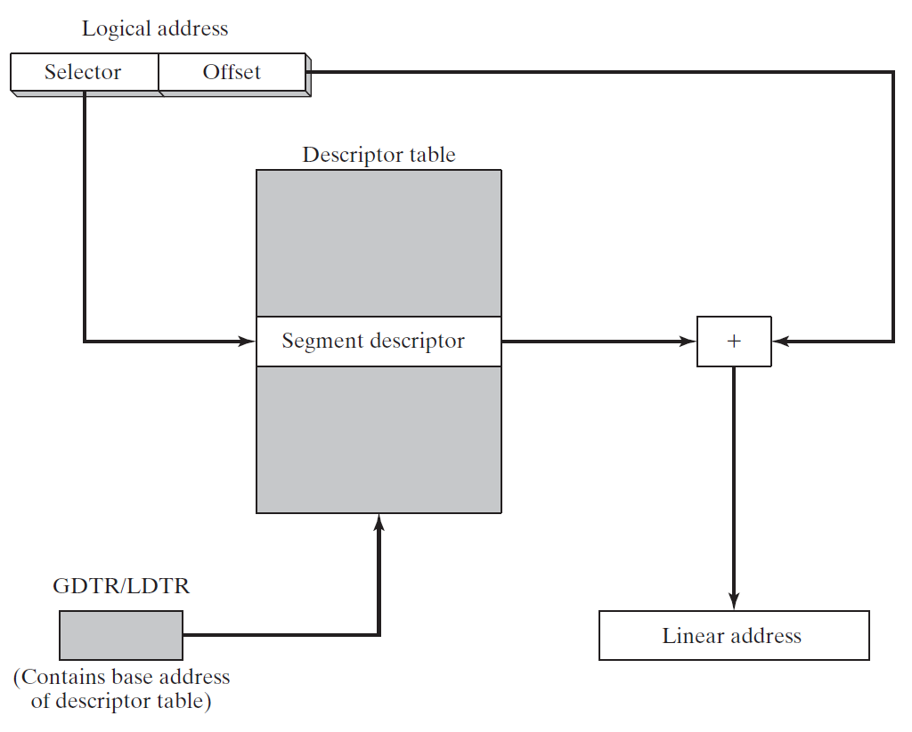
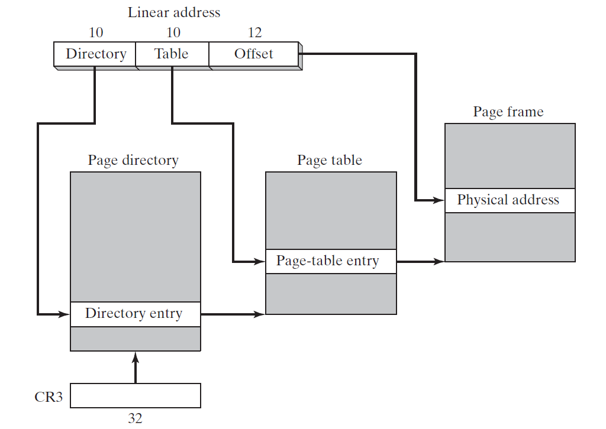

# Chapter 11 MS-Windows 编程
## 11.1 Win32 控制台编程
本章展示如何使用32-bit Microsoft Windows API进行控制台窗口编程。*应用程序接口(Application Programming Interface(API))* 是类型，常量，函数的集合，应用程序通过API来操作对象。

*Win32 Platform SDK* 和 Win32 API关系密切，称作 Microsoft Platform SDK (Softward Development Kit)，是工具，库，例子代码，以及文档的集合体，用来创建MS-Windows 应用程序。
### 11.1.1 背景知识
当Windows应用程序启动时，它创建控制台窗口或图形窗口。使用`LINk`命令来链接程序时，使用以下参数来创建控制台程序：

> /SUBSYSTEM:CONSOLE 

控制台程序有一个独立输入缓存(input buffer)以及一个或多个屏幕缓存(screen buffers)：

* 输入缓存包含输入记录队列，每个包含的数据和输入时间相关。例如输入事件为：键盘输入，鼠标点击，以及用户修改窗口大小
* 屏幕缓存是存储字符和颜色数据的二维数组，涉及控制台窗口文字显示形式

#### Win32 API 相关信息
函数通过查询MSDN网站上的相关信息来查看函数相关信息。

常量可以查看 SmallWin.inc，如果查询不到，去本书对应的网站查看 WinNT.h 这个文件。

#### 字符集和 Windows API Functions
当调用Win32 接口时可以使用两种类型的字符集：8-bit ASCII/ANSI 字符集和16-bit Unicode 字符集。Win32 API 提供了两个函数来处理不同字符集：

* WriteConsoleA 处理8-bit ANSI 字符集
* WriteConsoleW 处理宽字符集(包括Unicode)

当调用 `WriteConsoleA` 函数时，Win32 API 将字符转换为Unicode字符集然后调用 `WriteConsoleW`。

#### 高级和低级访问
访问控制台有两种级别，在简单和完全控制两边权衡：

* 高级控制台函数从控制台输入缓存读取字符流。它们将字符数据写入控制台屏幕缓存。输入和输出都可以重定向为读入文件或写入文件。
* 低级控制台函数获取键盘鼠标事件详细信息以及用户和控制台窗口交互(拖拽，重设窗口大小等等)信息。这些函数也允许详细控制窗口尺寸和位置，以及文本颜色。

#### 窗口数据类型
Win32 函数以C/C++程序员使用函数的规则为规范。在这些申明里，所有函数参数类型以标准 C 类型或者MS-Windows预定义类型为基准。区分数据变量和变量指针非常重要，以字母 **LP**开头的变量类型为指向某个对象的*长指针*。

#### SmallWin.inc 文件
本书作者自己创建的包含文件，内容包含了一些常量的定义，等价文本，以及函数原型用来Win32 API 编程。

#### 控制台句柄
几乎所有Win32 控制台函数需要传入句柄当做第一个参数。*句柄*是32-bit 无符号整数用来唯一表示一个物件例如 bitmap，drawing pen，或其他 输入/输出设备：

> STD_INPUT_HANDLE          standard input  
> STD_OUTPUT_HANDLE         standard output  
> STD_ERROR_HANDLE          standard error output

### 11.1.2 Win32 控制台函数
下表包含Win32 控制台函数快速索引。去网站[MSDN](www.msdn.microsoft.com)可以查看详细信息。

|            函数            |                  描述                  |
| :------------------------: | :------------------------------------: |
|        AllocConsole        |      为调用进程分配一个新的控制台      |
| CreateConsoleScreenBuffer  |           创建控制台屏幕缓存           |
|        ExitProcess         |          结束进程以及所有线程          |
| FillConsoleOutputAttribute | 为指定数量字符格子设置文本背景颜色属性 |
| FillConsoleOutputCharacter |   将一个字符按照指定次数写书屏幕缓存   |
|  FlushConsoleInputBuffer   |           刷新控制台输入缓存           |
|        FreeConsole         |          从控制台解开调用进程          |

### 11.1.3 显示消息框
在Win32应用程序里，最简单生成输出的方式是调用函数 `MessageBoxA`。

```asm
MessageBox PROTO,
    hWnd:DWORD,                         ; handle to window (can be null)
    lpText:PTR BYTE,                    ; string, inside of boxx
    lpCaption:PTR BYTE,                 ; string, dialog box title
    uType:DWORD                         ; contents and behavior
```

#### 内容和行为
*uType* 是一个bit-mapped整数包含三种类型选择：显示的按钮，图标，以及默认按钮选择。以下有几种按钮组合：

* MB_OK
* MB_OKCANCEL
* MB_YESNO
* MB_YESNOCANCLE
* MB_RETRYCANCEL
* MB_ABORTRETRYIGNORE
* MB_CANCELTRYCONTINUE

你可以选择当用户按下回车键后那个按钮被选择。选择为 **MB_DEFBUTTON1** (the default)，**MB_DEFBUTTON2**,**MB_DEFBUTTON3**,以及 **MB_DEFBUTTON4**。按钮被从左到右排列，索引从一开始。

四种图标可供选择。有时多个常量指向同一个图标：

* 停止标志：MB_ICONSTOP，MB_ICONHEAD，或者 MB_ICONERROR
* 问号标记(?)：MB_ICONQUESTION
* 信息标记(i): MB_ICONINFORMATION，MB_ICONASTERISK
* 惊叹号(!): MB_ICONEXCLAMATION，MB_ICONWARNING

当 MessageBOX 执行失败，返回零。其他返回用户点击的按钮对应的整数值，当关闭窗口时。

### 11.1.4 控制台输入
Win32 控制台有一个输入缓存包含一个输入事件记录的数组。每次的输入事件，例如击键，鼠标移动，鼠标点击将会生成一次输入记录保存在控制台输入缓存里。高等级输入函数，例如 ReadConsole 筛选和处理输入数据，只返回字符流。

以下为 `ReadConsole` 函数:

```asm
ReadConsole PROTO,
    hConsoleInput:HANDLE,                       ; input handle
    lpBuffer:PTR BYTE,                          ; pointer to buffer
    nNumberOfCharsToRead:DWORD                  ; number of chars to read
    lpNumberOfCharsRead:PTR DWORD,              ; ptr to num bytes read
    lpReserved:DWORD                            ; (not used)
```
### 11.1.5 控制台输出
`WriteConsole` 函数将一个字符串从当前光标开始写入控制台窗口并将光标设置到最后一个字符后面。函数原型为：

```asm
WriteConsole PROTO,
    hConsoleOutput:HANDLE,
    lpBuffer:PTR BYTE,
    nNumberOfCharsToWrite:DWORD,
    lpNumberOfCharsWritten:PTR DWORD,
    lpReserved:DWORD
```
### 11.1.6 读和写文件
`CreateFile` 函数创建一个新文件或打开已存在文件。如果成功，返回打开文件句柄，否则返回一个特殊常量 **INVALID_HANDLE_VALUE**。函数原型如下：

```asm
CreateFile PROTO,
    lpFilename:PTR BYTE,                        ; ptr to filename
    dwDesiredAccess:DWORD,                      ; access mode (reading or writing)
    dwShareMode:DWORD,                          ; share mode, controls the ability for multiple programs to access the file while it is open
    lpSecurityAttributes:DWORD,                 ; ptr Security attrib
    dwCreationDisposition:DWORD,                ; file creation options
    dwFlagsAndAttributes:DWORD,                 ; file attributes
    hTemplateFile:DWORD                         ; handle to template file
```

`ColseHandle` 函数关闭一个打开文件句柄。原型为：
```asm
CloseHandle PROTO,
    hObject:HANDLE                              ; handle to object
```

`ReadFile`从打开文件读取文本。原型为：

```asm
ReadFile PROTO,
    hFile:HANDLE,                               ; input handle
    lpBuffer:PTR BYTE,                          ; ptr to buffer
    nNumberOfBytesToRead:DWORD,                 ; num bytes to read
    lpNumberOfBytesRead:PTR DWORD,              ; bytes actually read
    lpOverLapped:PTR DWORD                      ; ptr to asynch info
```

`WriteFile` 函数将数据写入文件，使用输出句柄。原型为：

```asm
WriteFile PROTO,
    hFile:HANDLE,                               ; output handle
    lpBuffer:PTR BYTE,                          ; pointer to buffer
    nNumberOfBytesToWrite:DWORD,                ; size of buffer
    lpNumberOfBytesWritten:PTR DWORD,           ; num bytes written
    lpOverLapped:PTR DWORD                      ; ptr to asynch info                    
```

`SetFilePointer` 函数移动打开文件位置指针。这个函数可以向文件里增加数据或随机访问文件任意位置，函数原型如下：

```asm
SetFilePointer PROTO,
    hFile:HANDLE,                               ; file handle
    lDistanceToMove:SDWORD,                     ; bytes to move pointer
    lpDistanceToMoveHigh:PTR SDWORD,            ; ptr bytes to move, high
    dwMoveMethod:DWORD                          ; starting point
```
### 11.1.7 Irvine32库里的文件I/O
将Windows api 封装后的函数 `CreateOutputFile, OpenFile, WriteToFile, ReadFile, CloseFile`。在第五章有详细介绍。

### 11.1.8 测试文件I/O流程
[创建文件代码](CreateFile.asm)

[读取文件代码](ReadFile.asm)

### 11.1.9 控制台窗口操作
Win32 API 支持绝大数对控制台窗口和缓存的控制。

### 11.1.10 控制光标
Win32 API 提供函数设置光标尺寸，可见性，以及屏幕位置。

### 11.1.11 控制文本颜色
两种方式修改控制台窗口文本颜色。

* `SetConsoleTextAttribute` 修改当前文本颜色，并将所有输出到控制台文本颜色修改。
* `WriteConsoleOutputAttribute` 修改指定格子文本属性。

### 11.1.12 时间和日期函数
Win32 API 提供了大量关于时间和日期的函数，详细查看 SDK 文档。

### 11.1.13 使用64-Bit Windows 接口
对于Windows API 函数将调用32-bit函数的方式修改一下，即可适用于64-bit函数。但必须遵守以下规则：

1. 输入和输出句柄为64 bits 
2. 在调用系统函数前，调用程序必须通过从栈指针(RSP)寄存器减去32来保留至少32 bytes影子空间。这让系统函数使用这些空间来备份寄存器：RCX,RDX,R8,R9寄存器。
3. 当调用系统函数，RSP应当16-byte内存对齐。幸运的事Win64 API 没有强制这个规则，通常很难精准控制栈对齐。
4. 当调用系统函数结束后，调用者必须通过加上到时减去的栈步长来恢复RSP源有值。因为ESP必须指向函数返回值，当RET指令执行时。
5. 整数参数通过64-bit寄存器传递
6. INVOKE 不允许使用。前四个参数需要依次通过这几个寄存器，依次从左至右:RCX, RDX, R8, R9。其他参数需要压入堆栈。
7. 系统函数返回64-bit整数到RAX。


## 11.2 写一个Windows图形应用
本节内容略过，更多是对 Windows API 调用介绍，非通用技术。

## 11.3 动态内存分配
*动态内存分配(Dynamic memory allocation)*，或叫做 *堆分配(heap allocation)*，当创建对象，数组，或其他数据结构时编程语言用来申请内存的技术。

C，C++，以及Java有内置运行时堆管理器来处理堆内存的申请和释放。当程序启动时堆管理器通常向操作系统申请大块内存。然后创建指向存储块指针的*自由列表(free list)*。当接收到一次申请时，堆管理器标记一块合适大小的内存块并将指向这块内存的地址返回。之后，当删除同一块内存的请求到达时，管理器释放这块内存，并将其返回到自由列表。每当一次内存申请请求到达时，堆管理器扫描自由列表，查找到第一块足够大的内存来满足请求。

以下是Win32 API 函数用来操作内存表格：

|      函数      |                                                                         描述                                                                          |
| :------------: | :---------------------------------------------------------------------------------------------------------------------------------------------------: |
| GetProcessHeap |                    返回32-bit整数句柄指向程序存在的堆空间到EAX。如果函数执行成功，返回指向堆的句柄到EAX，如果失败返回EAX的值为NULL                    |
|   HeapAlloc    |                               从堆上分配一块内存。如果成功，在EAX的返回值里存储者内存地址。如果失败，返回EAX的值为NULL                                |
|   HeapCreate   |                           创建新的堆并且让调用程序可用。如果函数成功，返回新创建的堆句柄在EAX，如果失败，返回EAX的值为NULL                            |
|  HeapDestroy   |                                                销毁指定堆对象并释放句柄。如果函数成功，返回EAX的值非零                                                |
|    HeapFree    |                                     释放前面从堆上分配的内存，通过地址和堆句柄来标识。如果堆释放成功，返回值非零                                      |
|  HeapReAlloc   |       从堆上重新分配和重置内存块大小。如果函数成功，返回值为重新分配内存地址。如果函数失败并且你没有指定HEAP_GENERATE_ECXEPTIONS ，返回值为NULL       |
|    HeapSize    | 返回之前分配的内存大小。如果函数执行成功，EAX包含分配内存空间大小，单位为bytes。如果函数执行失败，返回值为SIZE_T - 1。(SIZE_T 为指针能指向最大字节数) |

## 11.4 x86 内存管理
这部分，我们将简述 Windows 32-bit 内存管理，展示直接集成到 x86处理器的功能。我们将关注内存管理的两个方面：

* 将逻辑地址转换为线性地址
* 将线性地址转换为物理地址(paging)

简要回顾一下第二章介绍的内存管理术语：

* *多任务系统(Multitasking)*允许多个程序(或任务)同时运行，处理器将自己的时间分配给同时运行的程序
* *段(Segments)*是可变内存区域被程序用来储存代码和数据
* *分段(Segmentation)*提供一种互相隔离段内存的方式。这使得多个程序同时运行而不互相打扰
* *段描述符(segment descriptor)* 是一个 64-bit 变量用来表示和描述一个独立内存段：它包含段基准地址，访问权限，大小限制，类型，以及使用信息。

现在加入新的两条术语：

* *段选择器(segment selector)* 是一个 16-bit 变量储存段寄存器(CS,DS,SS,ES,FS,or GS)
* *逻辑地址(logical address)* 是段选择器和32-bit偏移量的结合


### 11.4.1 线性寻址
1. 每个段选择器指向段描述符(描述符表里)，里面包含内存段基准地址
2. 来自逻辑地址的32-bit步长加上段基准地址，生成32-bit线性地址



如果没有*分页(paging)* 这项技术，线性地址就是物理地址。

#### 分页
分页是x86处理器的一项重要特性，使得计算机运行比实际内存大的程序成为可能。处理器通过初次加载部分程序到内存，将其他部分保存在硬盘上。程序使用的内存被分配成小的单位，称作*页(pages)*，通常4 Kbyte大小。每当程序运行时，处理器从内存选择卸载不活跃的页然后加载程序当前需要的页。

操作系统维护一个*页目录(page directory)* 以及一组 *页表(page tables)* 来追踪所有程序在内存里使用页信息。当程序尝试访问线性空间的地址，处理器自动将线性地址转换为物理地址。这个过程称作*页转换(page translation)*。如果请求的页不在当前内存，处理器打断程序并抛出一次*寻页错误(page falult)*。操作系统在程序恢复运行前从硬盘将请求的页拷贝到内存。从应用程序的视角观察，寻页错误和页转换自动发生。

#### 描述表
段描述符可以从两种表查找：全局描述表和局部描述表。

独立**GDT(global descriptor table)**在操作系统启动时将处理器转换为保护模式时创建。它的基准地址存储在**GDTR(global descriptor table register)**。该表包含指向段的条目(段描述符)。操作系统在GDT有所有程序使用的段存储的选项。

在多任务操作系统里，每个任务或程序通常赋值它自己的段描述表，称作**LDT(local Descriptor tables)**，**LDTR** 寄存器包含程序LDT的地址。每个段描述符包含一个在线性地址空间的基准地址。这个段通常和其它段不一样。

#### 段描述符细节
除了段基准地址，段描述符包含位映射字段指定段限制和段类型。一个只读段类型为代码段。如果程序试图修改只读段，处理器将产生错误。段描述符可以包含保护等级来阻止操作系统数据被应用程序访问。以下是独立选择字段的描述：

* **基准地址(Base address)**：32-bit整数定义段在4GBbyte 线性空间的开始地址
* **权限等级(Privilege level)**：每个段被赋予零到三的等级，等级零有最大权限，通常是操作系统内核代码。如果程序有更高等级数的权限级别尝试访问低等级数的权限，处理器错误将产生。
* **段类型(Segment type)**：指示段类型并制定可以访问的类型以及段增长方向(上或下)。数据(保护栈)段可以是只读的或读/写并可以向上或向下增长。代码段可以是只运行或运行/只读。
* **段呈现标志(Segment present flag)**：这个位指示段是否在当前物理内存里。
* **颗粒度标志位(Granularity flag)**：判断段限制位的解释。如果此位被清理，段限制使用byte单元解释。如果这位别设置，段限制以4096-byte单元解释。
* **段限制(Segment limit)**：20-bit整数指定段的大小。它被解释为以下两种方式的一种，依赖颗粒度标志：
  * 在段里bytes数量，范围 1 到 1Mbyte
  * 4096 Byte单元数量，使得段大小范围 4kbyte到4GByte

### 11.4.2 页转换
当分页开启，处理器必须装换32-bit线性地址到32-bit物理地址。处理器将使用三种结构：

* 页目录：最高到1024大小数组，页目录包含每个条目为32-bit大小
* 页表：最高到1024大小数组，页表包含每个条目为32-bit大小
* 页：4KByte 或 4MByte 大小空间

为了简化讨论，每个页假设使用4KByte大小：

线性地址划分为三个字段：指向页目录条目的指针，指向页表的条目，以及页帧的步长。控制寄存器(CR3)包含页目录开始地址。当将线性地址转换为物理地址，以下步骤被处理器执行：

1. *线性地址* 索引在线性地址空间的一个位置
2. 10-bit *目录*在线性地址的字段是页目录条目的索引。页目录条目包含页表的基准地址
3. 10-bit *表*在线性地址的字段是页目录索引表里索引。在对应表里条目包含在物理内存里页的基准地址
4. 12-bit *步长*在线性地址的字段加上页的基准地址。生成操作数的真实物理地址



