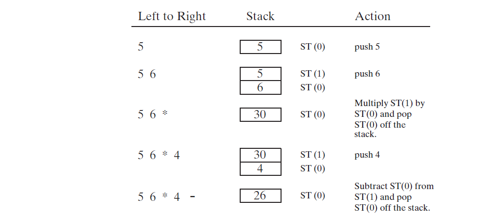

# Chapter 12 浮点数运算流程和指令编码

## 12.1 浮点数二进制表示
十进制浮点数包含三部分：符号位，有效数，以及指数。比如 -1.23154 * 10<sup>5</sup>，符号位是负数，有效位是1.23154，指数为5。

### 12.1.1 IEEE 二进制浮点数表示 
x86处理器使用三种IEEE组织定的754-1985标准浮点二进制储存方式来运算。下表为描述：

| 浮点类型                              | 描述                                                                                                                                                       |
| :------------------------------------ | :--------------------------------------------------------------------------------------------------------------------------------------------------------- |
| 单精度(Single Precision)              | 32bit: 1 bit 为符号位，8 bits 为指数，23 bits为有效位的小数部分。归一化范围为: 2<sup>-126</sup> 到 2<sup>127</sup>。通常也叫作短实数(short real)           |
| 双精度(Double Precision)              | 64bit：1 bit 为符号位，11 bits 为指数，52 bits为有效位的小数部分。归一化范围为：2<sup>-1022</sup> 到 2<sup>1023</sup>。通常也叫作长实数(long real)         |
| 双精度扩展(Double Extended Precision) | 80bit: 1 bit 为符号位，16 bits 为指数， 63 bits为有效位小数部分。归一化范围为： 2<sup>-16382</sup> 到 2<sup>16383</sup>。通常也叫作扩展实数(extended real) |

下图为单精度存储格式：


符号位为1，此数为负数，如果为0，此数为正数。

浮点数的表达式为：m * b <sup>e</sup>，m 称作有效位，或尾数；b是基数；e是指数。十进制数 123.154可以表示为如下：

> 123.154 = (1 x 10<sup>2</sup>) + (2 x 10<sup>1</sup> + (3 x 10<sup>0</sup>) + （1 x 10<sup>-1</sup>) + (5 x 10<sup>-2</sup>) + (4 x 10<sup>-3</sup>)

同样二进制数使用权重位置标记。浮点数 11.1011 表示如下：

> 11.1011 = (1 x 2<sup>1</sup>) + (1 x 2<sup>0</sup>) +(1 x 2<sup>-1</sup>) + (0 x 2<sup>-2</sup>) + (1 x 2<sup>-3</sup>) + (1 x 2<sup>-4</sup>)

### 12.1.2 指数
单精度指数存储为8-bit无符号整数以127为基准。指数真实值加127为存储值。比如二进制数 1.101 x 2<sup>5</sup>，真实指数为5，加上基数127后，基准指数132存储在指数位。

### 12.1.3 归一化二进制浮点数
任意二进制浮点数，移动小数点直到小数点左边有唯一"1"时，此数为归一化浮点数。

### 12.1.4 创建IEEE表示
符号位，指数，以及有效位是归一化编码，按照12-1小节所示内存布局即为IEEE浮点数。

IEEE 规范包含以下实数和非数编码：

* 正数和负数零
* 非归一化有限数 （当指数太小不能存储在指数位，需要舍去有效位来增加指数值）
* 归一化有限数 （浮点数的正常表现）
* 正和负无限数
* 非数值（NaN，Not a Number的简称），表示不存在的数，X86包含两种类型，安静型NaN进行大多数的算数操作不抛异常，信号型NaN会产生浮点数无效操作异常。
* 非定义数 （被浮点数单元(floating-point unit(FPU)）作为浮点数无效操作返回值

以下为特殊浮点数编码。对应位字母 x 表示可以是 1 或 0。QNaN 是安静型NaN，SNaN是信号型NaN。

|   值   |       符号位，指数，有效位       |
| :----: | :------------------------------: |
| 正数零 |  0 0000000 00000000000000000000  |
| 负数零 |  1 0000000 00000000000000000000  |
| 正无穷 |  0 1111111 00000000000000000000  |
| 负无穷 |  1 1111111 00000000000000000000  |
|  QNaN  | x 1111111 1xxxxxxxxxxxxxxxxxxxxx |
|  SNaN  | x 1111111 0xxxxxxxxxxxxxxxxxxxxx |

SNaN 有效位 x  第一位为零，其他位至少需要一个1。

### 12.1.5 将分数对应的小数数转为二进制实数
二进制将分子和分母转为二进制数，然后使用分子除以分母得到的结果为小数。

二进制实数转为十进制实数，步骤如下：

1. 符号位
2. 算指数位
3. 将有效位补上整数位1，然后小数点向右移动指数次
4. 将二进制转换为十进制


## 12.2 浮点数单元
Intel 8086 处理器被设计用来处理整数运算。这对于使用浮点运算的图形和运算密集型软件是个问题。通过软件模拟浮点运算是可行的，但性能损失很严重。类似于软件*AutoCad*需要更加强有力的方式来进行浮点数学运算。Intel推出了单独浮点协处理芯片**8087**，并且随着每代处理器一起升级。直到Intel 486的发布，浮点硬件集成到了主CPU被称作FPU。

###  12.2.1 FPU 寄存器栈
**FPU**没有使用通用寄存器(EAX,EBX,etc)。取而代之的，它有自己的一系列寄存器称作*寄存器栈(register stack)*。它将数值从内存加载到寄存器栈，执行运算，然后将栈上的值放回内存。**FPU**指令执行数学表达式使用*后缀(postfix)*格式。一般见到的表达式为*中缀(infix)*格式：`(5 * 6) + 4`。后缀表达式为：

> 5 6 * 5 +

中缀表达式 `(A+B)*C` 需要小括号来重写默认运算优先级。后缀表达式不需要。

#### 表达式栈
在执行后缀表达式的过程中，栈存储表达式的立即数。下图为执行`5 6 * 4 -` 的过程图。**ST(0)** 为栈指针当前指向的寄存器。



#### FPU 数据寄存器
**FPU**有八个独立地址80-bit数据寄存器编号为 R0 到 R7。合并到一起，称作*寄存器栈*。3-bit字段在 FPU 状态字(WORD)里来标记当前在栈顶端的寄存器编号。如下图所示，TOP的值为二进制 `011`，来标识R3为栈顶部。栈的顶部位置称作ST(0)，当写浮点指令时。最后一个寄存器为 ST(7)。


*push*操作(也称作*load*)将**TOP**的值减一同时将操作数拷贝到ST(0)寄存器。如果**TOP**的值为零在压入前，TOP回转到寄存器**R7**。*pop*操作(也称作*store*)将在**ST(0)**的值拷贝到一个操作数里，然后将TOP加一。如果在弹出之前**TOP**的值为7，则会转到寄存器**R0**。如果载入一个值到栈将已经在栈里存在的数据重写，*浮点异常(floating-point exception)*将会产生。下图为将 1.0 和 2.0压入栈中。


浮点数在寄存器里使用IEEE 10-byte 扩展实数格式。当FPU将运算结果放入到内存操作数时，它将结果转换为其中一种格式：整数，长整数，单精度浮点数，双精度浮点数，或者BCD。

###  12.2.2 边界(Rounding)
浮点目标操作数有效位是有限的，当浮点计算有效位结果长度大于目标操作数有效位长度时，FPU 有以下四种逼近方式：

* 向最近的偶数舍入：舍入结果最接近无限精确结果。如果两个值非常接近，最终结果以偶数为准（最后一位为零）
* 向下舍入方向 -&infin;：舍入结果小于或等于无限精确结果
* 向上舍入方向 +&infin;：舍入结果大于或等于无限精确结果
* 向零舍入（将要舍去的位截断）：舍入结果的绝对值小于或等于无限精确结果

**FPU**控制字包含两位称作**RC** 字段来标识那种舍入方法。字段值说明如下：

* 00 二进制：向最近的偶数舍入（默认）
* 01 二进制：向-&infin;方向舍入
* 10 二进制：向+&infin;方向舍入
* 11 二进制：向零舍入（截断）

*向最近的偶数舍入*是默认的舍入方法，此方法被认为是最精确以及被大多数程序实现的方式。

###  12.2.3 浮点数异常
每个程序里，都会发生错误，**FPU**需要处理这些状况。因此，它识别和侦测六种类型的异常条件：

* 无效操作(#I)
* 除零(#Z)
* 非归一化操作数(#D)
* 数值溢出(#O)
* 数值下溢(#U)
* 精度不准确(#P)

前三个（#I，#Z，#D）在运算前侦探。后面的三个（#0，#U，#P）在运算后侦探。

每个异常类型有相关的标记位和掩码位。当浮点异常被侦探时，处理器设置匹配的标记位。每个被处理器标记的位，将发生以下两种情况：

* 如果相关掩码位已设置，处理器自动处理异常并且程序继续运行
* 如果相关掩码位已清理，处理器调用软件异常句柄

处理器自动处理被大多数程序接受的异常。通用异常句柄可以被希望处理此类异常的应用所使用。单个指令可能触发多个异常，因此处理器保留自上次被清理后的所有异常。当系列运算完成后，可以检查是否有响应异常发生。

###  12.2.4 浮点数指令集
浮点指令集分类如下：

* 数据转移(Data transfer)
* 基础运算(Basic arithmetic)
* 比较(Comparison)
* 常数(Transcendental)
* 加载常量（只针对预定义常量）
* x87 FPU 控制
* x87 FPU 和 SIMD 状态管理

浮点指令名字以字母 F 开始用来和CPU指令做区别。第二个指令助记符字母(B或I)指示内存操作数如何解析：B 指示为BCD操作数，I 指示为二进制操作数。如果没有特别说明，内存操作默认为是实数格式。

浮点指令可以有零个，一个，或二个操作数。如果有两个操作值，其中一个必须是浮点寄存器。不可以使用立即数，但是预定义常量（比如 0.0，&pi;，log10）可以加载到栈。通用寄存器比如 **EAX,EBX,ECX,EDX**不能作为操作数（仅有的特例是 `FSTSW` 指令将FPU状态存入AX）。内存到内存的操作数不允许。

整数操作数必须从内存加载到FPU（不可以从CPU寄存器）。它们被自动转换为浮点格式。同样，从浮点数存储到整数内存操作数，值被自动舍去浮点数保存为整数。

#### 初始化(FINIT)
`FINIT` 指令初始化FPU。它将FPU的控制字(control word)设置为 037Fh，这导致所有浮点异常清除（masks），设置浮点舍去方式为最接近偶数，并且将计算精度设置为64bits。建议在程序开始时调用`FINIT`,来整理处理器初始状态。

#### 浮点数据类型
MASM支持的浮点数据类型如下表：

| 类型   | 使用描述                    |
| :----- | :-------------------------- |
| QWORD  | 64-bit整数                  |
| TBYTE  | 80-bit(10-byte)整数         |
| REAL4  | 32-bit(4-byte)IEEE 短实数   |
| REAL8  | 64-bit(8-byte)IEEE长实数    |
| REAL10 | 80-bit(10-byte)IEEE扩展实数 |

#### 加载浮点值
`FLD`(load floating-point value)指令将浮点操作数拷贝到FPU栈的顶部。操作数可以是32-bit，64-bit，或80-bit内存操作数。语法如下：

```asm
FLD m32fp
FLD m64fp
FLD m80fp
FLD ST(i)
```

`FILD`(load integer)指令将16-，32-，或64-bit 有符号整数源操作数转换为双精度浮点数并加载到ST(0)。源操作数符号位保持不变。

#### 加载常量
以下指令加载特殊常量到栈。它们没有操作数：

* `FLD1` 指令将1.0 压入寄存器栈
* `FLDL2T` 指令将log_2-10 压入寄存器栈
* `FLDL2E` 指令将1og_2-e 压入寄存器栈
* `FLDPI` 指令将&pi;压入寄存器栈
* `FLDLG2` 指令将log_10-2 压入寄存器栈
* `FLDLN2` 指令将log_e-2 压入寄存器栈
* `FLDZ`(load zeor)指令将 0.0压入寄存器栈

####存储浮点值

`FST`(store floating-point value)指令将来自己FPU栈顶的浮点操作数拷贝到内存。`FST`支持的内存操作数类型和`FLD`一致。

`FSTP`(store floating-point value and pop)指令拷贝**ST(0)**的值到内存，并且从栈上弹出(pops)**ST(0)**。

###  12.2.5 算数运算指令
运算指令支持的操作数类型和FLD(load)以及FST(store)一致。因此操作数可以是：简介，索引，基础-索引，以及它方式操作数。简单说明如下表：

| 指令类型   |       具体用途 | 指令  | 操作数                           | 描述                                                      |
| :--------- | -------------: | :---: | :------------------------------- | :-------------------------------------------------------- |
| 修改符号位 |     转换符号位 | FCHS  | 无操作数                         | 反转存储在ST(0)的浮点数符号位                             |
|            |     清除符号位 | FABS  | 无操作数                         | 清除ST(0)符号位，取绝对值                                 |
| 加法       |       浮点加法 | FADD  | 无操作数/寄存器操作数/内存操作数 | ST(0)加到ST(1)并弹出ST(0)/目标加到源/内存操作数加到ST(0)  |
|            |       浮点加法 | FADDP | FADD ST(i),ST(0)                 | 加法完成后，弹出ST(0)                                     |
|            | 整数和浮点加法 | FIADD | m16int/m32int                    | 在加法执行之前，将整数转换双精度扩展格式，然后和ST(0)相加 |
| 减法       |       浮点减法 | FSUB  | 无操作数/寄存器操作数/内存操作数 | ST(1)减去ST(0)并弹出ST(0)/目标减去源/内存操作数减去ST(0)  |
|            |       浮点减法 | FSUBP | FSUB ST(i),ST(0)                 | 减法完成后，弹出ST(0)                                     |
|            | 整数和浮点减法 | FISUB | m16int/m32int                    | 在减法执行之前，将整数转换双精度扩展格式，然后和ST(0)相减 |
| 乘法       |       浮点乘法 | FMUL  | 无操作数/寄存器操作数/内存操作数 | ST(0)乘ST(1)并弹出ST(0)/目标乘源/内存操作数乘ST(0)        |
|            |       浮点乘法 | FMULP | FMUL ST(i),ST(0)                 | 乘法完成后，弹出ST(0)                                     |
|            | 整数和浮点相乘 | FIMUL | m16int/m32int                    | 在乘法执行之前，将整数转换双精度扩展格式，然后和ST(0)相乘 |
| 除法       |       浮点除法 | FDIV  | 无操作数/寄存器操作数/内存操作数 | ST(1)除ST(0)并弹出ST(0)/目标除源/内存操作数除ST(0)        |
|            |       浮点除法 | FDIVP | FDIV ST(i),ST(0)                 | 除法完成，弹出ST(0)                                       |
|            | 整数和浮点除法 | FIDIV | m16int/m32int                    | 在除法执行之前，将整数转换双精度扩展格式，然后和ST(0)相除 |

###  12.2.6 浮点数比较
浮点值不能使用`CMP`指令来比较-因为整数通过减法来实现比较。替而代之的是浮点数比较使用`FCOM`指令。当`FCOM`执行完后，在执行条件跳转前还需要完成其他步骤。

FPU 有三个条件标志量：C3，C2，以及C0，分别对应标志量：Zero, Parity, 以及 Carry 标志量。对应流程如下：

* 执行FPU比较指令
* 使用 `FNSTSW`指令将 FPU 状态量字移入到寄存器 AX
* 使用 `SAHF` 指令将AH内容拷贝到 EFLAGS 寄存器
* 再使用跳转语句

Intel's P6 家族引入了 `FCOMI` 指令，它直接比较ST(0)和其他ST(i)的值，然后设置标志量。

#### 相等比较
浮点数的比较需要看自己的精确位数，通过自己需要的精确值取一个极小值来和两个浮点数差的绝对值来比较。

###  12.2.7 读和写浮点数
本书包含以下几个使用函数：

```asm
; 从键盘读取浮点数，并压入浮点栈
; ReadFloat

; 将浮点栈顶端ST(0)写入到控制窗口，使用指数的格式
; WriteFloat

; 展示FPU栈
; ShowFpuStack
```
[例子程序](floatTest32.asm)

###  12.2.8 异常同步
CPU和FPU是独立的单元，因此他们是并行运行的。当FPU抛出异常时，如果下一个指令不是浮点单元运算指令，或调用`FWAIT`指令，而是调用CPU指令，则会导致FPU的抛出的异常不能触发异常函数，而被忽略掉。

###  12.2.9 代码例子
这小节的内容为使用浮点运算指令实现几个简单代码例子。

#### 表达式例子
```asm
; 表达式 valD = -valA + (valB * valC)
.data
valA REAL8 1.5
valB REAL8 2.5
valC REAL8 3.0
valD REAL8 ?

.code
fld valA                    ; ST(0) = valA
fchs                        ; change sign of ST(0)
fld valB                    ; load valB to ST(0) and ST(1) = valA
fmul valC                   ; ST(0) = ST(0) * valC
fadd                        ; ST(0) = ST(0) + ST(1)
fstp valD                   ; valD = ST(0)
```

#### 数组之和
```asm
ARRAY_SIZE = 20
.data
sngArray REAL8 ARRAY_SIZE DUP(?)

.code
    mov esi, 0
    fldz                                ; load zero to ST(0)
    mov ecx, ARRAY_SIZE
L1:
    fld sngArray[esi]                   ; load mem into ST(0)
    fadd                                ; add ST(0), ST(1), pop
    add esi, type REAL8                 ; move to next element
    loop L1

    call WriteFloat                     ; display sum of array
```

#### 平方根之和
```asm
.data
valA REAL8 25.0
valB REAL8 36.0

.code
fld valA                                ; push valA
fsqrt                                   ; ST(0) = sqrt(valA)
fld valB                                ; push valB
fsqrt                                   ; ST(0) = sqrt(valB)
fadd                                    ; add ST(0), ST(1)
```
###  12.2.10 混合模式运算
CPU的指令不能正确执行浮点数，所以如果整数和浮点混合运算的方式是将整数加载到FPU然后运算。

###  12.2.11 掩码和未掩码异常
异常所对应的控制字默认是掩码状态，因此当浮点异常产生后，处理器会对运算结果赋值一个默认值然后继续运行。如果异常控制位是未掩码状态，将会调用异常函数。

FPU控制字位描述如下：

| 控制位 | 描述               |
| :----: | :----------------- |
|   0    | 无效操作异常       |
|   1    | 未归一化操作数异常 |
|   2    | 除零异常           |
|   3    | 溢出异常           |
|   4    | 下溢异常           |
|   5    | 精度异常           |
|  8-9   | 精度控制           |
| 10-11  | 舍入控制           |
|   12   | 无穷控制           |

FPU 字使用 `FSTCW` 和 `FLDCW` 两个指令来控制。以下为打开和关闭除零异常掩码位。

```asm
.data
ctrlWord WORD ?

.code
; unmask
fstcw ctrlWord                      ; get the control word
and ctrlWord, 11111111111011b;      ; unmask divide by zero
fldcw ctrlWord                      ; load it back into FPU

; mask
or ctrlWord, 100b
fldcw ctrWord
```
## 12.3 x86 指令编码
要完全理解汇编语言操作代码和操作值，你需要花费大量的时间探寻汇编指令转换为机器语言。这个主题非常复杂，因为Intel指令集有非常丰富的指令以及地址模式。

Intel 8086 处理器是第一个使用复杂指令集(*Complex Instruction Set Computer-CISC*)的设计。指令集包含丰富的内存寻址，位移，运算，数据转移，以及逻辑操作。相比精简指令(*Reduced Instruction Set Computer-RISC*)，Intel指令使用了非常多技巧来编码和解码。编码指令意味着将汇编语言指令和操作数转换为机器码。解码指令意味着将机器码转换为汇编语言。

### 12.3.1 指令格式
通用x86机器指令格式包含指令前缀byte，操作码，Mod R/M byte，扩展索引byte(scale index byte-SIB)，地址偏移，以及立即数。指令以小端方式存储，因此前缀byte存储在指令的开始地址。每个指令有一个操作码，但是剩余的字段是缺省的。


说明如下：

* **instruction prefex** 重写默认操作数大小
* **opcode** 标明可变的指令。ADD 指令有九种操作码，依赖不同的参数类型使用
* **Mod R/M** 字段标明地址模式和操作值。标记 **"R/M"**代表*寄存器* 和 *模式*。
* **scale index byte(SIB)** 用来计算数组索引偏移量
* **address displacement** 字段存储操作值的偏移量，或者用来当做间接寻址的偏移量
* **immediate data** 字段存储常量

### 12.3.2 单字节指令
最简单指令类型没有操作值或隐性操作值。这类指令只需要操作值字段，它们的值被处理器指令集提前侦测。

### 12.3.3 立即数移入寄存器
立即数(常量)以小端的方式加在指令后面。由于内存寻址模式非常复杂，首先来看将立即数移入到寄存器。将立即数移入到寄存器使用的`MOV`指令编码为**B8 +rw dw**，操作byte码为：**B8 +r8**，寄存器编号(0到7)加到**B8**。*dw*是立即操作数，低字节在前。下表为寄存器编号表：

| 寄存器 | 编码  |
| :----: | :---: |
| AX/AL  |   0   |
| CX/CL  |   1   |
| DX/DL  |   2   |
| BX/BL  |   3   |
| SP/AH  |   4   |
| BP/CH  |   5   |
| SI/DH  |   6   |
| DI/BH  |   7   |

以下为几个例子，里面用的数全为16进制

*PUSH CX* 机器码为 **51**。编码步骤如下：

1. **PUSH** 使用 16-bit的寄存器操作码为 **50**
2. 寄存器**CX**的编号为 1， 因此 1 加 50的操作码为 **51**

*MOV AX, 1* 16进制机器指令为 **B8 01 00**。编码步骤如下：

1. 将立即数移入到16-bit寄存器的操作码为 **B8**
2. 寄存器**AX**的编号为 0， 因此 0 被加到 **B8**
3. 立即数(0001)被以小端方式(01,00)连接到指令后面

*MOV BX, 1234h* 16进制机器指令为 **BB 34 12**。编码步骤如下：

1. 将立即数移入到16-bit寄存器的操作码为 **B8**
2. 寄存器**BX**的编号为 3， 因此 3 被加到 **B8** 结果为 **BB**
3. 立即数被以小端方式(34,12)连接到指令后面

### 12.3.4 寄存器-模式 指令
使用寄存器操作数的指令，Mod R/M 字节包含3-bit来标识寄存器操作值。选择8-bit或16-bit寄存器通过操作字段的第零位来标识：1 指示为 16-bit 寄存器， 0 指示为 8-bit 寄存器。下表为寄存器在R/M字段的编号：

|  R/M  |  寄存器  |  R/M  |  寄存器  |
| :---: | :------: | :---: | :------: |
|  000  | AX or AL |  100  | SP or AH |
|  001  | AX or AL |  101  | SP or AH |
|  010  | AX or AL |  110  | SP or AH |
|  011  | AX or AL |  111  | SP or AH |

例如，指令 `MOV AX, BX` 的机器码是**8B C3**。Intel 将16-bit寄存器移动到其他操作值的编码是 **8B/r**， /r 代表跟随在操作码后面 Mod R/M 字节。MOD R/M 自己有三个字段(mod,reg,r/m)组成。Mod R/M 值为 C3，有以下几个字段构成：

|  mod  |  reg  |  r/m  |
| :---: | :---: | :---: |
|  11   |  000  |  011  |

* 6到7位是*mod*字段，标识地址模式，mod 字段为11，指示 r/m 字段包含的为寄存器编号
* 3到5位是*reg*字段，标识目标操作值
* 0到2位是*r/m*字段，标志源操作值

> 这里书中是写反的

### 12.3.5 处理器依据操作数尺寸添加指令前缀
当 8088/8086指令被创建时，几乎所有256种操作码被用来处理8和16 位操作数。当Intel引入 32-bit处理器，他们不得不寻找一种方式发明新的操作码来处理32-bit操作数，并且还要兼容老的处理器。目标为16-bit处理器的程序，他们为使用32-bit操作数的指令添加了一字节的前缀。当程序发布目标为32-bit的处理器，32-bit的操作值是默认的，因此前缀字节加到使用16-bit操作数的指令。8-bit操作数不需要前缀。

以下为发布到16位处理器的代码：

```asm
.model small
.286
.stack 100h
.code
main PROC
    mov ax, dx          ; 8B C2
    mov al, dl          ; 8A C2
```
以下为发布到32位处理器的代码：

```asm
.model small
.386
.stack 100h
.code
main PROC
    mov eax, edx       ; 8B C2
    mov ax, dx         ; 66 8B C2
    mov al, dl         ; 8A C2
```