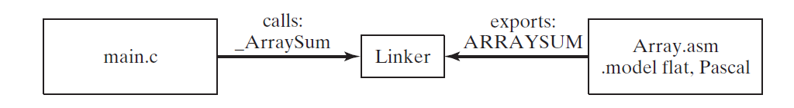

# Chapter13 高级语言接口

## 13.1 介绍
汇编语言开发效率低，但是运行效率高，占用空间小。高级语言开发效率高，但是会隐藏很多细节。因此在效率有特殊要求的地方，可以使用汇编实现。

### 13.1.1 通用规则
当从高级语言里调用汇编语言需要考虑以下几个问题：

1. *命名规则(naming convention)*，涉及到变量和函数名字规则。比如，汇编器或编译器是否会修改在目标文件里的变量名，如果改变，如何改变。
2. 段名字必须和这些要调用汇编语言的高级语言兼容
3. 程序使用的内存模型(tiny, small, compact, medium, large, huge, or flat)决定着段尺寸(16 or 32 bits)，以及调用和引用远近(相同的段为近，不同的段为远)。

*调用规则(calling convention)* 和函数如何被调用的底层细节相关，细节如下：

* 哪在调用函数时，些寄存器必须保留
* 函数传递参数的方法：寄存器，栈，共享内存，或其他方式
* 调用函数所用的参数排列顺序
* 参数传递值或引用
* 函数调用后栈指针是如何恢复的
* 函数如何将返回值返回到调用程序

*名字规则和外部标识*，当从别的语言写的程序里调用汇编语言函数，外部标识符必须有匹配的命名规则。外部标识符是生成在程序模块对象文件的名字，这种规则可以使链接器在其他程序模块里找到对应的名字。

比如，假设C程序 *Main.c* 调用外部函数 `ArraySum`。C编译器自动保留大小写并且在开头加下划线去索引外部名字，最终名字为: `_ArraySum`。*Array.asm* 模块，用汇编语言编写，导出的`ArraySum`函数名字为`ARRAYSUM`，因为模块在 .MODEL 指令中使用 Pascal 语言选项。这样链接器在链接时会失败。



在汇编语言模块，可以通过在`.MODEL`指令里选择相应来语言来控制大小写。

*段名字*，当链接汇编语言函数到用高级语言编写的程序里，段名字必须一致。本章节，将使用微软简化段指令 `.CODE, .STACk, and .DATA` 因为它们和 Microsoft C++编译器生成的段名字一致。

*内存模型*，调用程序和被调用函数必须使用相同的内存模型。在实地址模式，通常可以选择`samll, medium, compact, large, huge`。在保护模式下，必须选择使用 `flat`模式。

### 13.1.2 .MODEL 指令
在16-bit 和 32-bit模式下，MASM使用 .MODEL 指令来确定程序几项重要特征：

* 内存模型类型
* 函数名字范式
* 参数传递规则

`.MODEL` 指令语法如下：

> .MODEL memorymodel [,modeloptions]

内存模型描述如下：

| 模型(Model) | 描述                                                                                     |
| :---------- | :--------------------------------------------------------------------------------------- |
| Tiny        | 独立段，包含代码和数据。这种模型被有 .com 文件类型使用。                                 |
| Small       | 一个代码段，一个数据段。代码和数据距离近，默认情况下                                     |
| Medium      | 多个代码段和一个数据段                                                                   |
| Compact     | 一个代码段和多个数据段                                                                   |
| Large       | 多个代码和数据段                                                                         |
| Huge        | 和Large一样，除了独立数据items也许比单个段的大                                           |
| Flat        | 保护模式。代码和数据使用32-bit步长。所有数据和代码(保护系统资源)全部在一个单独的32-bit段 |

*模型选项*，在`.MODEL`指令中的选项字段可以包含指定语言和栈距离。指定语言决定了函数调用规则以及公共符号的命名规则。栈距离可以是 **NEARSTACK**(默认) 或 **FARSTACK**。

*语言选项*，在`.MODEL`指令中有许多不同指定语言，一些几乎不用(BASIC,FORTRAN,PASCAL)。另一方面，C 和 STDCALL使用很广。以下为使用例子：

> .model flat, C  
> .model flat, STDCALL

**STDCALL* 为调用 Windows 系统函数是指定的语言。

#### STDCALL
*STDCALL*指定语言导致程序参数以反向顺序(从最后一个到第一个)压入栈。
```asm
; AddTwo(5, 6)
push 6
push 5
call AddTow
```

另外一个重要规则是`STDCALL`需要为`RET`指令提供常量。当返回地址弹出之后，常量被加到 ESP。通过此种方式来清理传递给函数的参数占用的栈空间。
```asm
AddTwo PROC
    push ebp
    mov ebp, esp
    mov eax, [ebp + 12]
    add eax, [ebp + 8]
    pop ebp
    ret 8
AddTwo ENDP
```

最后，STDCALL 修改导出(public)函数名字为以下格式：

> _name@nn

开头为下划线，一个整数跟在@标记符后来标识函数参数使用的字节(4的整数倍)。

#### C
C 语言要求函数参数从最后一个到第一个压入栈，和 STDCALL 一致。在调用函数结束后，如何移除栈上的参数，C 语言将责任交到调用者。在调用函数后，常量加到ESP上，以此来重置到参数压入前的值。

```asm
push 6
push 5
call AddTwo
add esp, 8
```

C 语言在导出外部函数时，在函数名字前加下划线。

> _AddTwo
### 13.1.3 检验编译器生成代码
通过C++代码，来看编译器生成的汇编代码。

```C++
int sum_array(int arr[], int size)
{
    int sum = 0;
    for(int i = 0; i < size; ++i)
    {
        sum += arr[i];
    }
    return  sum;
}
```

汇编代码如下：

```asm
; Listing generated by Microsoft (R) Optimizing Compiler Version 19.21.27702.2 

; Function compile flags: /Odtp
_sum$ = -8 ; size = 4
_i$1 = -4 ; size = 4
_arr$ = 8 ; size = 4
_size$ = 12 ; size = 4
?sum_array@@YAHQAHH@Z PROC ; sum_array
; File C:\Users\ContainerAdministrator\AppData\Local\Temp\compiler-explorer-compiler119624-12084-1tyy23h.7uj7\example.cpp
; Line 3
  push ebp
  mov ebp, esp
  sub esp, 8
; Line 4
  mov DWORD PTR _sum$[ebp], 0
; Line 5
  mov DWORD PTR _i$1[ebp], 0
  jmp SHORT $LN4@sum_array
$LN2@sum_array:
  mov eax, DWORD PTR _i$1[ebp]
  add eax, 1
  mov DWORD PTR _i$1[ebp], eax
$LN4@sum_array:
  mov ecx, DWORD PTR _i$1[ebp]
  cmp ecx, DWORD PTR _size$[ebp]
  jge SHORT $LN3@sum_array
; Line 7
  mov edx, DWORD PTR _i$1[ebp]
  mov eax, DWORD PTR _arr$[ebp]
  mov ecx, DWORD PTR _sum$[ebp]
  add ecx, DWORD PTR [eax+edx*4]
  mov DWORD PTR _sum$[ebp], ecx
; Line 8
  jmp SHORT $LN2@sum_array
$LN3@sum_array:
; Line 9
  mov eax, DWORD PTR _sum$[ebp]
; Line 10
  mov esp, ebp
  pop ebp
  ret 0
?sum_array@@YAHQAHH@Z ENDP ; sum_array
```
## 13.2 内联汇编代码
### 13.2.1 在 Visual C++ 里的 __asm 指令
*内联汇编代码(Inline assembly code)* 是直接将汇编代码嵌入到高级语言中。大多数 C 和 C++ 编译器支持这项特性。

这部分，展示如何为运行在32-bit保护模式下使用flat内存模型的 Microsoft Visual C++ 写内联汇编代码。其他高级语言编译器支持内联汇编代码，但是语法不一样。

内联汇编代码是写外部汇编模块的直接替代方法。主要优点是写内联代码很简单因为没有外部链接问题，名字问题，以及不用担心参数传递协议。

主要缺点是使用内联汇编代码缺乏移植性。当高级语言必须为多个不通平台编译时，这是个问题。内联汇编代码运行在Intel Pentium 处理器但不能运行在RISC 处理器上。某些场景下，可以通过在代码里插入条件宏语句来控制不同版本的函数运行在不同的目标系统来解决问题。很容易发现，维护依然是个问题。但是通过外部汇编语言链接库，通过替换为不同平台设计的库相对容易。

#### __ASM 指令
在Visual C++， **_asm** 指令可以放在单个语句前，或可以标记为汇编语句块的开始(汇编块)。语法如下：

```C++
__asm statement

__asm {
    statement-1
    statement-2
    ...
    statement-n
}
```

#### 注释
注释可以添加在任意语句后面，可以使用汇编语言语法或 C/C++语法。Visual C++ 建议不要使用汇编风格注释，因为可能会和 C 语言宏交互，其可能会在逻辑行展开。

#### 特性
当写内联汇编时，可以用到的汇编语言特性如下：

* 可以使用大多数 x86 指令集
*  使用寄存器当做操作数
*  通过变量引用函数参数
*  引用 *asm* 代码块外部的代码标签和变量。(这非常重要，因为局部变量必须申明在asm代码块外)
*  不仅可使用汇编风格的数字字符，也可使用 C 语言风格标记。例如， 0A26h 和 0xA26 是等价的。
*  在例如 `inc BYTE PTR[esi]` 语句里使用 **PTR** 
*  使用 `EVEN` 和 `ALIGN` 指令

#### 限制
在写内联汇编时，不可以做如下事情：

* 使用数据定义指令，例如 DB(BYTE) 和 DW(WORD)
* 使用汇编操作符 (除了 PTR)
* 使用 `STRUCT, RECORD, WIDTH, MASK`
* 使用 宏指令，包括 `MACRO, REPT, IRC, IRP, ENDM`，或宏操作符 (<>, !, &, $, .TYPE)
* 通过名字引用段

#### 寄存器值
不可以使用任何在汇编块开始的寄存器值。寄存器也许已经在汇编块执行之前别使用过了。`__fastcall` 关键字在 Microsoft Visual C++ 导致编译器使用寄存器传递参数。为了避免寄存器冲突，不要一起使用 `__fastcall` 和 `__asm`。

通常，你可以修改 `EAX, EBX, ECX, EDX` 在你的内联代码因为编译器不期望这些值在语句之间保留。如果你修改太多的寄存器，将导致编译器无法全面优化同一个函数里的C++代码，因为优化需要使用寄存器。

尽管你不可使用 `OFFSET` 操作符，你可以通过 `LEA` 指令获取变量步长。

#### Length, Type, Size
在内联汇编中可以使用`LENGTH,SIZE,TYPE`这些操作符。`LENGTH`操作符返回数组里元素数量。`TYPE`操作符根据目标对象返回如下：

* C 或 C++ 类型占用的字节数
* 结构体占用的字节数
* 对于数组，单个元素占用的字节数

`SIZE` 操作符返回 `LENGTH * TYPE`。

### 13.2.2 文件加密例子
通过例子代码，来学习两个方面：

1. 练习汇编内联代码使用方式
2. 通过汇编代码了解调用函数的开销

[加密代码](encode.cpp)

## 13.3 链接32-bit 汇编语言到 C/C++
写驱动和嵌入式系统代码的程序员经常需要将C/C++模块和用汇编语言写的代码组合在一起。汇编语言非常擅长直接访问硬件，bit mapping，以及访问底层寄存器和 CPU 状态变量。用汇编语言实现一个应用非常的枯燥无味，但是使用C/C++写应用程序的主要部分，在使用汇编语言编写用 C 语言编写起来笨拙的部分将非常有用。下面讨论从32-bit C/C++ 程序调用汇编代码的标准要求。

C/C++程序从右到左传递参数，这就是参数在参数列表的顺序。当函数返回时，调用程序负责重置栈到之前的状态。通过在堆栈指针加所有参数对应的长度值，或者弹出对应数量的参数可以达到同样的效果。

在汇编语言代码里，你需要在 `.MODEL`指令里指定 C 调用规则并且为每一个要在C/C++里调用的函数创建原型。例子如下：

```asm
.586
.model flat, C
IndexOf PROTO, srchVal:DWORD, arrayPtr:PTR DWORD, count:DWORD
```

在 C 程序里，使用 `extern`标记符来申明一个外部的汇编语言函数。以下为如何申明 `IndexOf` :
```C
extern long IndexOf(long n, long array[], unsigned count);
```

如果函数将在 C++ 程序里调用，添加 "C" 标记符来防止C++ 名字装饰(decoration)：
```C++
extern "C" int IndexOf(long n, long array[], unsigned count);
```

*名字装饰(Name decoration)* 是标准 C++ 编译器技术，通过添加在函数名字后额外字符来标识每个函数参数的确切类型。支持函数重载的语言都需要这项技术。从汇编语言程序员的角度，程序使用装饰名字，C++ 编译器在最终生成可执行文件时，通知链接器查找装饰名字而不是源名字。
### 13.3.1 IndexOf 例子
随机一组数，然后让用户输入一个数去数组里查找，其中搜索数函数用汇编来实现。

[C++ 代码](test.asm.cc)

[汇编代码](indexOf.asm)

### 13.3.2 调用C和C++函数
汇编程序里也可以调用 C/C++ 函数。这里有两个理由做这件事：

* C/C++的输入输出更加灵活，因为它们丰富的输入输出库。当处理浮点数的时候非常有用。
* 两个语言都有扩展数学库

当调用标准 C/C++ 库函数的时候，必须从 C/C++的 main 函数开始，这样使得库初始化代码得以运行。

#### 函数原型
C++ 函数在汇编代码里调用，必须使用 "C" 和 extern 关键字，语法如下：

```C++
/*
extern "C" funcName(paramlist)
{
  ...
}
*/

extern "C" int askForInteger()
{
  cout << "Please enter an integer:";
}

// 也可将多个函数原型放到块里

extern "C" {
  int askForInteger();
  int showInt(int value, unsigned outWidth);
}
```

#### 汇编语言模块
如果你的汇编语言模块将从 Irvine32 链接库调用函数，它使用 `.MODEL` 指令如下：

> .model flat, STDCALL

尽管 `STDCALL` 和 Win32 API向兼容，但和使用 C 语言的调用规则不匹配。因此，你必须为 `PROTO` 指令添加 C 标记，以下为申明外部要被汇编语言模块调用的 C/C++ 函数：

```asm
INCLUDE Irvine32.inc
askForInteger PROTO C
showInt PROTO C, value:SDWORD, outWidth:DWORD
```

C 语言标记是必须的，因为链接器必须匹配 C++ 模块导出的函数对应的函数名和参数列表。同时，汇编器必须生成正确的代码来清理函数调用后的栈。

被C++程序调用的汇编语言函数也必须添加 C 标记，这样汇编器产生的名字链接器才能识别到。

使用 `.MODEL` 指令可以全局改变函数的调用方式。比如：

```asm
.586
.model flat, C
```

#### 函数返回值
C++ 语言说明书里没有讲关于代码实现细节，因此这里没有 C/C++ 函数的标准返回值实现方式。当你写汇编代码调用对应语言的函数时，查询编译器文档来找到函数如何返回值。以下为几种可能:

* 整数可以被返回到单个寄存器或组合寄存器
* 调用程序可以保留返回值的空间，函数在返回前可以将返回值插入栈
* 浮点数通常在函数返回前被压入浮点数栈

下面是 Microsoft Visual C++ 函数返回值：

* `bool` 和 `char` 值返回到 AL
* `short int` 值返回到 AX
* `int` 和 `long int` 值返回到 EAX
* 指针返回到 EAX
* `float, double, long double` 值压入浮点栈


### 13.3.3 乘法表例子
示例代码展示了如何在C++里申明，定义汇编语言调用的函数，以及要调用的汇编函数。汇编代码里如何申明C++函数，以及定义C++要调用的函数。

[C++ 代码](multipication.cc)

[汇编 代码](multipication_asm.asm)

命令行编译语法如下：

> ml /c /I E:\git\Irvine multiplication_asm.asm  
> cl multiplication.cc multiplication_asm.obj E:\git\Irvine\Irvine32.lib E:\git\Irvine\User32.Lib E:\git\Irvine\Kernel32.Lib

其中 `E:\git\Irvine` 为本书自带的代码目录。

### 13.3.4 调用C库函数
C语言有标准函数集合称作 *标准 C 语言库(Standard C Library)*。同样的函数也存在于 C++ 程序，因此汇编语言模块可以绑定 C/C++ 程序。汇编语言模块必须包含每个用到的 C 函数原型。可以通过访问C++ 编译器的帮助系统找到 C 函数的原型。在调用之前，必须将 C 函数原型转换到汇编语言原型。

以下为 C/C++ 语言 `printf` 函数的原型：

```C++
int printf(const char *format [, argument]...);
```

转换到汇编语言原型如下：

```asm
printf PROTO C, pString:PTR BYTE, args:VARARG
```

下面为示例程序：

[C++ 代码](main.cc)

[汇编 代码](asmMain.asm)

