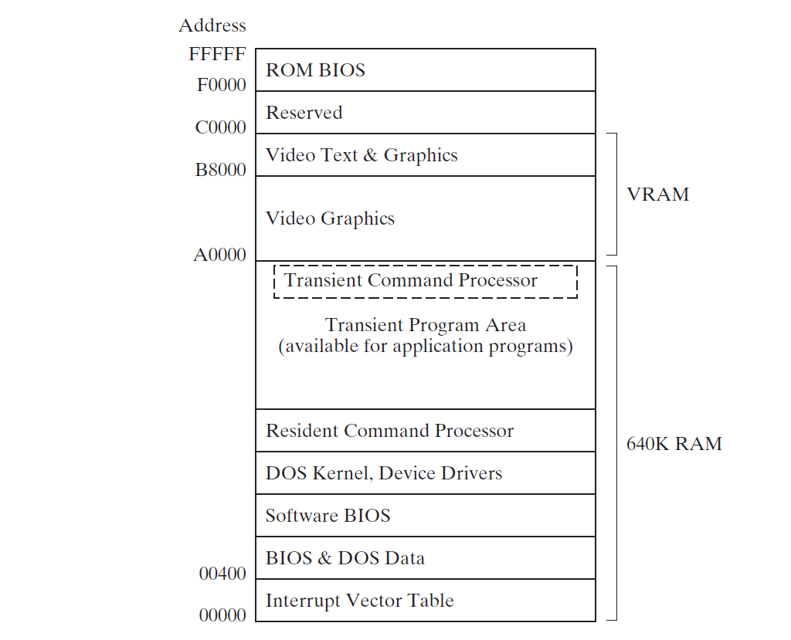
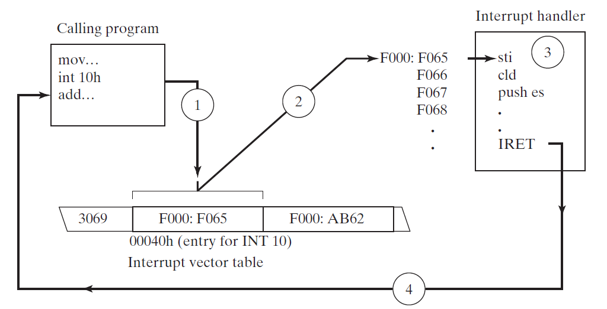

# Chapter14 16位 MS-DOS 编程

## 14.1 MS-DOS 和 IBM-PC
IBM's PC-DOS 是首个在 IMB 个人电脑上实现 real-address 模式的操作系统，使用 Intel 8088 处理器。后来进化到 Microsoft MS-DOS。由于这段历史，所以使用 MS-DOS环境来学习 real-addres 模式编程。Real-address 模式也称作 *16-bit 模式*，因为地址是通过 16-bit 值构建的。

本章，将学习到 MS-DOS 基本内存组织，如何激活 MS-DOS 函数调用(中断)，以及如何在操作系统级别演练基本输入/输出操作。所有的程序运行在 real-address 模式因为它们使用 `INT` 指令。中断原本被设计运行在 MS-DOS real-address 模式。在保护模式下也可以调用中断，但是这种技术超出了本书的范围。

Real-address 模式程序有以下几个特点：

* 仅有 1M 的地址空间内存
* 单个会话只能运行一个程序(单任务)
* 无内存边界保护，因此任意程序可以覆盖操作系统使用的内存
* 步长是 16 bits

当 IBM-PC 首次上市，因为它合理的价格，以及可以运行 Lotus 1-2-3，可以运行电子表格程序容易被企业接受。计算机爱好者非常喜欢 PC， 因为这是学习计算机工作原理的理想工具。

### 14.1.1 内存组织
下图为内存布局图：



在 real-address模式，内存最低的640k被操作系统和应用程序使用。接下来是显存和为硬件控制器保留的内存。最终 F0000 到 FFFFF 为系统**ROM**(read-only memory)。在操作系统区域内的内存，最低的 1024 字节内存(地址为：00000 到 003FF) 包含32-bit地址表，叫做 *中断向量表(interrupt vector table)*。这些条目称作 *中断向量(interrupt vectors)*，当处理硬件或软件中断时，被 CPU 使用。

在向量表的上面是 **BIOS** 和 **MS-DOS** 数据区域。接下来是 *software* **BIOS**，这里包含了控制大多数 I/O 设备的函数，包括键盘，硬盘，显示器，端口，打印机端口。 **BIOS**程序从MS-DOS 系统盘里的隐藏文件加载。MS-DOS内核是程序的合集(称作服务)，也是从系统盘文件加载。

MS-DOS 内核是文件缓存和可安装系统驱动组成。接下来的最高内存，常驻部分是 *命令处理器(command processor)* 从叫做 *command.com* 的可执行文件加载。命令处理器处理输入MS-DOS提示界面的命令，以及加载执行存在硬盘上的可执行程序。命令处理器的第二部分在内存地址 A0000 的下面。

应用程序可以被加载到持久命令处理器上面的第一个内存地址并且使用从此直至 9FFFF的地址。如果当前运行的程序覆盖了零时命令处理器区域，当程序退出时，零时处理器将被从启动盘加载回去。

在 IBM-PC 的显存区域(VRAM)从 A0000开始，当视频适配器转换到图形模式。当视频在彩色文字模式下，B8000 内存地址记录所有在显示器保存的文本。屏幕是内存-地图映射，因此在屏幕上的每一行和列对应到内存里的16-bit字。当一个字符拷贝到显存里，字符立马出现在屏幕上。

*ROM BIOS*，在内存地址范围：F0000 到 FFFFF，是操作系统的重要部分。它包含系统诊断和软件配置，以及被应用程序使用的底层输入/输出。 *BIOS* 存储在系统主板里的静态内存芯片里。大多数系统遵循IBM源BIOS的标准规则并且使用 BIOS 从 00400到004FF的数据区域。

### 14.1.2 重定向 Input-Output
当从命令提示符控制台运行程序时，可以重定向标准输入，从而从文件或硬件端口而不是键盘输入。标准输出也可以重定向到文件，打印机，或其他I/O设备。没有这种功能，程序将不得不通过修改程序来改变输入/输出。

使用管道(pipe) (|) 符号来拷贝程序的输出到其他程序的输入，以下为将 `DIR`命令输出拷贝到 `sort`的输入：

> dir | sort

### 14.1.3 软件中断
*软件中断(software interrupt)* 是调用操作系统程序的方式。大多数程序，称作 *中断句柄(interrupt handlers)*，为程序提供输入/输出功能。为如下任务提供功能：

* 显示字符和字符串
* 从键盘读取字符和字符串
* 显示彩色文本
* 打开和关闭文件
* 从文件读取数据
* 向文件写入数据
* 设置和读取系统时间和日期

### 14.1.4 INT 指令
`INT` *(call to interrupt procedure)* 指令调用系统子例程也称作中断句柄 *interrupt handler*。在`INT` 指令执行之前，一个或多个参数必须放入寄存器。然后，一个标识对应函数的数字移入`AH`寄存器。根据此函数，其他值也可能通过寄存器传入到中断函数里。语法如下：

> INT number

*number* 是一个在 0 到 FF 十六进制范围内的数。

#### Interrupt Vectoring
CPU使用中断向量表来处理`INT`指令，此表为内存最低1024bytes的区域。每个在表里的条目为32-bit 段-步长(segment-offset)指向中断函数的地址。每个机器的中断向量表各不相同。下图为中断调用流程图：



* Step 1:`INT`指令的操作值乘以4来定位机器中断向量表条目
* Step 2:CPU 将标志量，32-bit 段/步长，返回地址压入栈，禁用硬件中断，并执行存储在中断向量表(10h*4)指向的地址(F000:F065)的中断程序
* Step 3:在F000:F065上程序只到执行到 `IRET`指令
* Step 4:`IRET`指令弹出栈上的标志量和返回地址，导致处理器恢复执行 `INT 10h` 下面的指令

#### 通用中断
在**BIOS** 或 **DOS** 软件中断调用*中断服务例程-interrupt service routines(ISRs)* 。常用中断如下：

* `INT 10h` 显示服务。控制光标位置，彩色文本，滚动屏幕，显示视频图形
* `INT 16h` 键盘服务。读取键盘和检查状态
* `INT 17h` 打印服务。初始化，打印，返回打印机状态
* `INT 1Ah` 当天时间。获取自从电脑启动后的时钟振荡次数，或设置新值
* `INT 1Ch` 用户时间中断。每秒执行18.2次的空程序
* `INT 21h` MS-DOS服务。提供输入/输出，处理文件，内存管理。也称作 MS-DOS 函数调用。

### 14.1.5 16-Bit 编程
为MS-DOS设计的程序必须是16-bit应用程序运行在real-address模式下。Real-address模式应用程序使用16-bit段以及段地址模式。如果使用32-bit处理器，你可以使用32-bit通用寄存器来处理数据在real-address模式下。以下为16-bit程序特点：

* `.MODEL`指令指定程序使用的内存模型。建议使用 Small 模型，这让代码在一个段并且栈机上数据在另一个段
* `.STACK` 指令为程序分配一小段本地栈空间。通常，很少会用到超过256字节栈空间
* 如果想使用32-bit寄存器。可以使用 `.386`指令
* 如果主程序引用到变量，需要在主程序开始处执行两个指令。使用数据段的初始地址初始化 **DS**寄存器，使用 MASM 预定义常量 **@data**
* 每个程序必须包含结束程序并返回到操作系统执行序列的指令。一种方式是使用 `.EXTT`指令
* 可以使用`MOV`指令赋值给段寄存器，但是仅限于将程序段地址赋值于段寄存器
* 当汇编16-bit程序，使用本书提供的 *make16.bat*批处理。其连接 Irvine16.lib 并且执行古老的 Microsoft 16-bit 链接器
* Real-address 模式程序仅仅可以访问硬件端口，中断向量表，以及系统内存，当在 MS-DOS，Windows 95，98，以及 Millenium系统上
* 当**Small**系统模型使用，数据步长(地址)以及代码标签是16 bits。Irvine16 库使用 Small 内存模型，所有代码使用于16-bit段和程序数据以及栈
* Real-address模式下，栈条目默认为16-bits 。可以在栈上使用32-bit值(使用两个栈条目)

```asm
; in Irvine16.inc include code in ---irvine16---- block
;----------------irivne16----------
.MODEL small
.STACK 200h
.386
exit EQU <.EXIT>
;----------------irivne16----------
.data
.code
main PROC
    mov ax, @data
    mov ds, ax

    exit
main ENDP
END main
```

## 14.2 MS-DOS 函数调用(INT 21h)
MS-DOS 提供许多容易使用的函数在控制台显示文本。它们是被称作*INT 21h MS-DOS 函数* 的一部分。大概有200不同的函数被中断支持。被放置在AH寄存里的函数编号来标识。

### 14.2.1 选择的输出函数
这部分呈现最常用的 `INT 21h`函数来输出字符或文本。

### 14.2.2 Hello World 程序例子
[代码链接](Hello.asm)

### 14.2.3 选择的输入函数
本节，描述几个常用的 MS-DOS 从标准输入读取函数。

### 14.2.4 Date/Time 函数
`INT 21h`函数，参数 2Ah 获取系统日期，`INT 21h`函数参数 2Bh 设置系统日期。`INT 21h`函数，参数 2Ch 获取系统时间，`INT 21h`函数，参数 2Dh 设置系统时间。

## 14.3 标准 MS-DOS 文件 I/O 服务
MS-DOS 和 MS-Windows 使用 16-bit 整数来标识文件和 I/O 设备称作*句柄(handles)*。有五个预定义设备句柄。除了句柄2(error out)，其他在命令提示符界面都支持重定向。以下为一直存在的句柄：

* 0 -> 键盘(标准输入)
* 1 -> 控制台(标注输出)
* 2 -> 错误输出
* 3 -> 辅助设备(异步)
* 4 -> 打印机

每个 I/O 函数都有的共同特性：如果失败，Carry 标志量被设定，并且错误代码返回到AX。使用这个错误码来显示合适的消息。

### 14.3.1 创建或打开文件(716Ch)
函数描述如下：

```asm
; Create new file or open existing file
;---------------receives-------------------
; AX = 716Ch
; BX = access mode (0 = read, 1 = write, 2 = read/write)
; CX = attributes (0 = noraml, 1 = read only, 2 = hidden, 3 = system, 8 = volumeID, 20h = archive)
; DX = action (1 = open, 2 = truncate, 10h = create)
; DS:SI = segment / offset of filename
;---------------Returns-------------------
; if the create/open was successful, CF = 0, AX = file handle, and cx = action taken
; if create/open failed, cf = 1
;--------------sample call----------------
mov ax, 716Ch                       ; extended open/create
mov bx, 0                           ; read-only
mov cx, 0                           ; normal attribute
mov dx, 1                           ; open existing file
mov si, OFFSET FileName             
int 21h
jc failed
mov handle, ax                      ; file handle
mov actionTaken, cx                 ; action taken
```
### 14.3.2 关闭文件句柄 (3Eh)
函数描述如下：

```asm
; Close file handle
;---------------receives-------------------
; AH = 3Eh
; BX = file handle
;---------------Returns-------------------
; if the file was closed successfully, CF = 0
; otherwise CF = 1
;---------------Sample Call-------------------
.data
filehandle WORD ?
.code
mov ah, 3Eh
mov bx, filehandle
int 21h
jc failed
```
### 14.3.3 移动文件指针 (42h)
将当前指向文件内容位置指针移动到新位置，描述如下：

```asm
; Move file pointer
;---------------receives-------------------
; AH = 42h
; AL = method code; 0 -> 文件起始 ; 1 -> 当前位置 ; 2 -> 文件结尾
; BX = file handle
; CX:DX = 32-bit offset value
;---------------returns-------------------
; if the file pointer was moved successfully, CF = 0 and DX:AX return s the new file pointer offset
; otherwise CF = 1
;---------------sample call-------------------
mov ah, 42h
mov al, 0
mov bx, handle
mov cx, offsetHi
mov dx, offsetLo
int 21h
```
### 14.3.4 获取文件创建日期和时间
获取文件创建的日期和时间，文件需要打开，描述如下：

```asm
; get file creation date and time
;---------------receives-------------------
; AX = 5706h 
; BX = file handle
;---------------returns-------------------
; if the function call was successful, CF = 0, DX = date(in MS-DOS packed format), CX = time, and SI = milliseconds
; if the funciton failed, CF = 1
;---------------sample call-------------------
mov ax, 5706h               ; get creation date/time
mov bx, handle
int 21h
jc error                    ; quit if failed
mov date, dx
mov time, cx
mov milliseconds, si
```
### 14.3.5 两个典型函数
库 Irvine16 里的 `ReadString` 和 `WriteString` 函数。

### 14.3.6 读取和拷贝文件文本例子
使用中断 `INT 21h` 以及如下参数实现：

* 716Ch: 创建新文件，或打开已经存在文件
* 3Fh: 从文件或设备读取文件
* 40h: 向文件或设备写入文件
* 3Eh: 关闭文件句柄


### 14.3.7 读取 MS-DOS 命令尾部
在命令提示符里可以给运行程序传递参数，当程序启动时，任意在命令后面的文本将自动存储在128-byte *MS-DOS Command Tail* 位于被寄存器ES标记的距离段开始地址步长为 80h。这个内存区域称作 *program segment prefix(PSP)*。

首字节包含命令行的长度。如果值大于零，第二个字节包含空格字符。剩余的字节包含所有输入的命令行内容。

当使用重定向时，文件尾区域不保存任何文本。