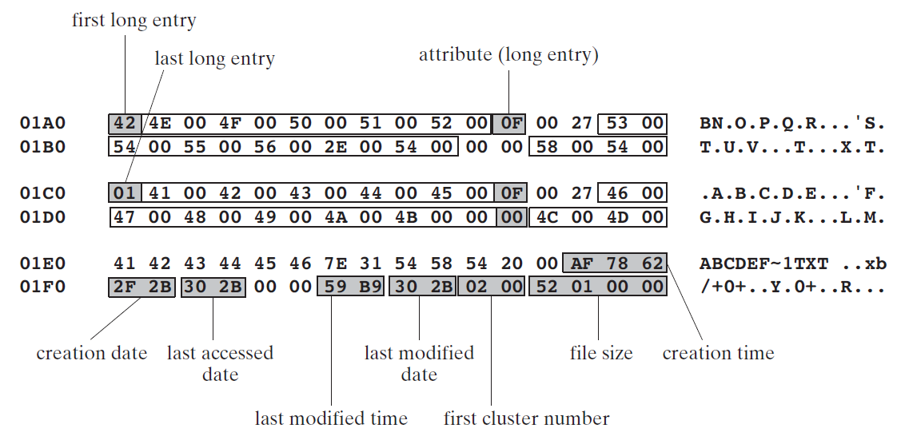

# Chapter 15 磁盘基础

## 15.1 磁盘存储系统
MS-DOS 访问控制磁盘分为三层：

* 最底层为*磁盘控制固件(disk controller firmware)* ，固件程序使用智能控制芯片为指定磁盘品牌和模型来索引磁盘区域(物理位置)
* 下一层为*系统BIOS*，其提供供操作系统用来完成诸如扇区读写，磁轨格式化这些任务需要的底层函数集
* 最高层是*操作系统接口*，其提供接口函数集提供诸如打开，关闭文件，设置文件属性，读取文件，以及写文件服务

磁盘存储系统都有某些共同特性：它们处理数据的物理分区和文件级别的访问，并将文件名映射到物理存储。在硬件层级，磁盘存储系统使用碟，面，磁轨，柱面，和扇区来描述。在系统 BIOS 层次，磁盘存储通过簇和扇区来描述。在系统层级，磁盘存储使用文件夹和文件来描述。

在MS-DOS，Windows 95， 98 以及 Millenium 上，使用汇编语言编写的用户层级的程序可以直接访问系统 BIOS，例如，你可能想存储或获取一些特殊格式的数据，恢复丢失的数据，或执行磁盘硬件诊断。

### 15.1.1 磁轨，柱面，以及扇区
典型的硬盘，有多个绑在柱子上的以恒定速度转动的磁盘构成，每个磁盘上面是读/写头来记录磁脉冲(magnetic pulses)。读/写头按组整体向中心或向边缘以很小的步长移动。

磁盘表面被格式化为不可见的同心圆，称作磁道，数据通修改过磁性来存储。典型的3.5寸盘包含几千个磁道。在不同磁道之间移动磁头称作*寻轨(seeking)*。*平均寻轨时间(average seek time)* 是一种磁盘速度衡量方式。另一种衡量方式是 **RPM**(每分钟旋转次数),通常是 7200。磁盘最外端的磁轨是轨道零，在指向中心的方向上磁轨编号逐级增加。

*柱面(cylinder)* 对应于通过一个位置的读/写头来访问所有的磁轨。文件初始存储在相邻的柱面。这减少了读/写磁头的移动量。

*扇区(sector)* 是磁轨大小为512字节的一部分。物理扇区被制造商通过磁性划分，使用称作*底层格式(low-level format)*。扇区大小永不改变，无论安装任何操作系统。硬盘每个磁轨可能有超过63个扇区。

*物理磁盘几何(Physical disk geometry)* 是描述磁盘结构的一种方式，用来让系统BIOS可读。对于每个磁盘其包含多个磁柱，每个磁柱包含多个读/写磁头，以及每个磁道包含多个扇区。关系如下：

* 每个磁盘包含的磁柱数量和每个磁盘面的磁轨数量相同
* 磁轨总数量和磁柱数量乘以每个磁柱的磁头数量相同

随着时间推移，随着文件散落在磁盘上，它们变为碎片(fragmented)。*碎片(fragmented)* 文件是其占用的扇区不是磁盘上的连续区域。当发生这种情况，读/写头不得不跨越扇区读取文件数据。这减缓了读写文件速度。

硬盘控制器运行一个称作*转换(translation)*的进程，将物理硬盘几何转化为被操作系统理解的逻辑结构。这个控制器通常嵌入在固件里，在硬盘里或者在分开的控制卡里。在转换后，操作系统使用称作*逻辑扇区号(logical sector numbers)* 运行。逻辑扇区号总是顺序排列，从零开始。

### 15.1.2 磁盘分区
在 MS-Windows，一个单独的物理硬盘可以被划分为一个或多个逻辑单元，称作*分区(partitions)* 或 *卷(volumes)*。每个格式化分区被一个个硬盘号标记，例如 C,D,E。硬盘可以使用一种或多种文件系统。每个硬盘可以包含两种类型分区：主分区和扩展分区。

主分区通常是启动盘并且包含操作系统。扩展分区可以被分为多个*逻辑分区(logical partitions)*。每个逻辑分区映射到一个驱动号(C,D,E,etc.)。逻辑分区不能启动。系统分区和逻辑分区可以格式化为不同的文件系统。

创建多个主分区，每个可以安装不同的操作系统，从而实现多系统。

*主启动记录(Master Boot Record - MBR)*，当硬盘的第一个分区创建时创建，其坐落于硬盘的首个逻辑扇区。*MBR*包含如下：

* 硬盘*分区表(partition talbe*，分区表记录了在硬盘上所有分区的位置和大小
* 一个坐落于分区启动扇区的程序，其将控制权交给加载操作系统的程序

## 15.2 文件系统
每个操作系统有多种类型的磁盘管理系统。最低阶，它管理区分。更高一阶，管理文件和目录。文件系统必须追踪每个磁盘文件的位置，大小，属性。FAT 文件系统最先在 IBM-PC 上诞生，依然在Windows操作系统上可用。FAT 文件系统使用如下结构：

* 逻辑扇区组织为*簇(clusters)*，这是所有存储文件和目录的最基本单元
* 将顺序*簇*序列组织为文件和目录

*簇*是文件使用的最小的存储空间单元，它包含一个货多个连续磁盘扇区。文件系统通过一系列簇组成的链表存储文件。簇的大小一栏文件系统类型以及分区空间大小。下图展示两个大小为 2048 字节的簇组成的文件，每个簇包含四个512字节的扇区。簇链表被*file allocation table-FAT* 所引用，FAT追踪文件所用的簇。指向首个在FAT里的簇条目存储在每个文件目录条目里。

很小的文件至少需要一个簇大小的磁盘空间，这会导致浪费空间。因为每个簇的空间不一定完全占用完。以下为大小为 8200 字节文件存储示意图：

### 15.2.1 FAT12
FAT12 文件系统首次使用在 IBM-PC 软盘上。目前仍然被所有的 MS-Windows 和 linux系统支持。簇大小仅仅为512字节，所以是很适合存储小文件。每个在文件分配表里的条目长度为12位。FAT12 卷容纳少于4087个簇。
### 15.2.2 FAT16
FAT16 文件系统只有在MS-DOS下格式化硬盘才有的格式。它被所有版本的 MS-Windows 和 Linux 支持。FAT16有以下特点：

* 存储在卷容量超过 1 GBbyte的设备上效率低，因为 FAT16使用大尺寸簇
* 在文件分配表里的条目长度为16位，限制了簇的总数量
* 卷可以容纳 4087 到 65526 数量的卷(按簇大小变化)
* 启动扇区没有备份，所以单个扇区读错误将是毁灭性的
* 没有内置文件安全系统或独立的用户权限

### 15.2.3 FAT32
FAT32 文件系统首先在 Windows 95 引入，并且在Windows 98上精制。相比 FAT16 有很多改善：

* 单个文件最大大小为 4GB 减去 2 字节
* 每个在文件分配表里的条目长度为 32位
* 卷可以包含 65526 到 268435456个簇
* 根文件夹可以在硬盘的任何位置，并且可以是任何大小
* 卷最大可以为 32 GBytes
* 在卷大小为 1 GByte 到 8 GByte 的空间相比 FAT16 使用更小的簇，结果是更小的浪费空间
* 引导记录包含一份关键数据结构的备份。这意味着 FAT32 硬盘相比 FAT16 硬盘的单点故障更加健壮

### 15.2.4 NTFS
NTFS 文件系统被所有最新的 Windows版本支持。相比FAT32 有明显的改善：

* NTFS处理大容量，既可以在单个硬盘也可以跨多个硬盘
* 对于超过 2 GBytes 硬盘，默认簇大小是 4 KBytes 
* 支持 255字符长度的 Unicode 文件名
* 允许设置文件和文件夹的权限。独立用户或组用户访问权限。不同层次的访问级别(读，写，修改，等等)
* 提供内置文件，文件夹的加密和压缩
* 可以在更改日志中跟踪文件随时间的修改
* 可以为单个用户或组用户分配磁盘空间大小
* 提供从错误数据稳定恢复功能。通过合约日志自动修复错误
* 支持硬盘镜像，相同数据异步写入多个磁盘

### 15.2.5 磁盘主分区 
FAT12 和 FAT16 卷有指定的位置存放启动记录，文件分配表，以及根目录。(FAT32驱动的根目录没有存储在固定位置)。

## 15.3 磁盘目录
每个 FAT-style 和 NTFS 硬盘有根目录，其中包含磁盘上的主要文件列表。根目录可能包含其他目录的名字，称作子目录。子目录被包含在其他目录里，此目录称作子目录的父目录。每个子目录可以包含文件名和额外的目录名。最终的结果是树状结构，根目录在最顶端，再下面是根目录的开枝散叶。

### 15.3.1 MS—DOS 目录结构
每个 MS-DOS文件目录条目长度为 32 字节。详细介绍如下：

| 16进制步长 | 字段名称      | 格式          |
| :--------: | :------------ | :------------ |
|   00-07    | 文件名        | ASCII         |
|   08-0A    | 扩展名        | ASCII         |
|     0B     | 属性          | 8-bit 二进制  |
|   0C-15    | MS-DOS 保留值 |               |
|   16-17    | 时间戳        | 16-bit 二进制 |
|   18-19    | 日期戳        | 16-bit 二进制 |
|   1A-1B    | 簇起始值      | 16-bit 二进制 |
|   1C-1F    | 文件大小      | 32-bit 二进制 |

* *文件名* 字段存储文件，子目录，或磁盘符号名。首个字节可能指示文件状态，或是文件名的首个字符。
* *簇起始值* 字段存储第一个分配给文件的簇编号，同时为文件分配表的首个条目。
* *文件大小* 字段为32位数，指示文件大小，单位为字节
* *属性* 字段指示文件类型。
* *日期* 字段指示文件创建或上次修改值
* *时间* 字段指示文件创建或上次修改值

### 15.3.2 MS-Windows 长文件名
MS-Windows，文件名长度超过 `8+3`字符。如果属性字节位 0Fh，系统查看文件条目起始字节。如果高位数值为 4，则文件名是由多个条目组成的。子条目则从 `n-1` 到 `1`，n 为条目数量。

例如文件名为：ABCDEFGHIJKLMNOPQRSTUV.txt，结构如下：

### 15.3.3 文件分配表(File Allocation Table-FAT)
FAT12，FAT16，以及 FAT32 文件系统使用 *文件分配表(file allocation table-FAT)* 来追踪每个文件在磁盘的位置。FAT 映射磁盘簇，显示特定文件的所有权。每个条目对应一个簇编号，每个簇包含一个或多个扇区。

每个文件通过FAT中的*簇链条(cluster chain)* 组成的链接表来表示。每个FAT条目包含一个整数索引下一个条目。

当文件使用的扇区出现碎片，没有大片的连续扇区，将会导致硬盘碎片，将会导致硬盘读写性能下降。因为跨磁道读写数据效率低。
