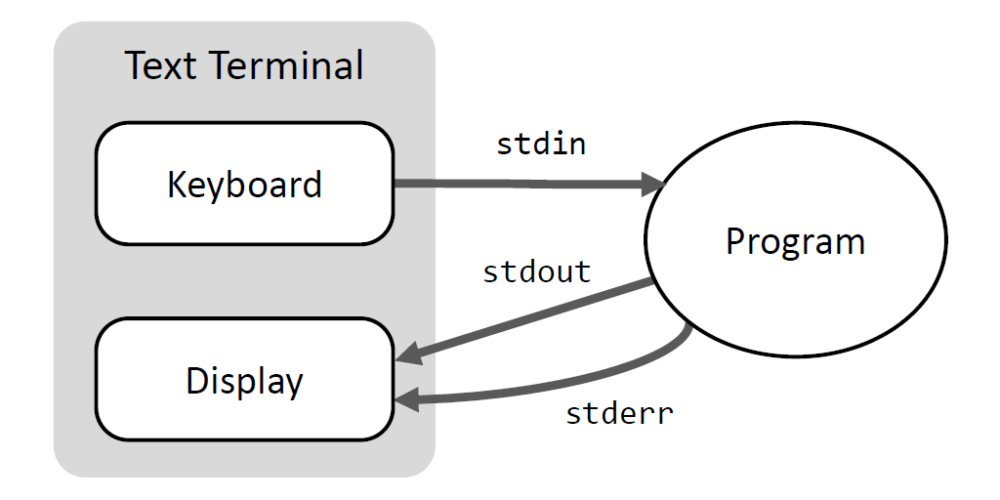
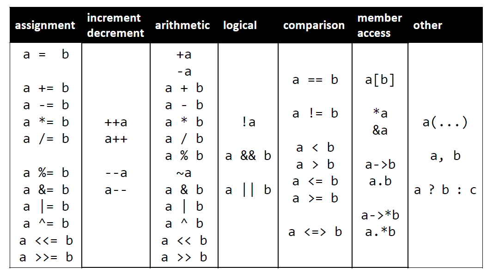
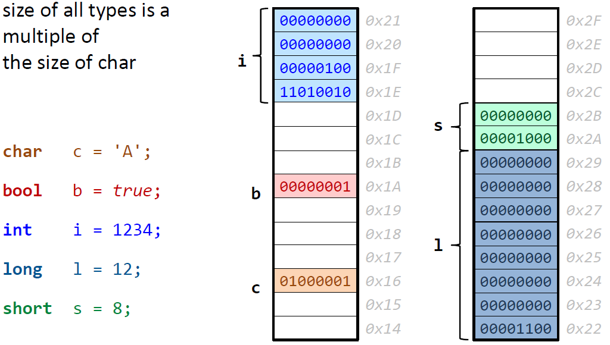
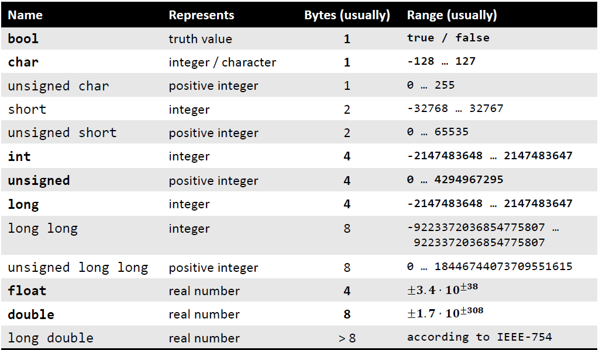

# 基础

## 基础 IO
### 终端I/O流(Terminal I/O Streams)

* 标准输入 (standard input - stdin)
* 标准输出 (standard ouput - stdout)
* 标注错误输出 (standard error -stderr)



### 输入/输出(Input/Output)
*流(stream)*  作为数据源和目标

|流|描述|是否缓冲|
|:---:|:---|:---:|
|cin|"characters from std**in**"|是|
|cout|"characters from std**out**"|是|
|cerr|"characters from std**error**"|否|
|clog|"characters from std**error**"|是|

*流操作符(stream operator)*

|操作符|描述|方向|
|:---:|:---:|:---:|
|`>>`|从流获取内容赋值到变量|`source >> target`|
|`<<`|将变量内容输出到流|`target << source`|

流操作符有如下特点：

* 支持基础类型和字符串(string)
* `>>` 读取所有内容直到空白字符(space, tab, newline, ...)
* 操作符可以链式调用，所以插入变量或抽取变量不影响整个链式调用
## 基础类型

### C++ 变量
确定类型的命名对象(named object for static type)

```C++
type variable = value;
type variable{value};       // C++11
```

C#,Python,Java... 程序员需要注意

```C++
int i;              // 变量未初始化
cout << i;          // 打印出来的值不确定
```

* 基础类型变量默认不初始化("you don't pay for what you don't ask for")
* 但是在申明变量时总是需要初始化变量

### 重要的基础类型

```C++
short s = 7;                // 有符号整形
int   i = 12347;
long  l = -785674990;

unsigned u = 12347;        // 正整数

float f = 1.88f;           // 单精度浮点数
double d = 3.52;           // 双精度浮点数

bool b = true;             // 布尔值

char c = 'A';              // 字符
char a = 65;               // 同样是有符号整数
```

### 基础类型字符标记

```C++
int i = 0x4A;              // 16 进制变量
int j = 0b10110101;        // 二进制 C++14

long l1 = -7859749901l;
long long l2 = 89565656974990ll;

unsigned u1 = 12347u;
unsigned u2 = 565654327ul;

float f = 1.88f;
double d1 = 3.5e38;
long double d2 = 3.5e38l;

double d3 = 512'232'697'499.052;  // c++14 支持的分隔符
```

### 操作符



### 术语
定义一个变量，对应使用到的术语：

```C++
// Variable(myChar): named object
// Object: 小块内存存储对应类型的值，内存：00100010，二进制值表示的整数值为34
// Value(34): 内存里存储的位集合，根据数据类型转化
// Type(char): Value & Operation 的集合，char 类型对应 -128...127 +*-/% 
char myChar = 34;
```
### 基础类型的内存大小



基础类型内存占用大小并不是确定的：

* 和平台相关 (32/64 bit Windows/Mac OSX/Linux)
* 通常在32bit平台，`int = long`

C++11 中引入了头文件`#include <cstdint>`来确保对应变量有确定的大小。

* `int8_t`          (int with 8 bits length)
* `int16_t`
* `uint64_t`        (unsigned int with exact 64bit length)
* `int_least32_t`   (int with at least 32bit length)

变量内容缩减(Narrowing)，具体情况如下：

* (隐式)从大的数据类型转换为小的数据类型
* 可能导致丢失信息
* 没有警告-默默的发生

```C++
double d = 1.23456;
float f = 2.53f;
unsigned u = 120u;

double e = f;               // ok           float->double
int i = 2.5;                // NARROWING    double->int
int j = u;                  // NARROWING    unsigned int->int
int k = f;                  // NARROWING    float->int
```
C++11 引入花括号初始化变量(Braced Initialization):`type variable {value}`，有如下特点：

* 所有数据类型皆可使用
* 内容缩减(Narrowing)会有警告信息

```C++
double d{1.23456};          // ok
float f{2.53f};             // ok
unsigned u{120u};           // ok

double e{f};                // ok           float->double
int i{2.5};                 // WARNING    double->int
int j{u};                   // WARNING    unsigned int->int
int k{f};                   // WARNING    float->int
```



基础类型实数标记：`std::numeric_limits<T>`

```C++
#include <limits>

numeric_limits<double>::max()           // 最大正数
numeric_limits<double>::min()           // 最小正数 大于零
numeric_limits<double>::lowest()        // 最小负数
numeric_limits<double>::epsilon()       // 最小间距(smallest diffrence)
```

## 枚举
作用域内(scoped)枚举在**C++11** 中引入，语法如下：

>`enum class name {enumerator1, enumerator2, ...,enumeratorN};`

每个枚举值映射到一个整数值，对应区间[0, N-1]。

```C++
enum class day {
    mon, tue, wed, thu, fri, sta, sun
};

day d = day::mon;

d = tue;            // COMPILER ERROR，tue only in day's scope
```

指定类型的作用域内枚举(Underlying Type of Scoped Enumerations)，在**C++11**中引入，使用例子如下：

```C++
enum class day : char{
    mon, tue, wed, thu, fri, sta, sun
};

enum class country_ISO3166_1 : int {
    AF, AX, AL, DZ, AS, AD, TW, JP, CN, CA, BJ
};
```

枚举变量默认隐式和整数映射，也可以明确指定枚举变量值：

```C++
enum class month{
    none = 0,
    jan = 1, feb = 2, mar = 3, apr = 4, may = 5,
    jun = 6, jul = 7, aug = 8, sep = 9, oct = 10,
    nov = 11, dec = 12
};

enum class flag{
    a = 2,
    b = 8,
    c = 5
};
```

基础类型和作用域内枚举变量之间的转换:

```C++
enum class month{
    none = 1,
    jan = 1, feb = 2, mar = 3, ...
};

cout << int(month::mar);  // 3
int i;
cin >> i;
month m = month(i);
```

对于非作用域枚举，需要注意以下两点：

* 不同作用域内的枚举变量可能充足
* 和基础变量的隐式转换

```C++
enum day {mon, tue, wed, thu, fri, sat, sun};

day d = mon;        // OK!, enumrator "mon" unscoped
int i = wed;        // OK!, i = 2

enum stars {sun, ...};  // COMPILER ERROR: collision
```

### std::vector 简介
`std::vector` 是C++“默认”**动态数组**，说明如下：

* 数组(array) = 容纳相同类型的不同对象
* 动态(dynamic) = 运行时可以修改大小(size)

```C++
#include <vector>

vector<int> v{2, 31, 47};       // 使用三个变量初始化
cout << v.size() << '\n';       // 3    (元素数量)
cout << v[0] << '\n';           // 2
cout << v[1] << '\n';           // 31
cout << v.front() <<'\n';       // 2    (首个元素)    
cout << v.back() <<'\n';        // 47   (末尾元素)    
```

`vector<T>::push_back(Element)` 在vector末尾添加类型为`T`的变量。

`vector<T>::resize(newSize, value = T{})` 和 `vector<T>::clear()` 使用如下：

```C++
vector<double> v{1.0, 1.0};         // {1.0, 1.0}
cout << v.size() << '\n';           // 2
v.resize(4, 2.0);                   // {1.0, 1.0, 2.0, 2.0}
v.resize(1);                        // {1.0}
v.clear();                          // {}
cout << v.size() << '\n';           // 0
```

`vector<T>` 初始化陷阱(C++11)：
```C++
vector<int> v1{5, 2};               // |5|2|
vector<int> v2(5, 2);               // |2|2|2|2|2|
```

### 类型申明和基础修饰符
`const`是变量修饰符，使用方式为`const variable = value`，说明如下：

* 变量初始化后不可修改
* 用来初始化的变量可以是可修改变量

`constexpr`在C++11中引入，用在两个地方：

* 变量修饰，`constexpr variable = static_value`，赋值后不可修改
* 函数返回值修饰，`constexpr return_type function(...) {...}`，函数在编译时得到执行结果

```C++
constexpr int i = 2;            // const expression of type int
constexpr int foo()
{
    return 5;                   // evaluatable at compile time
}

constexpr int bar(int i)
{
    return i * (i + 1)/2;       // 如果i在编译时已知，则可在编译时得到返回值
}
```

`auto`在C++11中引入，使用如下：

* 变量**类型自推导**，从右手边赋值
* 更加方便，安全，面向未来
* 对于泛型(类型无关)编程非常重要

```C++
auto i = 2;                     // int
auto u = 56u;                   // unsigned int
auto d = 2.023;                 // double
auto f = 4.01f;                 // float
auto l = -787878797987971l;     // long int
auto x = 2 * i;                 // x:int
auto y = i + d;                 // y:double
auto z = f * d;                 // z:double
```

类型别名：

```C++
/*
using newType = oldTYpe;        // C++11 引入
typedef oldType newType;        // C++98
*/

using real = double;
using index_vector = std::vector<std::uint_least64_t>;
```
## 程序结构
## 作用域生命周期
## 函数
## 字符串
## 引用
## 命令符参数
## 集合类型
## IO 流
## 类要点
## RAII
## 类基础设计
## 函数调用机制
## 异常
## 指针
## 诊断