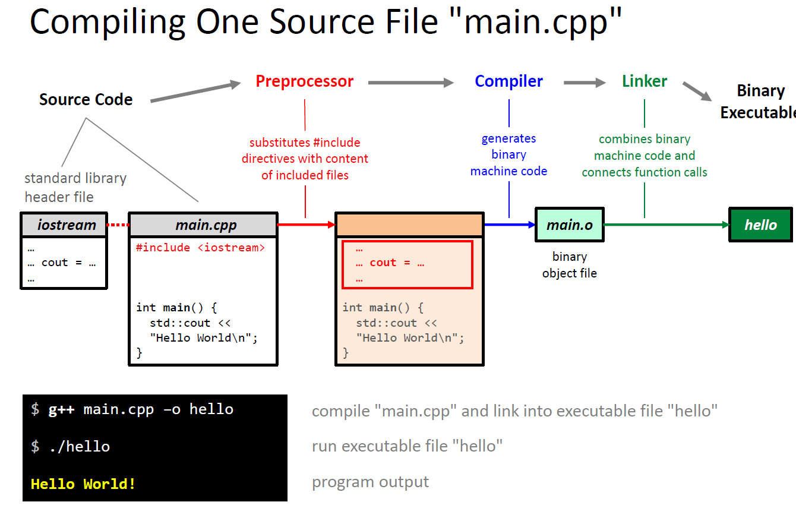

# 简介

## 什么是C++
### C++ 的特点如下：

* 控制：直接操控资源(CPU, 内存，以及其他)
* 抽象：方便的面向对象编程以及零或非常低的开销
* 性能：没有额外隐形的性能消耗

### C++ 大事记

| 标准  | 年份  | 事件                          | 标记    |
| :---: | :---: | :---------------------------- | :------ |
| C++98 | 1998  | 原始标准确立                  |         |
| C++11 | 2011  | 非常多新特性-几乎成为新的语言 | 现代C++ |
| C++14 | 2014  | 一些改善                      | 现代C++ |
| C++17 | 2017  | 许多新的有用特性              | 现代C++ |
| C++20 | 2020  | 许多新的已投票的改善          | 现代C++ |

### C++ 长处和短处
#### 长处

* 高性能
* 内存控制要求高
* 系统编程，控制硬件
* 大型并发程序
* 数字运算
* DSLs(Domain Specific Languages)

#### 短处
* 脚本编程
* 快速原型开发
* REPLs(read-eval-print loop)，交互式编程

### C 和 C++的区别
#### C 语言
* 严格意义上不是C++的子集(不同的作用域和解析规则)
* 弱类型系统
* C 程序员的心态：**“调试才是真正的工作”**

#### C++ 语言
* 强类型系统
* 高度抽象(带有不变量的自定义类型)
* C++ 程序员的心态：**“如果编译成功，那就没问题了”**

### 和Java/C#/Python/Ruby/... 的主要区别

#### 默认是值语义
* 所有的类型默认“和int表现一致”：能被**深度**拷贝&赋值**深度**对比，。。。
* Java/C# 只有基础如 ints,doubles,...类型使用值语义

#### 可检测的生命周期
* 总是知道一个对象的生命周期
* 重视知道一个对象何时被销毁

## 资源
### C++ 书籍
#### 新手级别
* Bjarne Stroustrup:
  * Programming:Principles and Practice using C++
  * Einfuhrung in die Programierung mit c++

#### 中级到高级
* Bjarne Stroustrup: Programming:
    * A Tour of C++
    * The C++ Programming Language
* Scott Meyers:
  * Effective C++
  * Effective Modern C++
  * Effective STL
* Herb Sutter:
  * Exceptional C++
  * More Exceptional C++
  * Exceptional C++ Style

### C++ 网络资源
| 网站                                              | 说明                                              |
| :------------------------------------------------ | :------------------------------------------------ |
| www.ccpreference.com                              | 有例子的标准库参考，支持C++11/14/17+以及C++20提案 |
| www.cplusplus.com                                 | 有例子的标准库参考，支持C++11/14                  |
| https://github.com/isocpp/CppCoreGuidelines       | 专业C++开发者的编程规范                           |
| https://isocpp.org 和 https://ioscpp.org/wiki/faq | C++基金会官网                                     |
| https://www.youtube.com/user/CppCon               | 最大C++会议演讲                                   |
| http://herbsutter.com                             | "Guru of the week" 文章                           |
| http://scottmeyers.blogspot.com                   | Scott Meyers 博客                                 |

### 出名的C++编译器

|         名称         | 支持平台            |
| :------------------: | :------------------ |
|       GUN G++        | Linux, Mac, Windows |
|     LLVM clang++     | Mac, Linux, Windows |
| Microsoft Visual C++ | Windows             |
|      Intel ICC       | Linux, Windows, Mac |

### 出名的代码编辑器

|        名称        | 支持平台        |
| :----------------: | :-------------- |
| Visual Studio Code | Win, Mac, Linux |
|    Sublime Text    | Win, Mac,Linux  |
|      Atom.io       | Win, Mac, Linux |
|     Notepad++      | Win             |
|       Gedit        | Linux/Gnome     |
|        Kate        | Linux/Kde       |
|        Vim         | Win, Mac, Linux |
|       Emacs        | Win, Mac, Linux |

### 调试器
#### gdb

* Linux 原生
* Windows：MinGW-w64 或 Windows附带的Linux子系统

#### cgdb(内核还是gdb)
* 源代码分屏
* 显示断点和当前指令
* 在Ubuntu/Debian/WSL：`sudo apt-get install -y cgdb`

#### gdbgui(内核还是gdb)
* 基于浏览器的gdb前端
* https://gdbgui.com/
* 在Ubuntu/Debian/WSL：`sudo pip install gdbgui`

### 出名的C++ IDE
|          名称           |   支持平台    | 特性                               |
| :---------------------: | :-----------: | :--------------------------------- |
|       Qt Creator        | Win,Mac,Linux | 对新手很友好                       |
|       Eclipse CDT       | Win,Mac,Linux | 非常棒的静态分析+语法高亮+VIM 插件 |
|     JetBrains CLion     | Win,Mac,Linux | 语言丰富，习惯用就用               |
| Microsoft Visual Studio |      Win      | 宇宙最强，不足为过                 |

### 编译&运行在浏览器里

|                   名称                    |       编译器       | 特点                                       |
| :---------------------------------------: | :----------------: | :----------------------------------------- |
| [LiveWorkspace](http://liveworkspace.org) |     GCC,Clang      |                                            |
|   [Rise4Fun](http://rise4fun.com/vcpp)    |        MSVC        |                                            |
|      [ideone.com](http://ideone.com)      |        GCC         |                                            |
| [Compiler Explorer](https://godbolt.org)  | GCC,Clang,ICC,MSVC | 探索不同编译器处理代码，带有注释的汇编输出 |

## Hello World
最经典的代码：

```C++
#include <iostream>

// our first program
int main()
{
    std::cout << "Hello World\n";
}
```

对于`#include <iostream>`

* 此行代码将会被文件 *"iostream"* 的内容代替
* 在编译器目录下，*iostream* 称为 <span style="Color:red">头文件</span>
* *iostream* 提供输入和输出功能

`// comments` 为程序注释：

* 只是将被编译器忽略
* 注释用来对源代码添加文档

```C++
// 单行注释
/* 多行注释 */
```

代码`int main() {...}`

* 定义称作 "main" 的**函数**
* 每个程序通过执行main函数开始
* `int`是main函数的返回值
* `()`为空的参数列表

代码 `std::cout << "Hello World\n";`

* 此语句将文本输出到控制台
* `std::`是标准库的*命名空间(namespace)*
* `cout(short for "character out")` 和标准输出相关
* `"Hello World\n"` 是 *字符串常量(string literal)*，字符序列
* `\n` 是"新的一行"字符
* 每一个语句都要使用分号结尾

`{...}` 一块语句使用花括号包围。

也可以是用`using namespace std` 来申明要使用的命名空间，代码变为：

```C++
#include <iostream>

int main()
{
    using namespace std;
    cout << "Hello World\n";
}
```

申明要使用的命名空间要注意：

* 允许我们忽略`cout`的前缀`std::`
* `cout`在`std`命名空间里定义
* 小心使用"using namespace"语句，限制在*最小可能区间(smallest possible scope)*

C++ 是编译语言，编译运行流程如下：

* 程序在运行前需要编译
* 编译器将*源代码* 转换为 *机器码*
* 机器语言：“能被计算机硬件-CPU执行的语言”

不同编译器输出的结果不一样：

* Java 为虚拟机输出的字节码
* C++ 本地代码(native code)或称为机器码用来CPU直接执行



重要的 g++ 参数

| 参数使用标记    | 说明                              |
| :-------------- | :-------------------------------- |
| -o myname       | 输出称作“myname”的文件            |
| -std=c++14      | 使用C++14标准编译，默认使用 g++ 6 |
| -std=c++17      | 使用C++17标准编译                 |
| -Wall           | 展示所有的警告                    |
| -O3 / -O2 / -O0 | 优化等级(最高/高/无)              |
| -c              | 仅编译，不链接                    |
| -v              | 输出 g++ 版本                     |
| -g              | 添加调试信息                      |

术语：

**Static** = 编译时

* 在编译时已知的信息
* 在运行时不会改变

**Dynamic** = 运行时

* 在编译时不知道或未指定
* 在运行时修改