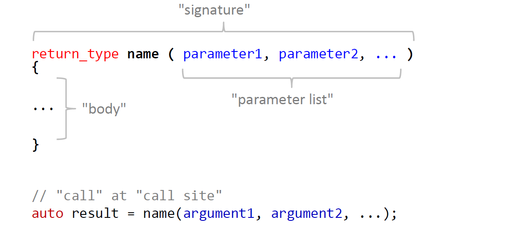

# 基础

## 基础 IO
### 终端I/O流(Terminal I/O Streams)

* 标准输入 (standard input - stdin)
* 标准输出 (standard ouput - stdout)
* 标注错误输出 (standard error -stderr)


### 输入/输出(Input/Output)
*流(stream)*  作为数据源和目标

|流|描述|是否缓冲|
|:---:|:---|:---:|
|cin|"characters from std**in**"|是|
|cout|"characters from std**out**"|是|
|cerr|"characters from std**error**"|否|
|clog|"characters from std**error**"|是|

*流操作符(stream operator)*

|操作符|描述|方向|
|:---:|:---:|:---:|
|`>>`|从流获取内容赋值到变量|`source >> target`|
|`<<`|将变量内容输出到流|`target << source`|

流操作符有如下特点：

* 支持基础类型和字符串(string)
* `>>` 读取所有内容直到空白字符(space, tab, newline, ...)
* 操作符可以链式调用，所以插入变量或抽取变量不影响整个链式调用
## 基础类型

### C++ 变量
确定类型的命名对象(named object for static type)

```C++
type variable = value;
type variable{value};       // C++11
```

C#,Python,Java... 程序员需要注意

```C++
int i;              // 变量未初始化
cout << i;          // 打印出来的值不确定
```

* 基础类型变量默认不初始化("you don't pay for what you don't ask for")
* 但是在申明变量时总是需要初始化变量

### 重要的基础类型

```C++
short s = 7;                // 有符号整形
int   i = 12347;
long  l = -785674990;

unsigned u = 12347;        // 正整数

float f = 1.88f;           // 单精度浮点数
double d = 3.52;           // 双精度浮点数

bool b = true;             // 布尔值

char c = 'A';              // 字符
char a = 65;               // 同样是有符号整数
```

### 基础类型字符标记

```C++
int i = 0x4A;              // 16 进制变量
int j = 0b10110101;        // 二进制 C++14

long l1 = -7859749901l;
long long l2 = 89565656974990ll;

unsigned u1 = 12347u;
unsigned u2 = 565654327ul;

float f = 1.88f;
double d1 = 3.5e38;
long double d2 = 3.5e38l;

double d3 = 512'232'697'499.052;  // c++14 支持的分隔符
```

### 操作符


### 术语
定义一个变量，对应使用到的术语：

```C++
// Variable(myChar): named object
// Object: 小块内存存储对应类型的值，内存：00100010，二进制值表示的整数值为34
// Value(34): 内存里存储的位集合，根据数据类型转化
// Type(char): Value & Operation 的集合，char 类型对应 -128...127 +*-/% 
char myChar = 34;
```
### 基础类型的内存大小


基础类型内存占用大小并不是确定的：

* 和平台相关 (32/64 bit Windows/Mac OSX/Linux)
* 通常在32bit平台，`int = long`

C++11 中引入了头文件`#include <cstdint>`来确保对应变量有确定的大小。

* `int8_t`          (int with 8 bits length)
* `int16_t`
* `uint64_t`        (unsigned int with exact 64bit length)
* `int_least32_t`   (int with at least 32bit length)

变量内容缩减(Narrowing)，具体情况如下：

* (隐式)从大的数据类型转换为小的数据类型
* 可能导致丢失信息
* 没有警告-默默的发生

```C++
double d = 1.23456;
float f = 2.53f;
unsigned u = 120u;

double e = f;               // ok           float->double
int i = 2.5;                // NARROWING    double->int
int j = u;                  // NARROWING    unsigned int->int
int k = f;                  // NARROWING    float->int
```
C++11 引入花括号初始化变量(Braced Initialization):`type variable {value}`，有如下特点：

* 所有数据类型皆可使用
* 内容缩减(Narrowing)会有警告信息

```C++
double d{1.23456};          // ok
float f{2.53f};             // ok
unsigned u{120u};           // ok

double e{f};                // ok           float->double
int i{2.5};                 // WARNING    double->int
int j{u};                   // WARNING    unsigned int->int
int k{f};                   // WARNING    float->int
```


基础类型实数标记：`std::numeric_limits<T>`

```C++
#include <limits>

numeric_limits<double>::max()           // 最大正数
numeric_limits<double>::min()           // 最小正数 大于零
numeric_limits<double>::lowest()        // 最小负数
numeric_limits<double>::epsilon()       // 最小间距(smallest diffrence)
```

## 枚举
作用域内(scoped)枚举在**C++11** 中引入，语法如下：

>`enum class name {enumerator1, enumerator2, ...,enumeratorN};`

每个枚举值映射到一个整数值，对应区间[0, N-1]。

```C++
enum class day {
    mon, tue, wed, thu, fri, sta, sun
};

day d = day::mon;

d = tue;            // COMPILER ERROR，tue only in day's scope
```

指定类型的作用域内枚举(Underlying Type of Scoped Enumerations)，在**C++11**中引入，使用例子如下：

```C++
enum class day : char{
    mon, tue, wed, thu, fri, sta, sun
};

enum class country_ISO3166_1 : int {
    AF, AX, AL, DZ, AS, AD, TW, JP, CN, CA, BJ
};
```

枚举变量默认隐式和整数映射，也可以明确指定枚举变量值：

```C++
enum class month{
    none = 0,
    jan = 1, feb = 2, mar = 3, apr = 4, may = 5,
    jun = 6, jul = 7, aug = 8, sep = 9, oct = 10,
    nov = 11, dec = 12
};

enum class flag{
    a = 2,
    b = 8,
    c = 5
};
```

基础类型和作用域内枚举变量之间的转换:

```C++
enum class month{
    none = 1,
    jan = 1, feb = 2, mar = 3, ...
};

cout << int(month::mar);  // 3
int i;
cin >> i;
month m = month(i);
```

对于非作用域枚举，需要注意以下两点：

* 不同作用域内的枚举变量可能充足
* 和基础变量的隐式转换

```C++
enum day {mon, tue, wed, thu, fri, sat, sun};

day d = mon;        // OK!, enumrator "mon" unscoped
int i = wed;        // OK!, i = 2

enum stars {sun, ...};  // COMPILER ERROR: collision
```

### std::vector 简介
`std::vector` 是C++“默认”**动态数组**，说明如下：

* 数组(array) = 容纳相同类型的不同对象
* 动态(dynamic) = 运行时可以修改大小(size)

```C++
#include <vector>

vector<int> v{2, 31, 47};       // 使用三个变量初始化
cout << v.size() << '\n';       // 3    (元素数量)
cout << v[0] << '\n';           // 2
cout << v[1] << '\n';           // 31
cout << v.front() <<'\n';       // 2    (首个元素)    
cout << v.back() <<'\n';        // 47   (末尾元素)    
```

`vector<T>::push_back(Element)` 在vector末尾添加类型为`T`的变量。

`vector<T>::resize(newSize, value = T{})` 和 `vector<T>::clear()` 使用如下：

```C++
vector<double> v{1.0, 1.0};         // {1.0, 1.0}
cout << v.size() << '\n';           // 2
v.resize(4, 2.0);                   // {1.0, 1.0, 2.0, 2.0}
v.resize(1);                        // {1.0}
v.clear();                          // {}
cout << v.size() << '\n';           // 0
```

`vector<T>` 初始化陷阱(C++11)：
```C++
vector<int> v1{5, 2};               // |5|2|
vector<int> v2(5, 2);               // |2|2|2|2|2|
```

### 类型申明和基础修饰符
`const`是变量修饰符，使用方式为`const variable = value`，说明如下：

* 变量初始化后不可修改
* 用来初始化的变量可以是可修改变量

`constexpr`在C++11中引入，用在两个地方：

* 变量修饰，`constexpr variable = static_value`，赋值后不可修改
* 函数返回值修饰，`constexpr return_type function(...) {...}`，函数在编译时得到执行结果

```C++
constexpr int i = 2;            // const expression of type int
constexpr int foo()
{
    return 5;                   // evaluatable at compile time
}

constexpr int bar(int i)
{
    return i * (i + 1)/2;       // 如果i在编译时已知，则可在编译时得到返回值
}
```

`auto`在C++11中引入，使用如下：

* 变量**类型自推导**，从右手边赋值
* 更加方便，安全，面向未来
* 对于泛型(类型无关)编程非常重要

```C++
auto i = 2;                     // int
auto u = 56u;                   // unsigned int
auto d = 2.023;                 // double
auto f = 4.01f;                 // float
auto l = -787878797987971l;     // long int
auto x = 2 * i;                 // x:int
auto y = i + d;                 // y:double
auto z = f * d;                 // z:double
```

类型别名：

```C++
/*
using newType = oldTYpe;        // C++11 引入
typedef oldType newType;        // C++98
*/

using real = double;
using index_vector = std::vector<std::uint_least64_t>;
```
## 程序结构
### C++中的表达式(expression)和陈述语句(statement)

表达式(expression)

* 一系列运算(操作符和操作值)
* 可能会生成结果

陈述语句(Statements)

* 按照顺序执行的程序片段
* 不产生结果
* 可以包含一个或多个表达式
* 使用`;`来分割
* 使用`{ }` 来组织

条件陈述语句(Conditional Statements)

```
if (condition1) {
    // do this if condition1 is true
}
else if (condition2) {
    // otherwise do this if condition2 is true
}
else {
    // otherwise do this
}
```
* 根据条件执行控制代码
* 条件必须是(可转换为)布尔变量
* 陈述语句将从上向下执行

在条件陈述语句里执行初始化(C++17)，语法为：

>`if (type var = value...; condition)`

引入此特性来约束零时变量的区域(scope)。

三元条件操作符语法为：

>`Result = Condition ? if-Expression : Else-Expression`

`switch` 特性如下：

* 选择判断整数类型值(char, int, long, enums, ...)
* 执行所有匹配到`case`和下一个`break`中间的代码(或者是使用"}"的闭区间)

同样`switch`也支持初始化变量(C++17)

循环遍历语法如下：

* `for(initialization; condition; step) {...}`
* `while(condition) {...}`
* `do {...} while(condition)`
* `for(type x : array) {...}`

## 作用域生命周期
内存管理愿望清单：

* 超大的内存空间
* 快速分配和访问
* 默认对象生命周期无限制
* 当对象不再使用时，尽快释放对象
* 避免运行时的内存管理开销

内存分为两部分：


生命周期和分配速度：

堆内存特性如下：

* 所有对象都可销毁
* 销毁的对象是无序的，这导致内存碎片的问题
* 在分配新对象时需要找到未被占用的连续内存

栈内存特性如下：
* 新的对象总是分配在栈顶
* 对象的销毁顺序和创建顺序相反
* 不能销毁新创建对象以下的所有对象

## 函数
函数结构如下：

```C++
return_type name(parameter1, parameter2, ...) {
    // body
}
```

创建函数遵循的原则是：

* 函数用来复用代码，同时让整个流程更加清晰
* 每个函数只做一件事，目标清晰

函数术语：



函数返回值：

* 只返回一个变量:`int, double, string, ... or user defined types`
* 或无返回:`void`

*C++14* 中引入了返回类型自推导：

```C++
// 返回类型为int，如果有多个不同类型返回变量，则编译失败
auto foo(int i, double d) {
    ...
    return i;
}

// C++11 中引入的尾部返回类型
auto foo(int i, double d)->int{
    ...
}
```

函数参数：

* 无参数：`()`
* 一个或多个：`(int a, double d, int c, ...)`
* 参数列表里的名字必须是唯一的

C++ 也支持默认参数，但默认参数后的其他参数必须也是默认参数。

```C++
void foo(int i = 0);                                    // ok
void foo(int i, int j = 10);                            // ok
void foo(int a, double b = 1.0, float c = 3.5f);        // ok
void foo(int a, double b = 1.0, float c);               // no
```

函数重载：

* 函数相同的名字，但是不同的参数列表
* 不能仅仅重载返回值，因为编译时不确定要使用哪个函数

递归函数：

* 递归 = 函数调用自身
* 需要跳出机制(needs break condition)
* 通常比循环优雅但是有些情况速度慢
* 对于递归深度有限制(因为栈大小是确定的，可能导致栈溢出)

```C++
int factorial(int n)
{
    if(n < 2) return 1; 
    return n * factorial(n - 1);
}
```

函数`const`参数，编译时检查是否参数被修改。

```C++
int foo(int a, const int b)
{
    a += 5;     // ok
    b += 10;    // Compile Error, can't change const int

    return (a + b);
}
```

函数定义顺序决定了函数的可见度，按照定义顺序，先定义的函数不可调用后定义的函数。但是如果提前申明了函数，即可调用。整个C++的编译流程在最后链接时才需要函数定义的位置。

```C++
// 错误调用函数的例子
int main()
{
    int i = 0;
    cin >> i;
    if(odd(i)) cout << "i is odd\n";            // odd not known yet!
    if(even(i)) cout << "i is even\n";          // even not known yet!
}

bool even(int i)
{
    return !odd(i);                             // COMPILER ERROR, odd not kownn yet
}

bool odd(int i)
{
    return (n % 2);
}

// 正确的方式
// 先申明
bool even(int);
bool odd(int);
int main()
{
    int i = 0;
    cin >> i;
    if(odd(i)) cout << "i is odd\n";            // OK, already declared
    if(even(i)) cout << "i is even\n";          // OK, already declared 
}

bool even(int i)
{
    return !odd(i);                             // Ok, already declared 
}

bool odd(int i)
{
    return (n % 2);
}
```

函数协议术语：


一些数学函数(double versions):


## 字符串
### 字符集
* `char`存储单个字符
* 内部表现为：数字 -128 到 127
* 常量字符 `'a', 'b', 'c', ...`
    * 使用单引号包围
    * 自动转换为数字

```C++
char c1 = 'A';
char c2 = 65;

cout << c1 << '\n';                 // A
cout << c2 << '\n';                 // A
cout << (c1 == c2) << '\n';         // 1
```

特殊字符：


### std::string

* 动态字符数组(相当于 vector<char>)
* 使用 `+` 和 `+=` 连接
* 使用`[]`访问单个字符
* 深度拷贝，深度对比, ...
  
`std::string` 操作：


字符串常量：

* "xyz" 类型为 `const char[]`，也称作 "C string"
* "xyz"s 类型为 `std::string`，C++14 新特性

注意字符串的拷贝问题：

```C++
#include <string>
using namespace std::string_literals;

auto hw1 = "Hello World";           // type of hw1 is const char[]
auto hw2 = hw1;                     // not copy of hw1

auto sw1 = "Hello World"s;          // type of str is std::string
auto sw2 = sw1;                     // copy of sw1
```

std::getline 使用说明：

```C++
string s;
// read entire line
getline(std::cin, s);
// read untile next tab
getline(std::cin, s, '\t');
// read untile next 'a'
getline(std::cin, s, 'a');
```

字符串常量：

* 字符常量 = `char`             'a', 'b', ...
* C 字符串常量 = `const char[]`  "ab", " xyz text", ...
* std::string Literals          C++14
  * `"A real C++ string"s`
* Unicode strings               C++11
  * `u8"A UTF-8 string."`
  * `u"A UTF-16 string."`
  * `U"A UTF-32 string."`
* Raw strings(no \ escape needed) C++11
  * `R"(folder\folder\\file)"`  字符串不包含小括号
  * `Ru8"(raw UTF-8 "quote" string)"`

## 引用

```C++
int i = 2;
int& ri = i;            // declare reference to i

cout <<i << '\n';       // 2
cout <<ri << '\n';      // 2

i = 5;
cout <<i << '\n';       // 5
cout <<ri << '\n';      // 5

ri = 88;
cout <<i << '\n';       // 88 
cout <<ri << '\n';      // 88 

int j = 0;
int& ri = j;            // COMPILER ERROR, 引用不可重新赋值

int& r2;                // COMPILER ERROR, 引用必须初始化
double& r3 = j;         // COMPILER ERROR, 引用类型和被引用变量类型要一致
```

`const`引用

```C++
int i = 2;
const int& ri = i;

cout <<i << '\n';       // 2
cout <<ri << '\n';      // 2

i = 5;
cout <<i << '\n';       // 5
cout <<ri << '\n';      // 5

ri = 88;                // COMPILER ERROR, const ref
```

使用`const` 引用当做函数参数，在编译时将检查参数是否被改变：

```C++
string sentence_const(string a, const string& b)
{
    if(a.empty()) return b;
    b += ".";               // COMPILER ERROR: b is const

    a += "," + b + ".";
    return a;
}
```

使用引用(no-const)当做函数参数，例如用在交换数据：

```C++
void swap(int& i, int& j)
{
    int temp = i;
    i = j;
    j = temp;
}
```

使用引用(no-const)可能导致以下几个问题：

* 通过参数可能导致的边际效应(输入参数可能被改变)
* 可能导致调试非常困难，以及难以理解
* 在某些情境下有用，但要避免当做**“输出参数”**

### 右值(rvalues)和左值(lvalues)

* 左值 = 能取到内存地址的表达式
* 右值 = 取不到内存地址的表达式

```C++
int a = 1;          // a and b both are lvalues
int b = 2;

a = a * b;          // (a * b) is rvalue
int c = a * b;      // ok

a * b = 3;          // COMPILER ERROR, can not assign 3 to rvalue
```

引用绑定

* `&` 仅能绑定到左值(保存在内存里的值)
* `const&` 可以绑定左值和右值(literals, temporaries...)

```C++
void swap(int& i, int& j) {...}
bool is_palindrome(const string& ) {...}

int main() {
    string s = "uhu";
    cout << is_palindrome(s) << is_palindrome("otto") << '\n';  // ok const&
    int i = 0;
    swap(i, 5);         // COMPILER ERROR, can not bind refrence to literal
}
```

引用也已使用`auto`，引用类型通过右边的赋值来推测出变量类型：

```C++
auto i = 2;                 // i:int
auto d = 2.023;             // d:double
auto x = i + d;             // x:double

auto& ri = i;               // ri: int&
const auto& rx = x;         // rx: double&
```

永远不要返回函数里的局部变量，因为局部变量存储在栈上，当函数执行结束时，栈上内容不受保护，下一次调用函数，或者局部变量赋值都会修改栈上的内容。如果在当前作用域内，栈上的内容是安全的。

引用用在*Range-Based*循环里：

```C++
vector<double> v {1,2,3,4,5};

// read-only access to vector elements
for(double x : v) {
    cout << x << '\n';
}

// modify vector elements
for(double& x : v) {
    cin >> x;
}
```

`const`的位置不影响引用的效果，只是两种风格：

```C++
// West const
void foo(const point& p) {...}
int i = 0;
const int& wcr = i;

// East const
void foo(point const& p) {...}
int i = 0;
int const& wcr = i;
```

### 使用值调用以及`std::move`
由于C++通过值传递参数时，默认是深度拷贝，所以有以三种情况：

1. 当需要深度拷贝时，没有问题，或者传递的参数是基础类型
2. 当不需要拷贝时，使用引用的效率高
3. 当传递的参数不在使用时，可以使用 `std::move` 将不再使用的值转换为右值当做函数参数

`std::move` 说明如下：

* 将传递的参数转换为右值
* 大多数标准库容器花很少的性能转移内容
* 被转移内容的变量不可再使用

对于函数参数为`const` 修饰的情况：

* 不能将变量移入到为`const`的参数
* 不能将函数参数为`const`的移入到其他变量

返回值和参数传递使用规则(C++11)：

返回值：

* 如果拷贝或转移(move)花很少性能，或者是智能指针，则返回值
* 如果变量不是函数内的局部变量，则可以返回引用

参数：

* 如果函数内需要拷贝，则传递值
* 如果函数内不需要拷贝，传递`const`引用，或者如基础类型拷贝损耗性能少的也可以传递值

## 命令符参数

* 在可执行程序右边指定
* 参数被空格分离
* 在 C 和 C++中：通过C字符串数组访问

```C++
// argc 参数数量
// argv 是参数数组，首个参数为程序自身名称

int main(int argc, char* argv[])
{
    for(int i =0; i <argc; ++i){
        cout << argv[i] <<'\n';
    }
}
```

有用的字符串和数字之间的转换函数：

```C++
// c++ strings -> numbers
#include <string>
int     stoi(const string&);
long    stol(const string&);        // c++11
float   stof(const string&);        // c++11
double  stod(const string&);

// c string ->numbers
#include <cstdlib>
int     atoi(const char*);
long    atol(const char*);
double  atof(const char*);
```
## 集合类型(Aggregate types)
通常三种类型：

基础类型(Fundamental Types)

* `int, long, ...`
* `float, double, ...`
* `enums(map to a fundamental type)`

集合类型 (Aggregate Types)->"PODs = plain old data types"

* 包含一个货多个*基础类型*或*集合类型*

Non-Trivial 类型

* 传统成员函数 (构造函数，析构函数，构造拷贝，赋值拷贝...)
* 可以实现多态(虚函数)

术语：

* `Type == recipe for making a cake`
* `Object == baked cake`

简单集合类型例子：

```C++
struct point {
    int x;
    int y;
};

// 复制总是深度拷贝所有成员

point p1 {1, 2};        // construction C++11
point p2 (1, 2);        // construction (对于类型截取没有检测)

point p3 = p1;          // copy on construction
point p4{p1};           // copy on construction
point p5(p1);           // copy on construction

auto p6 = p1;           // copy on construction
auto p7{p1};            // copy on construction C++11
auto p8 (p1);           // copy on construction

p2.x = 0;
p3 = p2;                // copy on assignment (both p2 & p3 existed before)
```

什么时候使用集合类型：

* 如果数据构成逻辑单元 (`date:day, month, year`)
* 函数需要传非常多的参数，需要将参数组织为逻辑单元
* 需要从函数返回多返回值，使用好的成员名字组成的结构体是更好的选择

Braced Initialization(C++11):

> `Type { arg1, arg2, ..., argN }`

* 花括号包围的列表变量
* 按照成员申明的顺序

```C++
enum class month {jan = 1, feb = 2, ..., dec = 12};

struct date {
    int yyyy;
    month mm;
    int dd;
};

int main(){
    date today {2013, month::may, 15};
    date tomorrow {2013, month::may, 16};
    auto yesterday = date {2013, month::may, 14};
}
```

组合类型(Compound Types):

```C++
enum class month {jan = 1, feb = 2, ..., dec = 12};

struct date {
    int yyyy;
    month mm;
    int dd;
};

struct person {
    string name;
    date birthday;
};

int main() {
    person me;
    me.name = "John Doe";
    me.birthday = date{2009, month::Jan, 13};
    me.birthday.dd = 12;
}
```

集合类型的对象拷贝时通常总是深度拷贝，对于只读参数使用`const`引用:

* 避免深度拷贝
* 表达函数参数为只读


```C++
enum class month { jan = 1, feb = 2, ..., dec = 12};
struct date { int yyyy; month mm; int dd;};

void print(const date& d) {
    cout << d.yyyy      << "_"
         << int(d.mm)   << "_"
         << d.dd        << '\n';
}

int main() {
    date today {2013, month::may, 15};
    date tomorrow = today;
    print(tomorrow);
}
```

`vector` of `structs`:

* 存储对象自己，而不是引用
* 如果`vector`销毁，容器里的对象也被销毁

`Range-Based for Loops` 引用：

```C++
struct point {int x; inty;};
vector<point> v {point{0, 1}, point{3, 1},
                 point{2, 2}, point{1, 0}};

// read-only access to vector elements
for(const point& p : v) {
    cout <<"(" << p.x << "," << p.y << ")\n";
}

// modify vector elements
for(point& p : v) {
    cint >> p.x >> p.y;
}
```
## IO 流


Stream Operators

```C++
std::ostream& operator <<(std::ostream&, const Type&);
std::istream& operator >>(std::istream&, Type&);

// 操作符通过返回的方式来实现链式调用
cin >> x >> y;  // <=> >>( >>(cin, x), y)
cout << x << y; // <=> <<( <<(cout,x ), y)
```
类似于`std::vector`标准容器没有提供默认*流操作符(stream operation)*，因为有非常多的可能性：

* 仅仅输出值，使用什么符号分割？
* 将输出格式化为文本或xml，还是其他
* 序列化/反序列化容器

通过重载操作符`<<` 和 `>>`,为自定义类型开启输出，和输入:

```C++
struct Point
{
    int x;
    int y;
};

// 输出
ostream& operator <<(ostream& os, const Point& p) {
    return os << "(" << p.x << "," << p.y << ")";
}

// 输入
istream& operator <<(istream& is, Point& p) {
    return is >> p.x >> p.y;
}

```
`std::getline(istream&, string&, stopat='\n')` ，函数用来读取流内容，只到遇到换行符结束：

```C++
string s;
// read entire line
getline(cin, s);

// read untile the next tab
getline(cin, s, '\t');

// read untile next 'a'
getline(cin, s, 'a');
```

`std::istream::ignore(n, c)`说明：

* 向前读取`n`个字符
* 读取中遇到字符`c`停止

```C++
// forward stream by 8 characters:
cin.ignore(8);

// forward stream by max. 10 characters or until after '=':
cin.ignore(10, '=');

// forward stream 'is' until after next newline character:
cin.ignore(std::numberic_limits<std::streamsize>::max(), '\n');
```

当读取流错误时，可以通过设置错误位，同时忽略流中的已有字符来重置流的状态：

```C++
void reset_cin()
{
    // clear status bit
    cin.clear();

    // ingore all bytes in input buffer until the next newline 
    cin.ignore(std::numberic_limits<std::streamsize>::max(), '\n');
}

int main()
{
    cout << "i? ";
    int i = 0;
    cin >> i;
    if(!cin.ok()) reset_cin();
    cout << "j? ";
    int j = 0;
    cin >> j;
    cout << "i: " << i << " j: "<< j << '\n';
}
```

读文件简介：

```C++
// reading files, std::ifstream
// text file "points.txt",每行两个数字，数字通过空格隔开(spaces or tabs)
// 1.0 ----> 2.0\n
// 12.2 ----> 33.4\n
// 5.0 ----> 9.8\n
// 8.822 ----> 88\n

#include <fstream>
int main()
{
    ifstream is {"points.txt"};
    while(is.good())        // while file open and not at eof
    {
        double x, y;
        cin >> x, y;
        cout << "(" << x << "," << y << ")\n";
    }
}   // file is closed automatically
```

写文件简介:

```C++
#include <fstream>
int main()
{
    ofstream os {"squares.txt"};
    if(os.good())
    {
        for(int i = 0; i < 20; ++i)
        {
            os << i << '\t' << i * i << '\n';
        }
    }
}   // file is closed automatically
```

构造好流后，可以主动打开或关闭流：

```C++
#include <fstream>
int main()
{
    ofstream os {"squares.txt"};
    os.close();
    os.open("points.txt");
}
```

文件打开模式：


流操作：


## 类要点
纯结构体没有方式*强制不变量(enforce invariants)*，比如如下结构体：

```C++
Date{
    int year;   
    int month;  // 月的范围如何强制在[1, 12]范围
    int day;
};
```

使用成员函数：

* 操作和查询成员变量
* 协助保证不变量

公有和私有的可见性的区别是：私有成员不可以在类外部访问。

`class/struct`的区别是默认可见性，`struct`默认可见性是公有的，`class`默认可见性是私有的。

`const` 成员函数特性：

* 数据成员在`const`成员函数中**只读**
* 允许编译器强制数据不可改

非常优雅的接口：

* 使用特殊的`operator []`成员函数
* 内部数据表现(`vector<int>`)隐藏

```C++
class ascending_sequence {
public:
    int operator [] (int index) const {return nums_[index];}
    int size()                  const {return nums_.size();}
};

int main(){
    ascending_sequence s;
    s.insert(8);
    s.insert(2);
    cout << s.size() << "numbers: " << s[0] << "," << s[1] << '\n';
}
```

构造函数说明：

* 构造函数用来初始化成员变量
* 如果自定义构造函数，则编译器不生成默认构造函数
* 如果想让构造函数(假设类型为`MyType`)和自定义构造函数并存，两种方式:
  * 实现默认构造函数
  * 使用`MyType() = defalut; // C++11`

C++11 引入了构造函数代理：

```C++
// our special [min, max] constructor
ascending_sequence(int min, int max): nums_{}
{
    ...
}

// special [0, max] constructor
asscending_sequence(int max) : asscending_sequence{0, max}
{

}

// default constructor
asscending_sequence() : asscending_sequence{0}
{

}
```
## RAII
*拥有权(Ownership)*：如果对象对资源的*重置(de-initialization)* / *析构(destruction)* / *清理(cleanup)*负责，则对象是资源的*拥有者(owner)*。

*拥有权作用域(Scoped OwnerShip)*：随对象创建而创建，伴随对象销毁而销毁

*析构函数(Destructor)*说明：

* 当对象销毁时执行析构函数
* 如果不自定义析构函数，编译器将生成默认析构函数
* 大多数类，默认析构函数可以完成任务

*析构函数*自动调用链条说明：

* 当对象析构时，所有的成员变量的析构函数按照顺序调用
* 所有成员的析构函数的调用顺序不可修改，也不会遗漏

**RAII** = "**R**esource **A**cquisition **I**s **I**nitialization"， 在C++中，使用作用域生命周期来管理资源，比如：*memory, file handles, database connections ...*。

**RAII** 说明如下：

* 对象构造/初始化时：请求资源(**acquire** resource)
* 对象析构时：释放资源(**release** resource)

### 类存在的意义
可以重复使用的抽象(Reusable Abstractions)：

* 隐藏底层实现细节
* 方便的接口

区间范围/正确性保证(Consistency/Correctness Guarantees)

* 在构造时确保变量取值正确
* 成员函数保证变量的区间范围

资源管理(RAII)

* 在构造式请求资源
* 在析构时释放资源

## 类基础设计
类设计建议：

* 访问*公共(public)*数据/成员函数 => *自由独立(free standing)* 函数
* 需要访问私有(private)数据       => 成员函数

提出这个建议的理由是：

* 减少修改类的风险 => "open/closed principle"
* 对于元编程非常重要

### 构造函数
申明构造函数`asceding_sequence(int max);`，有如下问题：

* 允许`ascending_sequence` 对象从`int` *隐式(implicit)*构造
* 这可以认为是个特性，但大多数情况下令人不解和容易出错

```C++
void foo(asceding_sequence s) {...}

int main() {
    // calls foo by constructing an ascending_sequence{10}!
    foo(10);
}
```

为了解决这个问题引入了*显示(explicit)*构造函数:`explicit asseding_sequence(int max);`，来防止隐式的构造。

### 类型接口(Type Interfaces)
给需要知道内部使用类型的开发者发布内部类型：

```C++
class ascending_sequence {
public:
    // type interface
    using value_type = int;
    using size_type = std::size_t;

    value_type operator [](size_type i) const;
    ...
};

cout << numeric_limits<ascending_sequence::value_type>::max()
     << numeric_limits<ascending_sequence::size_type>::max()
     << '\n';
```

### Range-based for loops need begin() and end()
通过成员函数或全局函数来实现：

```C++
class ascending_sequence {
public:
    using value_type = int;
    auto begin() const { return nums_.begin(); }
    auto end() const { return nums_.end(); }

...
private:
    std::vector<int> nums_;
};

ascending_sequence s {0, 10};

for(int i : s) {
    cout << i << ' ';
}
```

### 申明 begin() 和 end() 的返回类型
需要独立使用`begin()`和`end()`的返回类型时：

```C++
class ascending_sequence {
public:
    using value_type = int;
    using const_iterator = std::vector<int>::const_iterator;
    const_iterator begin() const { return nums_.begin(); }
    const_iterator end() const { return nums_.end(); }

...
private:
    std::vector<int> nums_;
};
```

### Stream output/input
```C++
class point {
public:
    explicit point(double x, double y): x_{x}, y_{y} {}
    double x() const { return x_;}
    double y() const { return y_;}

    // 使用 friend 的方式来解决访问私有成员的问题
    friend std::istream& operator >> (std::istream& is, point& p) {
        return is >> p.x_ >> p.y_;
    }
private:
    double x_, y_;
}

std::ostream& operator << (std::ostream& os, const point& p) {
    return os << p.x() << " " << p.y();
}

std::istream& operator << (std::istream& is, point& p) {
    // ??? p.x_ and p.y_ are private!
    // 需要额外构造对象，性能方面不友好
    double x, y;
    is >> x >> y;
    p = point{x, y};
    return is;
}
```

### 比较大小
不相等例子如下：

```C++
enum class month { jan = 1, feb = 2, ..., dec = 12};
struct date {int yyyy, month mm, int dd;}

bool operator < (const date& l, const date& r) {
    if(l.yyyy < r.yyyy) return true;
    if(l.yyyy > r.yyyy) return false;
    if(l.mm < r.mm) return true;
    if(l.mm > r.mm) return false;
    return l.dd < r.dd;
}

bool operator <= (const date& l, const date& r) {...} 
bool operator > (const date& l, const date& r) {...} 
bool operator >= (const date& l, const date& r) {...} 
```

C++20 引入的 `<=>` 比较方式：

```C++
(a <=> b) < 0;          // if a < b 
(a <=> b) > 0;          // if a > b 
(a <=> b) == 0;         // if a == b 
```
C++20 中编译器会生成默认比较函数：

* 生成操作符:`<=>, ==, !=, <, <=, >, >=`
* 通过递归比较成员数据
* 通过成员定义顺序

## 函数调用机制
函数调用简要说明：

* 不同的调用方式传递参数的方式不同，但基本都是通过压入栈，或寄存器传递，或两者结合
* 所有的程序运行指令都有自己的程序地址
* 栈空间使用的地址是从高向低走
* 函数的返回值使用 `eax` 存储
* 函数返回前内部使用的栈空间会被标记为未使用(本质是栈指针指向了进入函数前的地址)

函数调用流程：

* 传递参数，压入栈，或通过寄存器传递
* 将函数执行语句后的指令地址压入栈
* 跳转到函数所在地址
* 函数执行开始，压入寄存器`ebp`
* 将`esp`的值赋值于`ebp`
* 执行函数指令
* 执行结果后，将返回值赋值于`eax`，浮点和对象可能有所不同
* 清理使用的栈空间
* 使用要执行语句的地址，跳转到对应地址继续执行

## 异常

设计初衷：

* 初始原因：当构造对象失败时报告
* 处理扰乱控制流程的错误/事件

例子：

* 文件未知道未找到 => 不能继续读文件
* 内存不足 => 不能继续构造对象

异常生命周期：

* 任何函数可以 *抛出(thrown)* 或 创建异常对象
* 当抛出异常时，控制权回到调用函数的作用域
* 在此作用域可以通过`try ... catch` 块来处理异常
* 如果未被处理，就会向上继续抛出，直到`main`函数，程序退出

例子：

```C++
#include <stdexcept>    // contains some standard exception types

double square_root(double x) {
    if(x < 0) throw std::invalid_argument{"argument was negative"};
    return sqrt(x);
}

void print_root_of_input() {
    double d = 0;
    cin >> d;
    try{
        cout << square_root(d) << '\n';
    }
    catch(std::invalid_argument& e) {
        // deal with / report error here
        cerr << "error: " << e.what() << '\n';
    }
}
```

还可以使用`throw`继续抛出异常：

```C++
try {
    // potentially throwing code
}
catch(std::exception&) {
    throw;  // re-throw exceptions
}
```

使用`catch(...) 捕获所有异常：

```C++
try {
    // potentially throwing code
}
catch(...) {
    // handle failure
    throw;  // re-throw exceptions(s)
}
```

异常有哪些*启示(implications)*:

* 几乎所有代码都可能抛出异常
* 对于设计C++库影响非常大
* 可能导致*暗藏(subtle)*的资源/内存泄露

```C++
void add_to_database(const database& db, const string& filename) {
    auto con = make_dabase_connection(db);
    if(!file_exists(filename)) {
        throw file_not_found_error{filename};
        // database connectin not properly closed!
    }
    ...
    close_database_connection(con);         // 这里不会被执行，导致资源被泄露
}
```

没有异常的*保驾护航(Guarantees)*:

* 操作可能失败
* 资源可能泄露
* *固定值(invariants)* 可能被违规，不在规定的范围内
* 部分操作执行失败可能导致边际效应
* 异常可能向外繁殖

有异常的*保驾护航*：

基本保护：

* 确保固定值的正确性，没有资源泄露
* 存储的数据都是*合法(valid)*的值
* 部分操作执行失败可能导致边际效应

强("commit or rollback semantics")

* 操作可以失败，但是没有边际效应
* 所有的数据保持原有变量

不抛出异常(strongest):

* 操作保证成功执行
* 从外部观察不到异常(内部处理)

C++11 引入通过`noexcept`承诺不抛出异常，如果抛出异常，程序退出。使用`noexcept`必须考虑清楚：

* `noexcept`是函数接口的一部分 (C++17 之后)
* 如果将`noexcept`函数修改为可以抛出异常的函数，则调用者也需要修改

C++11 `noexcept`是`noexcept(Boolean Expression)`在`noexcept(true)`时的状态。

当在析构函数抛出异常要非常谨慎，以下例子说明：


C++11 中一些函数默认隐式为`noexcept`：

* 隐式申明的特殊成员函数
  * 默认构造函数
  * 析构函数
  * 拷贝构造函数，移动(move)构造函数
  * 拷贝赋值操作符，移动赋值操作符
* 继承构造函数
* 自定义析构函数

但有一些特殊情况下不为默认`noexcept`：

* 如果函数中调用了其他`noexcept(false)`的函数
* 显示的申明`noexcept(false)`

## 指针
指针主要用途是*观察对象(Observing Objects)*，原因如下：

* 如果不适用拷贝的方式来追踪对象(类似于引用的功能)
* 观察的目标也许在运行中改变(这种情况下不能使用引用)

指针是什么：


不同类型指针访问对比：

指针：

* 用来访问堆或栈上的资源
* 不影响指向对象的生命周期
* 使用场景：非直接观察/选择对象

智能指针：

* 用来访问堆或栈上的资源
* 被指向的对象申明周期通过智能指针管理
* 使用场景：资源管理


指针申明和解引用语法：


对于C++11中引入的`nullptr`说明如下：

* 隐式转换为`false`
* 在初始化指针是赋值为`nullptr` 或有效的地址
* 在解引用前检查指针是否为`nullptr`

如果可以不使用指针，则不使用指针：

* 指针可以存储任何地址
* 程序员需要确保地址的合法性

指针申明陷阱：

```C++
int* p1, p2;        // int pointer, int
int *p1, *p2;       // int pointer, int pointer

// better
int* p1;            // int pointer
int* p2;            // int pointer
```

`const` 和 指针：


## 诊断