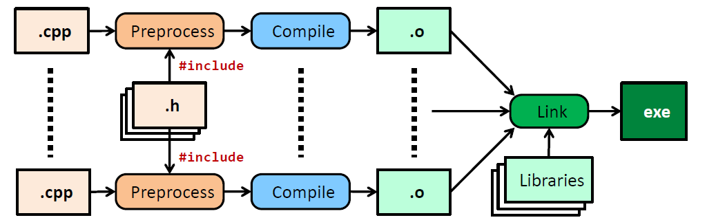
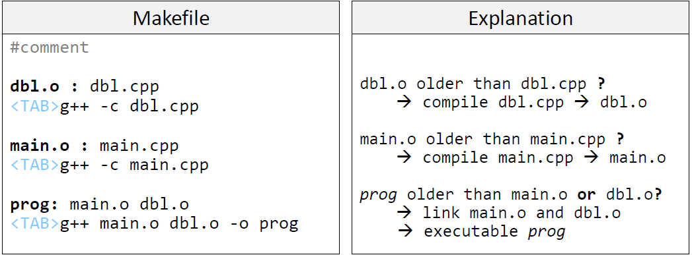
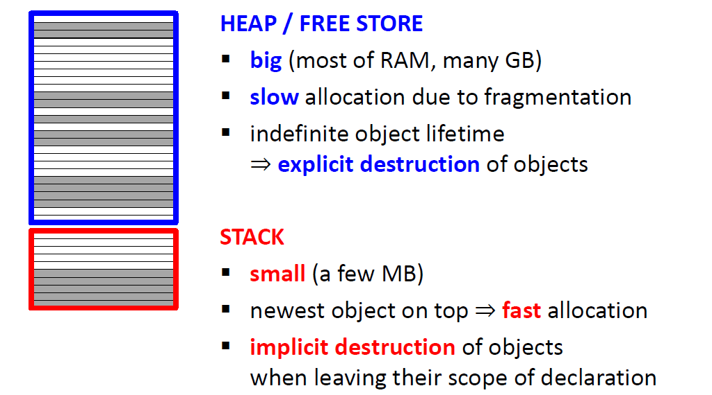
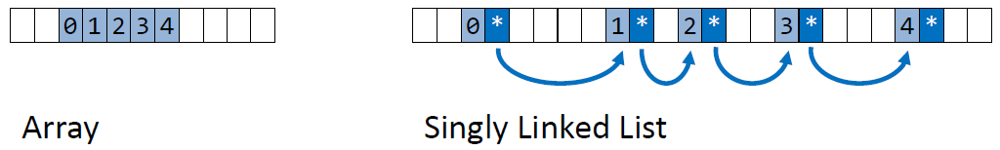
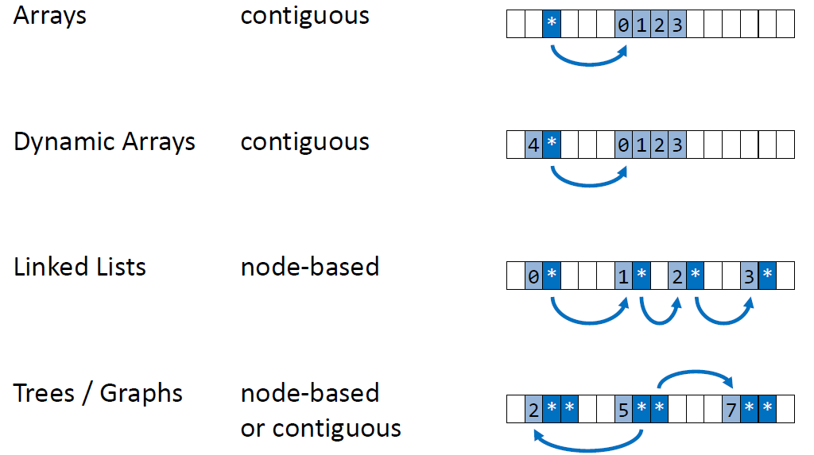
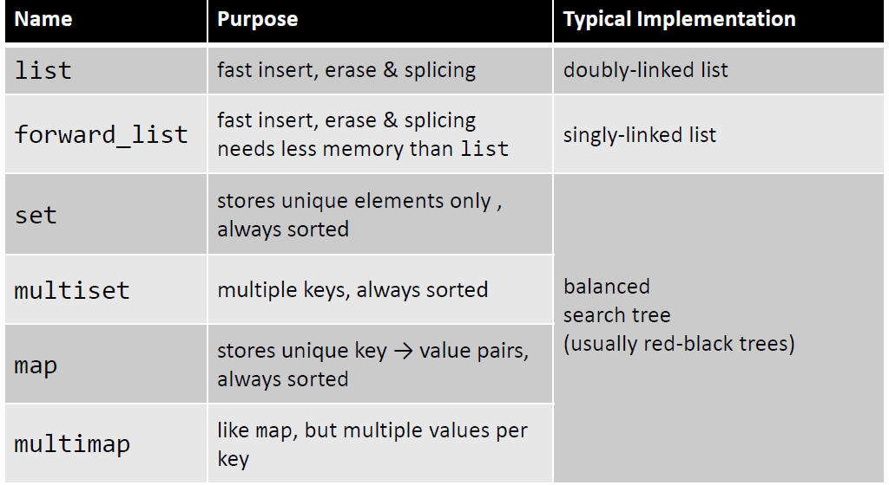
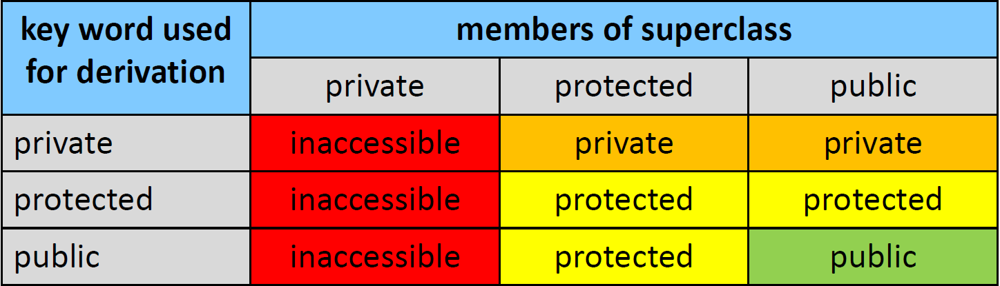

# 构建软件
## 分割编译
构建C++程序有以下问题和解决方案：

问题如下：

* 大规模的工程：超多的源代码
* 许多开发者协作构建工程
* 需要保证编译时间短
* 一些功能模块需要在不同的项目之间共享

解决方案：

* 将程序划分为多个独立的文件
* 独立编译文件
* 只有当文件修改时，重新编译文件

C++构建模型：

* **Headers**(\*.h) + **Translation Units**(\*.cpp)包含源代码
* **Preprocessor** 执行文本替换
* **Compiler** 将TUs 翻译为*object files*
* **Linker** 将object file 和*external libraries* 链接为可执行文件



示例如下：


```C++
// ---------------------------
//  头文件
// dbl.h
int dbl(int n);

// iostream
// ...cout...

// ---------------------------
// 转换单元
// db.cpp
#include "dbl.h"

int db1(int n) {
    return (2 * n);
}

// main.cpp
#include <iostream>
#include "dbl.h"

int main() {
    cout << dbl(4);
}
```

整个编译流程如下：

```GCC
// 头文件 iostream 和 dbl.h 被Preprocessor 插入 main.cpp
// 编译器将main.cpp 翻译为 main.o 文件
$g++ -c main.cpp

// 头文件 dbl.h 被Preprocessor 插入 dbl.cpp
// 编译器将 dbl.cpp 翻译为 dbl.o 文件
$g++ -c dbl.cpp

// 链接器将 main.o dbl.0 链接生成 pd4
$g++ main.o dbl.o -o pd4
```

### 预处理器(Preprocessor)

预处理器简介如下：

* 文本处理引擎
* 在编译执行前运行
* 指令以`#`开始

在C++中有如下用法：

* 结合源文件(#include)
* 条件编译
* 在编译阶段获取平台信息

> 宏(Macros) = 预处理器对文本进行替换

宏指令如下：

* `#define MACRO [TEXT]`
* `#ifdef MACRO / # ifndef MACRO ... #else ... #endif`
* `#undef MACRO`

特殊的宏介绍：
* `__LINE__, __FILE__, __DATE__, __TIME__`
* `__cplusplus`
  * C++98: #define 199711L
  * C++11: #define 201103L
  * C++14: #define 201402L
  * C++17: #define 201703L

### #inlcude 问题

各个文件介绍如下：

```C++
// a.h
struct foo{
    int member;
};

void foo(foo&);
...

// b.h
#include "a.h"

struct bar{
    float x;
};

void g(foo&, bar&);
...

// main.cpp
#include "a.h"
#include "b.h"

int main(){
    foo f;
    bar b;
    ...
}
```

在`main.cpp`被预处理后，`foo`和`f`被**定义**了两次：

```C++
// main.cpp: #include "a.h"
struct foo {int member;};
void f(foo&);

// main.cpp #include "b.h"
// b.h #include a.h
struct foo {int member;};
void f(foo&);

// b.h self
struct  bar {float x;};
void g(foo&, bar&);

int main(){
    foo f;
    bar b;
    ...
}

```

解决方案使用：`#include Guards`：

```C++
// a.h
#ifndef A_H
#define A_H
struct foo{
    int member;
};

void f(foo&);
...
#endif

// b.h
#ifndef B_H
#define B_H
#include "a.h"

struct bar{
    float x;
};
void g(foo&, bar&);
...
#endif
```

### 类的Header/Source分离

示例如下：

```C++
// a.h
class A{
public:
    void bar();
    double square(double);
    int bar(int a, int count);
private:
    int m_;
};

// a.cpp
#include "a.h"

void A::bar() {
    cout << m_ << '\n';
}

double A::square(double x) {
    return (x * x);
}

int A::bar(int a, int c) {
    return ((a + m_) * c);
}
```

### 命名空间污染
在头文件中使用命名空间：

```C++
using namespace std;            // 避免这样使用命名空间
using std::cout;                // 使用带命名空间的符号
```

这样使用命名空间的原因如下：

* 每个包含的头文件，在预处理后将所有`using namespace`里符号包含进来
* 如果包含多个头文件，很容易导致不同命名空间的符号冲突

### 链接器(linker)

链接器简介：

* 汇总机器码
* 插入跳转地址来实现函数调用

#### 外部链接
外部链接简介如下：

* **Symbol**：函数或变量
* **Exteranl Linkage**：符号*申明*在本TU(translation unit)，但*定义*在其他地方
* 函数默认为外部链接

如果在头文件中定义了函数，那么多个TU包含此头文件，那每个TU都会包含此函数的定义，在链接时就会出现重复定义的错误，同时对于程序占用空间也是一种浪费，编译时间也会增加。

如果想让编译器为每个TU独自生成函数，可以使用以下两种方法：`unnamed namespace` 或使用关键字`inline`，例子如下：

```C++
// a.h
namespace {
    void foo(){
        ...
    }
}

// tu1.cpp
#include "a.h"

void bar(){
    ...
    foo();
    ...
}

# tu2.cpp
#include "a.h"
void baz(){
    ...
    foo();
    ...
}
```

`static const`成员变量为外部链接，所以需要分离的申明和定义：

```C++
// widget.h
class Widget{
public:
    ....
    // declaration
    static const int x;
    static const std::string s;
    
private:
    ...
};

// widget.cpp
// definition
const int Widget::x = 42;
const std::string Widget::s = "47";
```

C++17支持`static inline`成员变量，为内部链接：

```C++
class Widget{
public:
    ...
    static inline const int x = 42;
    static inline std::string s = "47";
private:
    ...
};
```

`static constexpr`成员变量：

* 提供*编译时(compile-time)* 常量
* 没有链接产生的问题

```C++
class Widget {
public:
    // ok
    static constexpr int x = 42;
    // 相比直接返回常量，返回常数的函数更加灵活
    static constexpr int y() { return 42;}
    ...
private:
    ...
};
```

### Make 简介

* 用来做流水线编译流程
* 处理**makefiles**文件
* 如果不指定参数，默认查找名称为"Makefile"的文件

```makefile
# read makefile
# compile&link ->program prog
make prog

# execute prog
./prog
```
*Makefiles*简介：

* 可以包含编译，链接，以及其他指令
* 编码文件依赖特征(encode dependencies)，比如源文件和object的依赖特征
* 依赖特征通过文件的编辑日期



有用的g++参数简介：

| 参数     | 描述                                         |
| :------- | :------------------------------------------- |
| -s       | 忽略可执行文件中的文件表                     |
| -D MACRO | 定义宏"MACRO"                                |
| -I path  | 添加包含路径(add include path)               |
| -l lib   | 链接外部库"lib"(link external library "lib") |
| -L path  | 指定外部库的路径                             |
| -S       | 输出汇编代码到指定文件                       |
| -pg      | 为*gprof*添加性能分析信息                    |

## Literal 类型

Literal类型指的的是限定为`constexpr`的变量对应的类型：

* constexpr 构造函数
* constexpr 操作
* constexpr 函数返回值

`constexpr`相关的语句消耗几乎可以忽略：

* 编译器可以优化构造函数和操作
* 不需要运行时内存分配消耗
* 不需要运行时操作消耗

例子：

```C++
class point{
public:
    constexpr point(int x, int y) noexcept: x_{x},y_{y}{}
    constexpr double x() const noexcept { return x_;}
    constexpr double y() const noexcept { return y_;}
private:
    int x_;
    int y_;
};

auto constexpr distance2(const point& p1, const point& p2) noexcept {
    auto dx = p1.x() - p2.x();
    auto dy = p1.y() - p2.y(); 
    return dx * dx + dy * dy;
}
int main(){
    point p1{1, 2}, p2{3, 4};
    cout << "distance:" << distance2(p1, p2) << '\n';
}
```
## 运算类型
本小节介绍了如下内容：

* 对象自身操作符重载，比如`+=, -=, *=, /=`
* 对象之间运算操作符重载，比如`+,-,*,/`
* 输出/输入操作符重载, 比如 `<<,>>`
* 对象之间对比操作符重载, 比如 `==, !=, >, >=, <, <=`

在这里需要注意的问题：

* 返回类型为对象时，是返回引用还是值
* 有些操作符运算需要访问私有成员，所以需要注意`friend`的用法
* 操作符重载本质是上函数定义

## 独享关系
堆和栈特性，以及堆和栈上对象生命周期介绍：



*从属关系(Ownership)*：如果一个对象是另一个资源的“拥有者(owner)”，则此对象对此资源的销毁/析构/清理负责。

*堆释放(heap deallocation)* 的目标是：当堆上的对象不再有其他对象指向它时，立即释放此对象占用的资源，比如：

* **JAVA** 使用**垃圾回收(Garbage Collector)**，搜索未被引用的对象然后删除，缺点是消耗cpu算力
* **C** **手动**删除对象，缺点是容易出错
* **C++** 特殊的**内存管理类(memory management class)**，比如`vector,set,map,smart pointers, ...`

**垃圾回收(GC)** 有如下问题：

* GC会和应用抢占CPU时间
  * 这就是使用GC导致的*运行时惩罚(runtime penalty)*
  * GC不适合对时间有严格要求的运行时程序
* GC不能长时间运行，会导致以下问题：
  * 一些对象不再使用了，但仍然未删除
  * 比实际需要花费的内存更多，实践中大概花费五倍多一些

*High Performance Compute(HPC)* 和`Vector`的值初始化：

* `std::vector` 值的初始化，本质上是数组的初始化
* 运行时初始化消耗可能非常昂贵/不可预估
* 可能的解决方案：使用不初始化的类型

```C++
class no_init_double {
public:
    constexpr no_init_double() noexcept:x_{}{}
    constexpr no_init_double(double x) noexcept:x_{x}{}
    constexpr double operator ()() const noexcept { return x_;}
    ...
private:
    double x_;
};

vector<no_init_double> v(1000000);
```

`unique_ptr<T>`简介：

* 存储分配在堆上的一个对象
* 指针销毁时，指向的对象也销毁
* *唯一的所属关系(unique ownership)*：一个`unique_ptr`只包含一个对象
* 不可拷贝，但可移动

```C++
#include <memory>

void foo() {
    auto p = make_unique<int>();        // create int on the heap
    *p = 5;                             // do something with it
    if(...){
        auto p2 = p;                    // compiler error
        auto p3 = move(p1);             // p3 owns object now, p holds nullptr
    }   // p3 and object get destoryed
}   // <- int object is destroyed automatically!
```

基于C++11，返回值和参数传递最佳实践：

返回值说明：

* 返回值，如果返回的值`copy`和`move`消耗低，否则使用智能指针
* 如果是*工厂模式*，使用`unique_ptr/shared_ptr`，不使用指针
* 引用，当对象在函数外部依然存活时
* 多类型返回，使用`tuple<...>`，但使用`class/struct`更佳

参数说明：

* 函数中需要拷贝值，使用值参数
* 函数中不需要拷贝，使用const引用
* 修改外部对象，使用引用
* 可选值，使用`optional<T>`或`const T*`
* 偷取零时变量内容，使用`rvalue`引用
  
## 基于节点的数据结构
连续数据对应的数据结构和基于节点的数据结构对比：



两种数据结构的特点/舍弃(Tradeoffs)

* 连续数据对应的数据结构更加快速的遍历(更少的cache misses)
* 节点数据结构更加快速的修改(更少的拷贝)

一些重要的数据结构：



标准库里基于节点的容器：



## 特殊类成员
假设申明一个类：

```C++
class date{
public:
    int yyyy;
    int mm;
    int dd;
};
```

编译器会自动生成如下函数：

* 默认构造函数              `date();`
* 拷贝构造函数              `date(const date&);`
* 拷贝赋值操作符            `date& operator=(const date&);`
* 析构函数                  `~date();`

拷贝赋值操作符返回被赋值的引用，这是为了实现*链式赋值(chaining of assignments)*。

C++11中引入关键字`=default`来显示让编译器生成成员函数：
```C++
class MyClass{
    // 构造函数
    MyClass() = default;

    MyClass(const MyClass&) = default;

    // 析构函数
    ~MyClass() = default;

    // 赋值操作符
    MyClass& operator= (const MyClass&) = default;
};
```

C++11中也引入了关键字`=delete`来移除指定成员函数，比如可以让类没有拷贝/赋值成员函数：

```C++
class MyClass{
    // 构造函数
    MyClass() = delete;
    MyClass(const MyClass&) = delete;

    //赋值操作符
    MyClass& operator=(const MyClass&) = delete;
};
```
`delete`还可以移除任何overload函数：

```C++
void foo(int i) {...}
void foo(double d) {...}
void foo(float) = delete;

foo(10);                // ok
foo(1.23);              // ok
foo(1.23f);             // compiler error
```

C++11 引入了`initializer_list`构造函数，构造函数即可传入任意数量相同类型的参数:

```C++
#include <initializer_list>

class ascending_sequence
{
public:
    ascending_sequence();
    ascending_sequence(int max);
    ascending_sequence(std::initializer_list<int> il):nums_{}
    {
        nums_.resize(il.size());
        std::copy(begin(il), end(il), begin(nums_));
        std::sort(begin(nums_), end(nums_));
    }
private:
    std::vector<int>_;
};

ascending_sequence v1;                  // ();
ascending_sequence v2 {1, 2, 3};        // (initializer_list<int>)
ascending_sequence v3 {10};             // (initializer_list<int>)
ascending_sequence v4 (10);             // (int)
```

一个标准类的成员函数如下：

```C++
class T{
    T();                                        // 默认构造函数

    T(std::initializer_list<...>);              // 初始化列表构造函数
    
    ~T();                                       // 析构函数

    T(const T&);                                // 构造拷贝函数

    T& operator=(const T&);                     // 拷贝赋值函数
};
```
## 命名空间
定义一次规则(The One Definition Rule-ODR):

* 在任意*转换单元(translation unit)*中，模板，类型，函数，或对象只能有且只有一次*定义(defination)*
* 这些当中的部分可以*申明(declare)* 多次
* 在整个程序中，对象或非内联函数只能定义一次

所以不同的库中有非常大概率的命名冲突，我们需要一种组织架构大型软件的方式。

*命名空间(namespace)* 有如下作用：

* 避免命名冲突
* 将库组织规划为不同的区域

命名空间有如下特性：

* 一个命名空间可以在任意多个文件中使用
* 一个文件中可以使用任意多个命名空间
* 命名空间支持网状结构
  
```C++
namespace std{
    namespace chrono{
        class system_clock {...};
    }
}

auto t1 = std::chrono::system_clock::now();
```

使用`using`指令来引入命名空间，需要注意的是不要在头文件中使用`using`，导致命名空间污染：

```C++
namespace std{
    namespace chrono{
        class system_clock {...};
    }
}

using namespace std::chrono::system_clock;
auto t1 = system_clock::now();
```

命名空间还可以使用别名：

```C++
namespace std{
    namespace chrono{
        class system_clock {...};
    }
}

namespace sc = std::chrono;
auto t1 = sc::system_clock::now();
```

C++11 提供内联命名空间，可以用来版本管理：

```C++
namespace mylib{
    inline namespace current {
        class A {...};
    }

    namespace old{
        class A {...};
    }
}

mylib::A        ac;             //mylib::current::A
mylib::old::A   ao;             
```

重载函数在编译时，会根据参数查找命名空间。(Argument Dependent Lookup - ADL):

```C++
namespace lib1 {
    class A;
    void foo(A);
    void bar(int);
}

namespace lib2{
    class A;
    void foo(const A&);
}

lib1::bar(5);               // 需要明确指定相应的命名空间
lib1::A a1;
lib2::A a2;

foo(a1);                    // ADL select Lib1::foo
foo(a2);                    // ADL select lib2::foo
```

成员函数和非成员函数如何选取对应函数：

```C++
object.fn();            // 在 object 对应的类型里查找成员函数fn
fn(object);             // 在 object 对应的命名空间查找函数fn
```
## 模板
模板引入的动机是因为算法是一致的，但不得不实现算法相同，参数类型不同的函数。这导致以下问题：

* 写这些相同函数，不同类型参数的函数非常的单调无聊
* 容易发生错误，因为C/C++中的隐式转换
* 重复的代码不易于维护

### 函数模板简介

* 使用模板只需实现一次
* 不同的类型即可生成对应的函数
* `std::algorithms` 就是通过函数模板实现的
* 参数类型通过参数自推导

```C++
template<class T>
void swap(T& a, T& b) {
    auto temp = std::move(a);
    a = std::move(b);
    b = std::move(temp);
}

double d1, d2;
swap(d1, d2);           // 生成 swap<double> 函数
```

参数自推导例子：

```C++
template<class T>
void f(T x) { ... }
int i;
f(i);                  // f<int>
f(&i);                 // f<int*>
f(std::move(i));       // f<int>

int& ri = i;
f(ri);                  // f<int>

double d;
f(d);                  // f<double>

f(0);                  // f<int>
f(0.0);                // f<double>
f(0.0f);               // f<float>
f(0u);                 // f<unsigned int>

// 两个参数
template<class A, class B>
void f(A a, const B& b) {...}

f(2.0, 2.3f);          // f<double, float>

f(2, 2);               // f<int, int>

int i;
double d;

f(i, d);               // f<int, double>

// 指针变量
template<class A, class B>
void f(A& a, B* b) {...}
int i;
double d;

f(i, &d);           // f<int, double>

f(i, &i);           // f<int, int>

f(1.0, &i);         // Error: non-const ref doesn't bind to rvalue

f(d, 0);            // Error: pointer type not deducible

f(d, static_cast<int*>(nullptr));   // f<double, int>

f<double, double*>(d, nullptr);     // explicit parameters
```

### 类模板
简单说明：

* `std::`的容器使用类模板实现
* C++14以及之前必须显示使用类型

```C++
template<class T>
struct point{
    T x;
    T y;
};

point<double> p1 {1.0, 2.0};
point<float> p2 {1.0f, 2.0f};
```

C++17类模板参数自推导：

```C++
struct A {int x; int y;};

auto p = pair{12, A{3, 4}};         // pair<int, A>
auto t = tuple{1, 2.0, A{5, 6}};    // tuple<int, double, A>

template<class T>
class point{
public:
    point(T x, T y):x_{x}, y_{y}{}
    const T x() const noexcept {return x_;}
    const T y() const noexcept {return y_;}
private:
    T x_;
    T y_;
};

point pi {1, 2};        // point<int>
point pi {1.0, 2.3};    // point<double>
```

从模板参数获取类型：

```C++
template<class T>
struct Point{
    using value_type = T;
    T x;
    T y;
};

template<class PointType>
struct PointCloud{
    using coordinate_t = typename PointType::value_type;
    ...
};
```

C++14 引入的模板变量(通用常量)：

```C++
template<class T>
constexpr T pi = T(3.1415926535897932385);

auto rf = 0.245f;

auto af = pi<float> * pf * pf;

auto al = 0.245l;

auto al = pi<long double> * rl * rl;
```

值参数，必须为整数类型(`int,char,short,long,enums,...`)：

```C++
template<class T, int n>
class Array{...}

Array<float, 5> a;

template<int index, class Container>
const auto& get(const Container& c) { return c[index];}

vector<int> v{1, 2, 3, 4, 5};

get<1>(v);

```

默认参数简介：

* class 模板 C++98 引入
* 函数模板 C++11 引入
* 变量模板 C++14 引入

```C++
template<class T1, class T2 = double, class T3 = T2>
class Con {...}
Con<int>             c1;         // int,double,double
Con<int, int>        c2;         // int,int,int
Con<int, int, float> c2;         // int int float

template<class T1, class T2 = int, class Ret = T2>
Ret foo(T1, T2) {...}

auto r1 = foo(1, 2.0);                          // int, double, double
auto r2 = foo<float, double>(1, 2);             // float, double, double
auto r3 = foo<float, double, int>(1, 2);        // float, double, int 
```

C++11 引入的模板别名：

语法为：

> using NewType = OldType;

```C++
using DoubleVector = vector<double>;

// template alias
template<class T>
using PairVector = vector<pair<T, T>>;

// template alias with default parameter
template<class T>
using NumberTriple = tuple<T, T, T>;
```

模板实例化：

只有模板类和函数有使用时，编译器才会生成对应的类和函数。

```C++
template<class T>
class point{
public:
    T x;
    T y;
};                              // 这不是类

point<double> p1 {1.0, 2.0};    // 模板实例化，编译器生成 class point<double>
```

类成员函数实例化：

只有当成员函数被使用，才会实例化(编译器检查)。

```C++
// cl.h
template<class T>
class Cl{
public:
    void set(T x) {
        m_ = x;
    }

    void add(T x){
        m_.inc(x);
    }
private:
    T m_;
};

// prog1.cpp
#include "cl.h"
Cl<double> c;

// ok
c.set(5.0);

// prog2.cpp
#include "cl.h"
Cl<double> c;
// compiler error
c.add(5.0);             // double does not support .inc
```

类模板特化：

```C++
// declaration & general definition
template<class T>
class MyType{
...
};

// specialized definition for int
template<>
class MyType<int>{
...
};

// instantiate
MyType<double> td;          // general
MyType<float> tf;           // general
MyType<int> ti;             // specialized

// ------------------------------------------
// declaration only
template<class T>
class MyType;

// specialized definition for int
template<>
class MyType<int> {...};

// specialized defination for double
template<>
class MyType<double> {...}; 

// instantiate
MyType<double> td;          // specialized
MyType<int> ti;             // specialized
MyType<float> tf;           // COMPILER ERROR: no definition available!
```

类模板分离特化：

```C++
// declaration & general definition
template<class A, class B>
class MyType{
    ...
};

// partially specialized definition
template<class A>
class MyType<A, int> {
    ...
};

// partially specialized definition
template<class B>
class MyType<double, B>{
    ...
};
```

模板以及分离编译：

在需要实例化的地方，必须包含模板的完整定义：
* 因此将整个模板放在头文件中是最佳实践
* 几乎所有的模板库为头文件


## 共享关系
`shared_ptr<T>` C++11引入， 简介如下：

* 存储对象的指针(分配在堆上)
* 共同拥有：所有的`shared_ptr`公用同一个object
* 如果最后一个 `shared_ptr`销毁，object销毁
* 可拷贝

```C++
#include <memory>

struct A{
    int x;
};

void foo(){
    shared_ptr<A> a = make_shared<A>();
    p->x = 5;
}
```

`make_shared<T>(args...)` C++11引入，简介：

* 转发所有构造参数 (forwards all constructor arguments)
* 性能优势  (performance advantages)
* 对于异常安全很重要(important for exception safety)

### 循环引用
使用`shared_ptr` 互相引用，导致两个`shared_ptr`不能销毁。

```C++
struct B;
struct A{
    shared_ptr<B> bptr_;
};

struct B{
    shared_ptr<A> aptr_;
};

void foo(){
    auto ap = make_shared<A>();
    auto bp = make_shared<B>();

    ap->bptr_ = bp;
    ap->aptr_ = ap;
}
```

使用`weak_ptr<T>` 来解决循环引用的问题：

* 不干涉对象的生命周期(does not keep pointed-to object alive)
* 断开循环引用(breaks circular relations)

```C++
struct B;
struct A{
    shared_ptr<B> bptr_;
};

struct B{
    weak_ptr<A> aptr_;
};

void foo(){
    auto ap = make_shared<A>();
    auto bp = make_shared<B>();
    auto wp = weak_ptr<A>(ap);          // 构造弱引用指针
    auto sp = wp.lock();                // 从weap_ptr 生成 share_ptr
    ap->bptr_ = bp;     
    ap->aptr_ = ap;

    if(sp.expired()){
        cout << "sp expired\n";         // object still reachable 
    }

}
```

深度拷贝：

```C++
// on the stack
point p {1, 2};     // p -> {1, 2}
point s = p;        // s -> {1, 2} , s 和 p 指向不同的位置，相同的内容
s.x = 33;           // s -> {33, 2}

// on the heap
auto p = make_unique<point>(1, 2);      // p -> {1, 2}
auto s = make_unique<point>(*p);        // s -> {1, 2} 不同的指针，指向不同的位置

// unique 指针不允许拷贝，通过申明构造拷贝函数为delete实现
auto p = unique_ptr<point>(1, 2);
auto s = p;                         // compile error

// 浅拷贝，p 和 s 指向同一个object
auto p = shared_ptr<point>(1, 2);     // p -> {1, 2}
auto s = p;                           // s -> {1，2} 指向同一个位置
s->x = 33;                            // p -> {33, 2}, s-> { 33, 2}

// 在栈上的深度拷贝
auto p = make_shared<point>(1, 2);      // p -> {1, 2}
auto s = make_shared<point>(*p);        // s -> {1, 2}  p 和 s 指针指向不同的位置
```

值语义 vs 引用语义

> 值语义：深度拷贝(所有数据被拷贝)  
> 引用语义：浅拷贝(只有引用被拷贝)

C++：

* 几乎所有的数据类型默认为值语义
* 所有的数据类型可以选择引用语义

Java,C#,Python, ...

* 基础类型为值引用
* 类类型为引用语义
* 必须手动实现所有的深度拷贝函数
* 语言级别的语义，不可控

返回值和参数传递(C++11):

返回值：

* 值：如果`copy`或者`move`便宜(cheap)，使用值语义，否则使用智能指针
* 来自工厂：使用`unique_ptr/shared_ptr`，不要直接使用指针
* 引用：生命周期超越函数作用域
* 多返回类型，可以使用`tuple<...>`，推荐:`struct/class`

参数：

* 如果函数内需要拷贝，通过值语义传递
* 如果不需要拷贝，使用`const reference` 传递
* 修改外部变量，使用引用
* 默认值，使用`optional<T>`或`const T*`
* 从零时变量获取内容，使用右值引用

## OOP
面向对象编程(Object Oriented Programming)：

* 封装
  * 公共接口和私有实现的分离
  * 确保类型不变的部分(guarantees type invariants)
* 继承
  * 基类成员函数当做公共接口
  * 多个继承类型可以从基类继承接口
* 多态
  * 继承类型可以覆盖(override)已继承函数
  * 调用指向父类的引用或指针对应的函数将在运行时获取到对应的函数

封装例子：

```C++
class Circle{
// ---------------------------------
// public interface(公共接口)
public:
    void draw() const;
    void place(const point&);
    void rotate(const point&, degrees);
// ---------------------------------
// 内部呈现(internal representation)
private:
    double radius_;
    point center_;
};
```

通过上面的代码示例，对封装的应用如下：

* public interface: 绘制和操作对象
* implementation details: 数据表现(data representation)
* invariant: 修改不了内部数据

继承例子：

```C++
class Shape{
public:
    void draw() const;
    void place(const point&);
    void rotate(const point&, degrees);
};

class Circle : public shape{
    ...
};

class Rectangle : public Shape{
    ...
};

```
不同的继承方式，访问权限不同：



多态例子：

```C++
void foo(const Shape& s)
{
    s.rotate(point{0, 0}, 90);
    s.draw();
}

Rectangle r;
foo(r);                 // should call Rectangle's member functions

Triangle t;
foo(t);                 // should call Triangle's member functions
```

C++中多态不是默认的，至少有一个虚函数的类型为多态类型。

C++11 中引入了`override`关键字，此关键字可选，但是可以让编译器检查是否*覆盖(override)* 成功。

```C++
class Base{
    ...
    virtual void f(int i) const{}
};

class Derived1 : public Base{
    ...
    void f(int i) override;                 // COMPILER ERROR: doesn't overide f(int) const;
};

class Derived2 : public Base{
    ...
    void f(double i) override;              // COMPILER ERROR: dosn't override f(int) const;
};
```

基类的析构函数需要申明为虚函数，否则会导致父类析构函数不被调用。

抽象类型：

```C++
class Shape{
public:
    virtual ~Shape() = default;
    virtual void draw() const = 0;
    virtual void place(const point&) = 0;
    virtual void rotate(const point&, degree) = 0;
};
```

* 抽象类型 = 至少有一个*纯虚函数(pure virtual function)*
* `=0;` 意味着纯虚：可实例化的类型必须实现这些函数
* 继承类型如果不实现这些函数，仍然为抽象类型
* 不能将抽象类实例化

调用父类函数：

```C++
class CircleWithHole : public Circle{
public:
    CircleWithHole(double r, const point& ctr, const Circle& hole):
        Circle{r, ctr},         // call base constructor
        hole_{hole}
    {

    }
    ...
    void draw() override {
        Circle::draw();             // call base draw (to draw outer circle)
        hole_.draw();
    }
private:
    Circle hole_;
};
```

Liskov Substitution Principe:

* 继承应给反应出`IS-A`关系(inheritance should reflect an IS-A relationship)
* 每个继承者应当可以代替基类(every Derived should be able to be used in place of a Base)
* 注意：现实世界或数学中的关系不等于类型关系 (beware:real-world or math relationships != type relationships)

`final` 函数&类， C++11引入：

* `final` 函数不可以*覆盖(override)*
* `final` 类不可以继承

```C++
class Base{
public:
    virtual void print() const;
};

class Type1 final : public Baes {       // can't derive from Type1
public:
    void print() const override;
};

class Type2 : public Base{
public:
    void print() const override final;          // can't override print further
};
```

不要使用保护成员数据，因为继承类会破坏基类的*不变性(invariant(s))*!

```C++
// BAD
class Counter{
public:
    void increase() {++n_;}
    int get() const {return n_;}
protected:
    int n_;
};

class XYZ : public Counter{
public:
    void scale(int s){
        Baes::n_ * = s;         // n_ might be negative
    }
};

// Better
class Counter{
public:
    void increase() {++n_;}
    int get() const {return n_;}

protected:
    void reset(int c){
        if(c > 0){
            n_ = c;
        }
    }
private:
    int n_;
};
```

尽量避免继承成员数据：

* 也许在子类中不需要此数据 => 浪费内存
* 也许和子类冲突 => 破坏接口

成员数据应被当做具体实现。

不要使用数据继承来导致数据冗余，使用组合：

```C++
// ---------------------------------
// BAD
class Statistics{
public:
    // common interface & data
private:
    /* lots of data */
};
// needs the same data, -_-
class S1 : public class Statistics{}; 

// doesn't need the same data, -_-!
class S2 : public class Statistics{};

// needs the same data, -_-
class S3 : public class Statistics{}; 

// ---------------------------------
// BETTER 
class Statistics{
    // only common interface
};

class Data{...};

class S1 : public Statistics{
    Data d_;
};

class S2 : public Statistics{};

class S3 : public Statistics{
    Data d_;
};
```

`protected virtual` 使用原则：

* 虚函数 = 类的*派生接口(derivation interface)*
* 只有继承类需要*覆盖(override)* 它们
* 基类最好是纯虚函数
* 使用公共非虚成员函数来调用虚函数

```C++
class Baes{
public:
    virtual ~Base() = default;

    void log() const {
        if(log_ready()){
            print_log();
        }
    }

protected:
    virtual bool log_ready() const = 0;
    virtual void print_log() const = 0;

};
```

不要在构造函数里调用虚函数：

```C++
class Shape{
    Shape() {
        init();
    }
    virtual void init() {/* default init */}
};

class Circle : public Shape{
    void init() override {/* circle init */}
};
```

这里总是调用`Shape::init()`，原因如下：

* `Shape::Shape` 在 `Circle::Circle` 之前调用
* 只有当`Circle::Circle`调用之后，对象才是`Circle`实例

`typeid(expression)` 简介：

* 运行时类型推断(Runtime Type Inference-RTTI)
* 类型名字字符串和平台/编译器相关

```C++
#include <tpyeinfo>
Circle c;
Rectangle r;

Shape& s1 = c;
Shape& s2 = r;

// types know at compile time
cout << typeid(c).name() << '\n';       // Circle
cout << typeid(r).name() << '\n';       // Rectangle
j
// types are looked up at runtime 
cout << typeid(s1).name() << '\n';      // Circle
cout << typeid(s2).name() << '\n';      // Rectangle
```

继承准则：

* 使用 `IS-A` 模型关系
* 不要使用成员数据继承，会导致数据冗余，使用组合代替
* 避免深度继承
* 数据成员始终为私有

虚函数：

* 等价于类的派生接口
* 应当为*保护型(protected)*
* 纯虚函数更佳
* 使用非须有的公共函数来调用
* 基类的析构函数应当为虚函数

对于OOP的评论：

性能影响：
* 虚函数的调用会导致内联非常难或者不可能(virtual function calls make inlining vary hard or impossible)
* 最高性能的C++代码因为此原因不使用多态
* 多态和值语义不能很好的搭配

C++是多范式语言：
* OPP只是多个范式中的一种(函数编程，元编程)
* 函数式/元设计也不差
* 不要将自己的思维限制在OOP的解决方案中