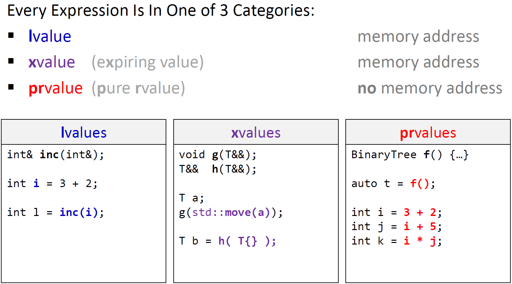
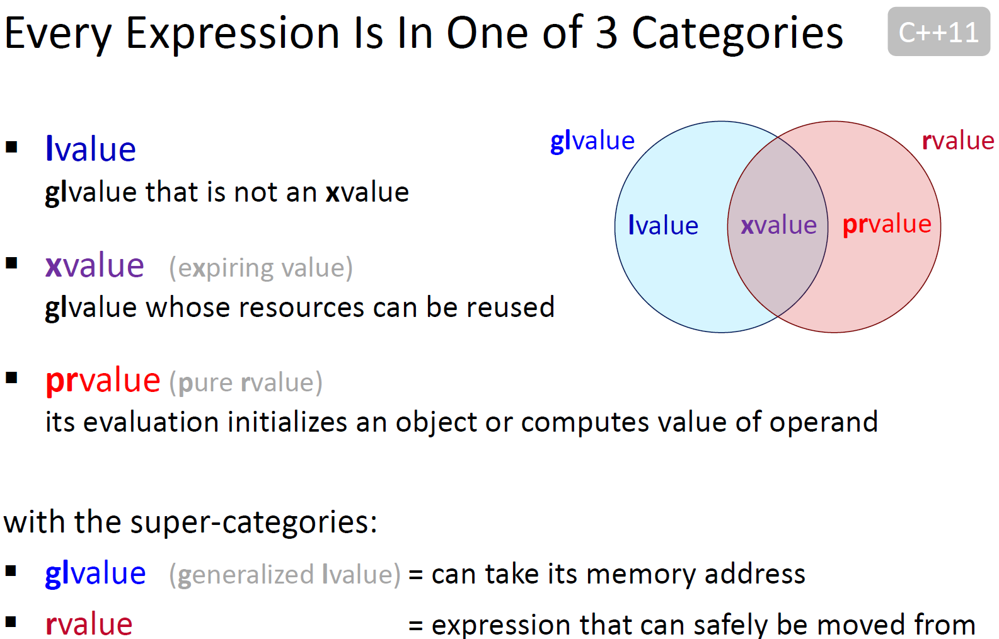
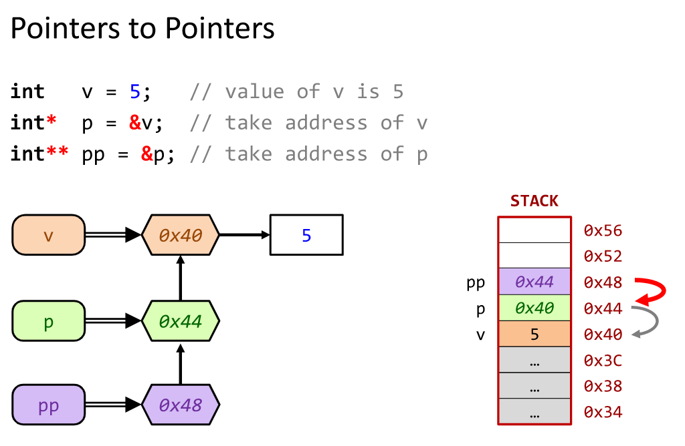

# 高级话题
## 类型转换
类型*铸造(cast)*：

* cast 是两种类型之间的转换
* 一些转换很慢
* 可能导致代码难以理解，并且容易出错
* 只有当必须使用时在使用

通用类型转换：

1. 通过单个参数的构造函数 -> 推荐使用
2. 通过转换操作符        -> 谨慎使用

```C++
class A {...};

class B{
public:
    explicit B(const A&);           // construct a B from A
    explicit operator A() const;    // make an A from B 
};
```

`static_cast<TargetType>(expression)` 简介：

* 编译时转换(转换自身没有运行时消耗)
* 满足以下条件时，可以转换：
  * 目标类型定义了源类型作为参数的构造函数
  * 源类型定了返回目标类型的*操作符转换*

```C++
int i = 5, j = 20;
auto r = static_cast<double>(i)/j;          // prevents int division

class A {...};
class B {
public:
    B(const A& a) {
        ...
    }
};

A a;
auto b1 = static_cast<B>(a);                // conversion A->B
auto b2 = B(a);                             // same
```

`dynamic_cast<TargetType>(expression)`：

* 将父类(superclass)转换为子类(derived class)
* 只可以转换指针和引用
  * 对于指针：如果转换失败，返回`nullptr`
  * 对于引用：如果转换失败，抛出异常

```C++
class Vehicle{

};

class Car : public Vehcile{

};

class Movie{

};

Car c;
Vehcile* v = &c;

auto cc = dynamic_cast<Car*>(v);                // succeeds: cc = &c

auto m = dynamic_cast<Movie*>(v);               // fails: m = nullptr;
```

`const_cast<TargetType>(expression)`：

* 去掉const属性("casts constness away")
* 没有运行时额外开销
* 通常避免使用，在一些内部数据结构实现方面很有用
* 源基础类型和目标基础类型必须相同

```C++
Circle c;
const Circle* cpc = &c;

Circle* pc = const_cast<Circle*>(cpc);
```

`reinterpret_cast<TargetType>(expression)`：值=通过类型解析对应数据位(bits)

* 根据不同的类型重新诠释数据位
* 没有运行时消耗
* 通常避免使用
* 要使用的情况非常罕见(通常是数据结构中的低层次转换)
* 在某些情形下不可以使用，可能违反类型别名规则

智能指针转换：

```C++
auto sp = make_shared<X>();

// static_pointer_cast<Y>(sp) <=> static_cast(Y*)(sp.get())

// dynamic_pointer_cast<Y>(sp) <=> dynamic_cast(Y*)(sp.get())

// const_pointer_cast<Y>(sp) <=> const_cast(Y*)(sp.get())
```
## Move 语义
首先来看`swap`函数：

```C++
void swap(T& a, T& b)
{
    auto temp = a;              
    a = b;
    b = temp;
}
// 说明
// a 的数据拷贝到 temp
// b 的数据拷贝到 a
// temp 的数据再拷贝到 b
```

数据的交换只需让`temp`先记录存储`a`的地址，然后将指向`b`的地址赋值给`a`，再将`temp`记录的`a`地址赋值给`b`。这样就省去了中间三次拷贝。

C++11 引入`std::move`函数返回右值，从而调用类型的右值赋值函数或右值构造函数。

```C++
void swap(T& a, T& b)
{
    auto temp = move(a);
    a = move(b);
    b = move(temp);
}
```

* 如果类型`T`移动更加高效，则提升性能
* 几乎所有的标准容器使用`move`更加高效，除去`std::array`

`move`在使用例子：

```C++
// 拷贝构造函数
vector<int> v {1, 2, 3, 4, 5, 6};           // v->1,2,3,4,5,6
vector<int> w(std::move(v));                // w->1,2,3,4,5,6;  v = nullptr

// 赋值函数
vector<int> v {1, 2, 3, 4, 5, 6};           // v->1,2,3,4,5,6
vector<int> w {7, 8, 9};                    // w->7,8,9
w = std::move(v);                           // w->1,2,3,4,5,6; 7,8,9 丢弃; v = nullptr

// unique_ptr 拷贝构造函数
auto x = make_unique<int>(5);               // x->5
auto y = std::move(x);                      // y->5, x = nullptr

// unique_ptr 赋值函数
auto x = make_unique<int>(5);               // x->5
unique_ptr<int> y;                          // y->nullptr
y = std::move(x);                           // x->nullptr, y->5
```

*rvalues* 和 *lvalues*

> lvalue = 可以获取表达式的内存地址的值  
> rvalue = 不可以获取表达式内存地址的值

```C++
int a = 1;                                  // a and b are both lvalues
int b = 2;
a = b;
b = a;

a = a * b;                                  // (a*b) is an rvalue
int c = a * b;

a * b = 3;                                  // COMPILER ERROR: can not assign 3 to rvalue

int i  = 1;                                 // OK, literals are rvalues
i = 2;          

int* pi = &i;                               // OK, can take address of lvalue i

int& foo();                                 // two functions
int bar();

i = bar();                                  // OK, result of bar is rvalue

foo() = 3;                                  // OK, result of foo is an lvalue reference
int* pf = &foo();                           

int* pb = &bar();                           // COMPILER ERROR: can not take address of rvalue
```

*rvalue* 引用：

* *lvalue references*:
  * `T&` 只能绑定到**no-const** 类型的*lvalues*
  * `const T&` 可以绑定到**const** 类型的*lvalues* 或*rvalues*

* *rvalue references*:
  * `T&&` 只能绑定类型为*rvalues*

```C++
void foo(T& x);                            // "I modify x"

void bar(const T& x);                      // "I just read from x"

void baz(T&& x);                           // "I (might) absorb x"
```

C++11 引入`std::move`将表达式转换为*rvalue*：

```C++
void foo(int& x)            {cout << x;}
void bar(const int& x)      {cout << x;}
void baz(int&& x)           {cout << x;}

int i = 0;
foo(i);                     // OK
foo(move(i));               // ERROR: lvalue ref cannot bind to rvalue

bar(i);                     // OK
bar(move(i));               // OK

baz(i);                     // ERROR: rvalue ref cannot bind to lvalue
baz(move(i));               // OK
```





## 类型推导
`auto` C++11 引入，简介：

* 舍去const和引用(throw away const and references)
* 和模板的参数类型推导规则几乎一致

```C++
int i = 1;
int& ri = i;
const int& cri = i;

auto x = i;             // int
auto y = ri;            // int
auto z = cri;           // int
```

* 添加`const`变为不可修改的类型
* 添加`&`得到引用类型

```C++
int i = 1;

const auto ci = i;     // const int
auto& ri = i;          // int&
const auto& cri = i;   // const int&
```

C++14 引入返回值推导：

```C++
auto foo(const vector<int>& v, double d)
{
    vector<double> r;
    ...
    return r;                   // deduced return type: vector<double>
}
```

```C++
template<class T>
auto mean(const vector<T>& v)
{
    auto total = std::accumulate(begin(v), end(v), 0);
    return (total / v.size());      // deduced return type depends on result of division 
}
```

C++11 引入 `decltype`:

* 获取表达式的类型
* 获取到的类型包含`const` 和 引用

```C++
int          i = 1;
int &       ri = i;
int const& cri = i;

using T1 = decltype(i);         // int
using T2 = decltype(ri);        // int &
using T3 = decltype(cri);       // int const&

T2 x = i;                       // int & 
decltype(cri) y = i;            // int const&
```
## 类型特征
需要包含头文件 `#include <type_traits>`，主要做如下事情：

* get subtypes/type aliases defined within a class
* check if a type satisfies certain requirements
* transform one type into an other
* get special constants associated with a type


## 完美转发(Perfect Forwarding)
### 动机：通用工厂函数(Generic Factory Functions)

```C++
template<class T, class A1, class A2, class A3>
auto factory(A1 a1 = A1(), A2 a2 = A1(), A3 a3 = A1())
{
  return pair<T, int>{T{a1, a2, a3}, 0};
}

```

实现此函数需要满足：

* `T` 必须为三个参数
* `factory` 最多为三个参数
* `A1,A2,A3` 必须有默认构造函数
* `a1,a2,a3` 通过值传递(可能会导致昂贵的值拷贝)，如果使用`const&` 和 `&` 传递，各种情况的组合爆炸(combinatoric explosion)

### 任意参数

```C++
template<class... Args>     // Args = "paramter pack"
void f(Args..);

template<class T, class.. Args>
auto factory(Args... args)
{
  return pair<T, int>{ T{args...}, 0};        // "unpacking"
}
```

* 优点：任意参数
* 缺点：仍然使用值传递

### Forwarding References

```C++
template <class T>
// 函数f的参数类型必须为模板类型T，才可以forward
// 对于参数的类型没有(const, volatile)限定
void f(T&&);          // bind to const or non-const lvalues and rvalues

template<class T>
void foo(T& );        // overload for lvalues only

template<class T>
void foo(T&& );       // overload for everything else except lvalues


template<class T>
void f1(T&&);         // forwarding ref

struct A {
  template<class T>
  void f2(T&&);       // forwarding ref
}

template<class T>
struct B{
  void f3(T&&);      // not a forwarding reference!

  template<class X>
  void f4(X&&);      // forwarding ref
}
```

### 引用组合

```C++
// 组合表，引用没有传递性
/*
&   &   -> &  
&   &&  -> &  
&&  &   -> &
&&  &&  -> &&
*/

template<class T>
void r(T & x);            // A& &       -> A&

template<class T>
void cr(T const& x);      // A&   const&  -> A const& 
                          // A&&  const&  -> A const& 

template<class T>
void fwr(T && x);         // A const& &&  -> A const &
                          // A&       &&  -> A&
                          // A&&      &&  -> A&&

// std::forward<T>(arg) 将arg类型转换为 T&&

template<class T, class Arg>
auto make_wrapper(Arg&& arg)
{
  return wrapper<T> {std::forward<Arg>(arg)};
}

// arg 可以正确转发：
// * constness
// * l/r-valueness

// 注意：arg 有名字，因此是左值
// 必须使用 std::forward 来保持住潜在的右值的属性(preserve potential rvalueness)
```

### Variadic Templates + Forwarding Refs = Perfect Forwarding

* 任意数量参数
* 处理任意组合：`& / const& / &&`
```C++
template<class T, class... Args>
auto factory(Args&&... args)
{
  return pair<T, int>{std::forward<Args>(args)..., 0};
}
```

## 指针运算

```C++
/*
      pc                  ps                  pi
      |                   |                   |
|0x15|0x16|0x17|0x18|0x19|0x1A|0x1B|0x1C|0x1D|0x1E|0x1F|0x20|0x21|0x22|0x23|0x24|0x25|
|----| 3  |----|----|----|    5    |---------|          9        |----|----|----|----|
      ****                **** ****           **** **** **** ****
        c                     s                         i
*/

char    c = 3;
short   s = 5;
int     i = 9;

char*   pc = &c;
short*  ps = &s;
int*    pi = &i;

pc++;               // 0x17
ps++;               // 0x1C
pi++;               // 0x22 
```

```C++
/*
      pc                  ps                  pi
      |                   |                   |
|0x15|0x16|0x17|0x18|0x19|0x1A|0x1B|0x1C|0x1D|0x1E|0x1F|0x20|0x21|0x22|0x23|0x24|0x25|
|----| 3  |----|----|----|    5    |---------|          9        |----|----|----|----|
      ****                **** ****           **** **** **** ****
        c                     s                         i
*/

char    c = 3;
short   s = 5;
int     i = 9;

char*   pc = &c;
short*  ps = &s;
int*    pi = &i;

pc--;               // 0x15
ps--;               // 0x18
pi--;               // 0x1A 
```

### 指针运算

```C++
/*
      p
      |
|0x15|0x16|0x17|0x18|0x19|0x1A|0x1B|0x1C|0x1D|0x1E|0x1F|0x20|0x21|0x22|0x23|0x24|0x25|
|----|          5        |-----------------------------------------------------------|
      **** **** **** ****|          
                i
*/
int i = 5;
int* p = &i;

/*
                          p
                          |
|0x15|0x16|0x17|0x18|0x19|0x1A|0x1B|0x1C|0x1D|0x1E|0x1F|0x20|0x21|0x22|0x23|0x24|0x25|
|----|          5        |-----------------------------------------------------------|
      **** **** **** ****|          
                i
*/

p = &i + 1;


/*
                                                                  p
                                                                  |
|0x15|0x16|0x17|0x18|0x19|0x1A|0x1B|0x1C|0x1D|0x1E|0x1F|0x20|0x21|0x22|0x23|0x24|0x25|
|----|          5        |-----------------------------------------------------------|
      **** **** **** ****|          
                i
*/

p += 2;
```

### `[]`操作符

> p[n] = 指针地址 + n

```C++
/*
        p
        |
|2  |0  |5  |0  |1  |3  |8  |9  |0  |
*/

char c = 5;
char* p = &c;

/*
        p
        |
|2  |0  |5  |0  |1  |3  |7  |9  |0  |
*/

*(p + 4) = 7;

/*
        p
        |
|2  |0  |5  |0  |1  |3  |2  |9  |0  |
*/

p[4] = 2;
```

### 指向指针的指针


## C 数组

在堆上的C数组特征：

* 可用性差(horrible usability)，但在一些远古的代码里经常看到
* 相同类型的块对象
* 长度必须是常量表达式
* 首个值的索引为0

```C++
double a[3] {1.0, 1.2, 5.4};          // declare array of 3 doubles

a[1] = 123.5;                         // change second value

for(int i = 0; i < 3; ++i){
  cout << a[i] << '\n';               // write values to console
}

指针和C数组：

非常奇怪的是数组变量为首个变量的地址。

```C++
int number[5];                            // int array of size 5
int* p;                                   // pointer to int

p = numbers;          *p = 10;            
p++;                  *p = 20;            // 指针加 1
p = &numbers[2];      *p = 30;            // 指向第三个元素
p = numbers + 3;      *p = 40;            // 指向第四个元素
p = numbers;          *(p + 4) = 50;      // 指向第五个元素

for(int n = 0; n < 5; ++n)
  cout << numbers[n] << ",";              // 10, 20, 30, 40, 50
```

数组访问：

```C++
int numbers[5] {1, 2, 3, 4, 5};

// 以下两种形式等价
*(numbers +2)   = 9;
numbers[2]      = 9;
```

为啥避免使用C数组：

* 不能深度拷贝和赋值
* 数组变量为指向数组的首个元素指针
* 数组不知道自己的长度
* 不能安全的当做函数参数

C语言里的String:

* 字符数组
* 使用`\0`结尾
* 字符`"xyz"` 的类型为 `char const[]`

## 手动内存管理
局部变量分配在栈上，通过`new`变量分配在堆上。

```C++
// 分配在栈上
int i = 5;
int j = 12;

struct point {
  int x;
  int y;
};

point p {44, 55};

// 分配在堆上
int* p = new int{5};
delete p;                                 // free object

int* a = new int[3]{1, 2, 3};             // allocat array of s "T" objects
delete a[];                               // free array
```

手动管理内存分配有以下问题：

* 指针指向已经删除的内存
* 指向被其他进程使用的内存
* 手动跟踪分配(new)和释放(delete)
* 非常容易错，可能导致非常难捕捉的bugs

### 黑暗时代(before C++11)
直接操作指针：

* 显示的 `new` + `delete`通常不在同一个地方
* 没有直接的接口
* 非常容易内存泄漏

### 现代C++

智能指针：

* 自动删除对象
* 自说明接口和拥有权(self-documenting interfaces / ownership)
* 无内存泄漏

### Address Sanitizer(ASAN)

* g++, clang++
* 探测内存错误bugs
  * 内存泄漏
  * 访问已经释放的内存
  * 访问错误的栈区域
* 使用额外的指令分析你的代码
  * 粗略增加70%运行时间
  * 粗略增加3倍内存使用

#### 例子
```C++
int main()
{
  int* p = nullptr;
  cout << "p = " << *p << '\n';
}
```

```
$ g++ asan.cpp -o asan -fsanitize=address

$ ./asan
```

### Valgrind

* 检测常见运行时错误
  * 读写已释放内存或错误的栈区域
  * 使用未初始化值
  * 错误释放内存，比如释放两次
  * 错误使用内存分配函数
  * 内存泄漏-错误的内存使用逻辑流程，导致不使用的内存没有释放返回操作系统

* Windows
  * Dr.Memory
  * Windows 10 64 Bit: Valgrind in WSL

```
valgrind [options] ./program [program options]

// Options
// -- help
// --tool=memcheck    check the memory of your program
// --leak-check=full  see the details of your leaked memory
// -v / --verbose     show some extra information
```

### 标准库里异常

```C++
#include <exception>        // utilities for handling
#include <stdexcept>        // predefined types

// operator new throws
// std::bad_alloc           // 内存分配失败
// std::bad_new_array_size  // if array length < 0 或太大

try{
  int* a = new int[1000000];
}
catch(std::bad_alloc){
  cerr << "out of memory\n";
}
```

### 异常导致的内存问题

下面为内存泄漏实例代码：

```C++
void read_bufferd(string const& filename) {
  int* buf = new int[1024];
  if(!file_exists(filename)){
    throw file_not_fonnd_error{filename};
  }

  // buffer memory leaks
}
delete[] buf;
```

智能指针和异常导致的内存问题：

```C++
void foo(unique_ptr<Widget> w, Gadget g)
{

}

foo(new Widget{}, Gadget{});

// C++ Standard:
// 所有的函数参数在进入函数前执行完毕
// 函数参数执行顺序不确定

// 六种的两种顺序：
// 1. new Widget{}            1. Gadget{}
// 2. Gadget{}                2. new Widget{}
// 3. unique_ptr<Widget>{}    3. unique_ptr<Widget>{}

// 如果 Gadget 构造函数抛出异常
// Widget 已经在堆上构造
// unique_ptr 还未拥有Widget的拥有权
// Widget 对象泄漏

foo(make_unique<Widget>(), Gadget{});

// 没有泄漏的可能性
// make_unique<Widget>() 在Gadget执行之前或之后完全执行
// 如果 Gadget 构造函数抛出异常，Widget 被 unique_ptr 拥有
// Widget 无论如何都会正确是销毁
// 使用 make_unique  和 make_shared
```

## 分配器(Allocators)
为内存分配策略提供通用接口：

* 为C++运行时的 `new/delete`提供委托
* 相同尺寸块的内存池(pool of blocks)
* 不同尺寸块的内存池(pool of blocks with different sizes)

为啥这样做？

* 解耦内存分配策略和容器逻辑
* 速度：内存分配速度慢
* 确保有足够的内存
* 确保理想的内存布局/更加紧凑(better locality)

接口：

```C++
template<class T>
class MyAllocator
{
public:
  T* allocate(std::size_t n);

  void deallocate(T*, std::size_t n);
};
```

`new/delete`的委托：

```C++
template<class T>
class NewDeleteAllocator
{
public:
  T* allocate(std::size_t n){
    return new T[];
  }

  void deallocate(T* p, std::size_t) {
    delete[] p;
  }
}
```

块分配器：

```C++
template<class T>
class BlockAllocator {
public:
  BlockAllocator(size_t blockSize, size_t numBlocks = 1);

  T* allocate(size_t n);

  void deallocate(T* p, size_t);
private:
  vector<T> buffer_;
  size_t blockSize_;
  vector<T*> claimed_;
};
```

用到分配器的地方(Allocator Awareness)：

大多数的 `std::` 容器都使用分配器，除了`std::array`

```C++
namespace std {
  template<class T, class Allocator = std::allocator<T>>
  class vector{
  public:
    explicit vector(Allocator const&);
  };
}
```

分配器是容器类型的一部分：

* 分配器在运行时不可改变
* 创建容器后，容器类型根据分配器类型不同

```C++
std::vector<int, std::allocator<int>> v1;

std::vector<int, BlockAllocator<int>> v2;

void foo(std::vector<int, std::allocator<int>> const&);

void foo(std::vector<int, BlockAllocator<int>> cosnt&);

```

使用分配器(C++11)：

推荐使用：`std::allocator_traits`

```C++
class point {
public:
  point(double x, double y);
};

MyAllocator<point> alloc;
using a_t = std::allocator_traits<MyAllocator<point>>;

auto p = a_t::allocate(alloc, 2);         // obatin memory for 2 objects
at::construct(alloc, p, 1.3, 5.4);        // construct new Point object
at::construct(alloc, p+1, 4.8, 2.0);      // construct new Point object

a_t::destroy(alloc, p);                   // destroy 1st point object
a_t::destroy(alloc, p+1);                 // destroy 1st point object

a_t::deallocate(alloc, p, 2);             // give memory back
```