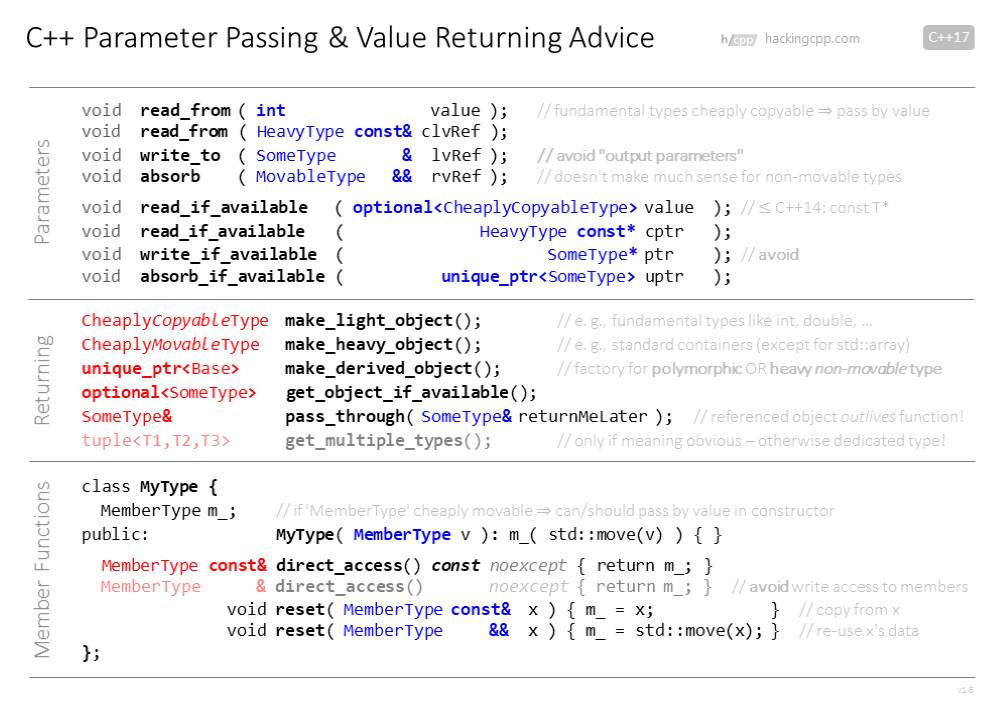

# Software Design Basic
## 设计原则
为啥关心软件设计：

* 正确性
* 可维护性

我们想要的：

* 可理解的 *programs/functions/classes/...*
* 编译器作为是否正确的检查者，如果编译通过，几乎是对的

> Interfaces should be easy to use correctly and hard to use incorrectly -Scott Meyers

### 坏的设计常见原因

**好心办坏事(The road to(code) hell is paved with good intentions:)**

* 为将来的改变过度设计
* 类的接口和交互太过接近现实世界或抽象数学对象模型
* 尝试建立完美和通用系统或继承结构来"做/描述/建模"任何东西
* 试图“抽离”硬件限制

**坏设计的常见表现**：

* 命名不统一
* 通过继承来便面数据冗余
* 为每个成员添加`setter/getter` 
* 类和函数实现多个目的("god classes", 1000-line functions with 10 if-levels)
* 函数有很多参数(通常是相同类型)
* 接口暴露太多实现细节
* 继承层次过深
* 超级灵活或超级模块化的系统，有无数种方式让对象互相交互

**让你的意图清晰并避免疑惑**：

* 无歧义和准确的命名
* 严格的选择(e.g. set of possible/valid values)
* 设计清晰的专一类型
* 个数较少并且类型不同的参数，避免output参数(通过非const引用)
* 选择标准库的容器和算法更佳
* 选择在C++社区人尽皆知的设计模式

**你不清楚将发生什么**：

修改经常发生-并且是你想不到的方式：

* 不要尝试预测将要发生的改变/需求
* 仅仅添加此刻的需求
* 限制未来变化的可能性

**限制潜在变化的范围/影响**：

* 最小范围内申明变量
* 每个函数和类型功能单一性
* 避免繁琐的，难以检查的前置条件
* 避免深度继承层次

**OOP 设计模式**：

需要知道的设计模式如下：

* Composite, Decorator, Bridge, Vistor, Proxy, Facade,...
* Iterator, Strategy, Observer, Command, Template Method,...
* Factory Method, Abstract Factory, Singleton

## 设计学习：函数接口

首次看到如下的代码：

```C++
// lots of code ...
ps = raad(filename, '\t', maxN, true, false);

// lots of code...
```

我们得到的信息如下：

```C++
ps = raad(filename, '\t', maxN, true, false);

// 可能的函数签名

SomeType? read(string?, char, int?, bool, bool);
```

真正的定义如下：

```C++
vector<Point> read(
    std::string const& filename,
    char separator = ' ',
    int maxN = -1,
    bool positiveXYonly = false,
    bool continueOnError = true);
```

如果不得不扩展函数，比如任务是读取`point.x <= 0 and point.y <= 0`:

尝试一：

```C++
vector<Point> read(
    std::string const& filename,
    char separator = ' ',
    int maxN = -1,
    bool positiveXYonly = false,
    bool negativeXYonly = false,            // 这里添加新参数
    bool continueOnError = true);

// 破坏以往的调用

ps = read(fname, '\t', maxP, true, true);
```

尝试二：

```C++
vector<Point> read(
    std::string const& filename,
    char separator = ' ',
    int maxN = -1,
    bool positiveXYonly = false,
    bool continueOnError = true,
    bool negativeXYonly =  false);

// 当 positiveXYonly 和 negativeXYonly 同时为true时

ps = read(fname, '\t', maxP, true, true, true); 
```

接口设计之初就不合理：

* 难以理解
* 难以使用正确
* 几乎很难扩展


函数名字：
```C++
ps = read(...);

// 表达更加清晰
ps = read_points(...);
```

`-1` 作为极限值是愚蠢的:

```C++
vector<Point> read(
    std::string const& filename,
    char separator = ' ',
    int maxN = std::numeric_limits<int>::max(),         // 使用标准库的最大值
    bool positiveXYonly = false,
    bool continueOnError = true);
```

因为读取数量是正数，负数是浪费：

```C++
vector<Point> read(
    std::string const& filename,
    char separator = ' ',
    size_t maxN = std::numeric_limits<size_t>::max(),         // 使用正数 
    bool positiveXYonly = false,
    bool continueOnError = true);
```

远离Bool参数：

```C++
enum class exclude {
    none, negativeXY, positiveXY
};

enum class on_error {
    continue_reading, stop_reading, empty_result
};

vector<point> read_points (
    std::string const& filename,
    char separator = ' ',
    size_t maxN = numeric_limits<size_t>::max(),
    exclude = exclude::none,
    on_error = on_error::continue_reading);
```

分割符最好使用类型：

```C++
class value_separator {
public:
    constexpr explicit value_separator(char s = ' ') noexcept : s_{s}
    {

    }

    constexpr char value() const noexcept {return s_;}

private:
    char s_;
}
```

Count Limit 使用类型

```C++
class count_limit {
public:
    constexpr explicit count_limit(size_t n) noexcept:n_{n}
    {

    }

    static constexpr count_limit value() noexcept{
        return count_limit{std::numeric_limits<size_t>::max};
    }
private:
    size_t n_;
};

bool operator == (count_limit x, count_limit y)
{
    return x.value() == y.value();
}
```

新的函数接口如下：

```C++
vector<point> read_points(
    std::string const& filename,
    value_separator = value_separator{' '},
    count_limit = count_limit:none(),
    exclude = exclude::node,
    on_error = on_error::continue_reading);

...

ps = read_points(
    filename,
    value_separator{'\t'},
    count_limit{maxp},
    exclude::negativeXY,
    on_error::stop_reading);
```

通过更高阶的参数筛选Point：

```C++
vector<point> read_points(
    std::string filename,
    value_separator = value_separator{ ' '},
    count_limit = count_limit::none(),
    on_error = on_error::continue_reading,
    std::function<bool(Point const&) filter
    = [](Point const&) {return ture;});

// 对于x,y 为正数：

ps = read_points(
    file_name,
    value_separator{'\t'},
    count_limit{maxP},
    on_error::stop_reading,
    [](Point const& p) {
        return p.x >= 0 && p.y >= 0;
    });
```

改造后：

* 函数调用变的更加容易理解以及清晰
* 专用约束类型在将来更容易修改和扩展
* 我们在其他函数和类里重用约束类型

更好的方案：约束设置类型

```C++
read_settings how;
how.max_count(maxP);
how.filter([](point const& p){
        return p.x >= 0 && p.y >= 0;}
    );

how.error_action(on_error::stop);

ps = read_points(filename, how);

// 也可以使用指定构造函数
ps = read_points(
    filename,
    read_settings{
        count_limit{maxP},
        on_error::stop,
        [](point const& p) {
            return p.x >= 0 && p.y >= 0;
        }
    });
```

设置类型：

* 可以更好的控制不同设置
* 比起很多默认参数，更容易使用
* 在其他函数读取时兴许可以用到

替代："Reader" class = Settings + Action

```C++
point_reader read;
read.max_count(maxP);
read.filter([](point const& p) {
    return p.x >= 0 && p.y >= 0;
});

read.error_action(on_error::stop);

ps = read(filename);
```

Reader = Settings + Action，是否合适依据使用场景：

* setting 离开action 不能独立使用
* 设置一次，可以多次执行read
* reader 可能携带额外的状态，上次的调用可能影响下次的调用

### 参数使用tips



## 设计学习：绕轴旋转

此算法正常输入为：

* 归一化向量
* 角度
* 我们想避免向量归一化的消耗
  * 长度是否为一(dot product)
  * 如果不是归一化，则需要求平方根

首次尝试：

```C++
quaternion make_screw_rotation(double a, double x, double y, double z);
```

这是最坏的接口：

* 参数：这是四元数的组件吗？角度？轴？没有明确说明 =>只能看文档
* 角度是弧度还是角度 => 检查不了
* 坐标轴是否归一化? => 需要检查
* 结果是单位四元数? => 需要检查

通过编译器来检查参数顺序：

```C++
quaternion make_screw_rotation(double angle, vector3d const& axis);
```

好一些：

* 参数意义比较明确，并且顺序也会被编译器检查

任然对于使用者和实现者有问题：

* 角度是弧度还是角度 => 检查不了
* 坐标轴是否归一化? => 需要检查
* 结果是单位四元数? => 需要检查

使用限制类型：

```C++
rotation3d make_screw_rotaion(radians a, direction3d const& d);

auto d = direction3d{1.0, 0.0, 1.0};
auto a = degrees{45.0};
auto q = make_screw_rotation(a ,d);
```

* 参数意义比较明确，并且顺序也会被编译器检查
* 实现者知道角度是弧度
* 实现者知道坐标轴是归一化
* 使用者知道旋转值是3维坐标
* 这样的实现可以不牺牲性能吗？ -YES！

## 遍历实现

### 应用

搜索：

* arrays & lists: 线性搜索，二分搜索
* graphs & trees：深度搜索，广度搜索

容器子区间：

* n-d 矩阵：列，子矩阵，带(band)，border elements，...
* m-tuples of elements:pairs, triples,...

生成序列：

* 数字系列：线性，几何 ...
* 位模式 序列

### Ranges

**Range = has begin and end**

* 常规实现：遍历器 + 访问函数
* 所有标准容器通常来讲都是"ranges"
* 可以通过range-based for loops

### 遍历数据结构

更高阶的函数：

* 函数使用一个或多个函数作为参数
* 无状态;固定流程
* C++标准库算法是HOF(高阶函数)

迭代器：

* 指针对象：自增，解引用，比较，拷贝，...
* 无状态;边控控制流程

协程(C++20)

* resumable/stateful functions
* 变量控制流程

### 使用高阶函数生成对

```C++
temlate<class Range, class Inspector>
void for_all_pairs(Range const& r, Inspector&& inspect)
{
    for(auto const& x : r) {
        for(auto const& y : r) {
            inspect(x , y);
        }
    }
}
vector<int> v {1, 2, 3, 4};
for_all_pairs(v, [](int x, int y) {
    cout << "(" <<x << "," << y << ")";     // (1, 1) (1, 2) (1, 3) (1, 4) (2, 1) ... (4, 3) (4, 4)
});
```

同时遍历两组序列，不能用固定流程实现。

```C++
vector<int> a {1， 2， 3}；
vecotr<char> b {'a', 'b', 'c'};

// 期望输出
// (1, 'a')
// (2, 'b')
// (3, 'c')

// 固定流程实现不了
for(int x : a) {
    for(int y : b) {
        cout << "(" << x "," << y << ") ");
    }
}

std::for_each(begin(a), end(a), [](int x) {
    std::for_each(begin(b), end(b), [](int y) {
        cout << "(" << x "," << y << ") ");
    });
})

// 使用遍历器来解救

auto i = begin(a);
auto j = begin(b);

while(i != end(a) && j != end(b)) {
    cout << "(" << x "," << y << ") ");
    ++i;
    ++j;
}

// 或使用协程
template<class Range>
auto items(Range const& r) {
    for(auto const& x : r) {
        co_yield x;
    }
}


auto y = items(b);
for(auto x : items(a)) {
    cout << "(" << x "," << y() << ") ");
}
```

还可以添加更高阶的函数：

```C++
template<class Range1, class Range2, class Inspector>
void for_all_zipped_pairs(Range1 cosnt& r1, Range2 const& r2, Inspector&& inspect)
{
    using std::begin;
    using std::end;
    auto i = begin(a);
    auto j = begin(b);
    while(i != end(a) && j != end(b)) {
        inspect(*i, *j);
        ++i;
        ++j;
    }
}
```
