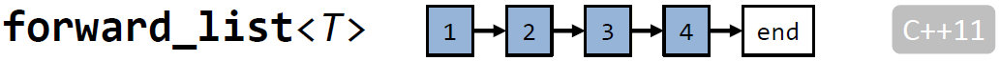
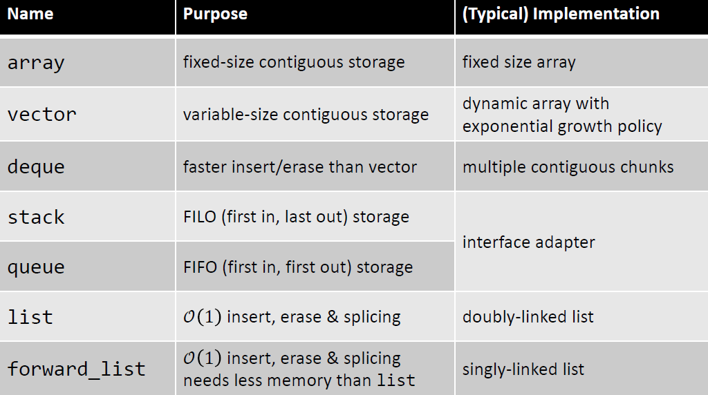

# 标准库
## 顺序容器
C++11 引入 `array<T,size>`，介绍如下：

* `size`必须是常量表达式(编译时必须得到真实值)
* 首个值的索引为 `0`
* 拷贝构造和赋值都使用深度拷贝

```C++
#inlcude <array>

array<int, 6> a {4, 8, 15, 16, 23, 42};

cout << a.size() << '\n';       // 6
cout << a[0] << '\n';           // 4
cout << a[3] << '\n';           // 16
cout << a.front() << '\n';      // 4
cout << a.back() << '\n';       // 42
```

### vector 简介
通过一个例子来理解`vector`的长度和容量：

```C++
vector<int> w{0, 2};
w.push_back(2);
w.push_back(3);
w.push_back(4);
cout << w.size() << '\n';       // 5
cout << w.capacity() << '\n';   // 8
```


`vector` 的 `resize` 函数介绍如下：

```C++
#include <vector>
vector<double> v{1.0, 1.0};         // {1.0, 1.0}
cout << v.size() << '\n';           // 2
cout << v.capacity() << '\n';       // 2
v.resize(4, 2.0);                   // {1.0, 1.0, 2.0, 2.0}
v.resize(1);                        // {1.0, _1.0_, _2.0_, _2.0_}，长度为1，但容量为4
v.push_back(4.0);                   // {1.0, 4.0, _2.0_, _2.0_}，长度为2， 容量为4
v.clear();                          // {_1.0_, _4.0_, _2.0_, _2.0_}，长度为0，容量为4

cout << v.size() << '\n';           // 0
cout << v.capacity() << '\n';       // 4
```

`vector<T>::emplace_back(arg1, arg2, ...,argN)` 简介：

* 通过arg1 到 argN 构造类型为T的对象插入容器
* 类型T需要满足对应参数的构造函数

```C++
struct point{
    point(int a, int b):x(a),y(b) {}
    int x;
    int y;
};

vector<point> v;                // {}
v.push_back(point{1, 2});       // {{1, 2}}
v.emplace_back(3, 4);           // {{1, 2}, {3, 4}}
```

`vector<T>` iterator 简介：

* 指向容器的一个索引地址
* 通过`++,--,+,-,+=,-=`来导航(navigation)
* 通过符号`*`来访问值
* 通过iterator和整数的组合可以构造范围


`vector<T>` 插入和删除简介：


### deque<T> (double ended queue)

* 由几块连续的内存组成
* 相比`vector`从两端添加元素效率更高
* 相比`vector`访问元素的效率低(因为不是连续的一块内存)

```C++
#include <deque>

deque<int> d {0, 0, 0};                     // {0, 0, 0}

d.push_back(1);                             // {0, 0, 0, 1}
d.push_front(2);                            // {2, 0, 0, 0, 1}

vector<int> v {3, 4, 5, 6};
d.insert(begin(d), begin(v), end(v));       // {3, 4, 5, 6, 2, 0, 0, 0, 1}
d.erase(begin(d)+2, begin(d) + 5);          // {3, 4, 0, 0, 0, 1}
```

### list<T>


* 双向列表
* 对于大批量的删除和增加效率更高
* 常量时间级别的分片
* 不可以通过`[]`操作符随机访问元素

```C++
#include <list>
list<int> l;                            
l.push_back({23, 42});                  // l: 23 <-> 42
l.push_front(4);                        // l: 4 <-> 23 <-> 42

list<int> k {8， 15， 16};              // k: 8 <-> 15 <-> 16
l.splice(begin(l) + 1, std::move(k));   // k: empty l: 4 <-> 8 <-> 15 <-> 16 <-> 23 <-> 42
```

### forward_list<T>



* 单链表
* 每个值对应一个指针
* 没有函数：`size(), back(), push_back(), pop_back(), insert()`
* 使用函数: `insert_after(), splice_after(), before_begin()`

```C++
#include <forward_list>

forward_list<int> l {23, 42, 4};                // 23 -> 42 -> 4
l.insert_after(begin(l), 5);                    // 23 -> 5 -> 42 -> 4
l.insert_after(before_begin(l), 88);            // 88 -> 23 -> 5 -> 42 -> 4
```

在C++17中引入了模板参数自推导：

```C++
vector a {1, 2, 3, 4};                          // vector<int>
vector b {1.0, 2.2, 3.2, 4.8};                  // vector<double>

list c {1.0f, 2.3f, 4.6f};                      // list<float>

struct Point {int x; int y;};

vector d { Point{1, 2}, Point{3, 4}};           // vector<Point>
```

标准容器总结：



### 容器的遍历

正向遍历，对所有标准容器有效：

```C++
vector<int> v {1, 2, 3, 4, 5, 6};
for(int x : v) cout << x << '\n';

// read-only, if type cheap to copy/or copy needed
for(auto x : v) cout << x <<'\n';

// read-only, if type expensive to copy
for(const auto& x : v) cout << x << '\n';

// modify values
for(auto& x : v) cin >> x;

// explicit use of iterators
for(auto i = begin(v); i != end(v); ++i) cout << *i << ' ';
```

反向遍历，对标准容器`array, vector, deque, list, set, map` 生效：

```C++
vector<int> v {1, 2, 3, 4, 5, 6};

for(auto i = rbegin(v); i != rend(v); ++i)
{
    cout << *i << ' ';
}
```

有用的遍历函数：

```C++
#include <iterator>
vector<int> v {1, 2, 3, 4, 5, 6, 7};

auto i = begin(v);
cout << *i;             // 1

auto n = next(i);
cout << *n;             // 2

cout << *next(i, 3);    // 4

cout << *prev(n);       // 1
```

### 标准算法


标准算法是通用的，因为**算法和容器类型以及容器内容类型无关**。

* N 个容器，M 种算法
* 常规实现：N X M 种实现？
* 更好的实现方式：通过通用迭代器接口来遍历容器
* 只要针对迭代器接口实现 M 种算法

迭代器简介：

* 指向容器的一个位置
* 通过`++,--,+, -, +=, -=`来导航
* 通过`*`操作符访问值


通用性的限制：

* 一些算法可能比较慢，比如一些容器不支持 0(1) 访问 (std::list, std::set, std::map, ...)
* 一些算法/容器的结合不产生作用 (比如在std::set 或 std::map 使用二分搜索)

迭代器范围起始使用`begin(w)`来定义，结束使用`end(w)`来定义，范围的起始分别定义为`@first` 和 `@last`。


#### 函数distance简介


```C++
#include <iterator>

vector<int> v {0, 1, 2, 3, 4, 5, 6, 7, 8};

cout << distance(begin(v), end(v)) <<'\n';                          // 9

cout << distance(begin(v) + 3, begin(v) + 6) <<'\n';                // 3
```

#### Minimum/Maximum 操作

函数介绍如下：

```C++
#include <algorithm>

// min 返回最小值
// max 返回最大值
// min_element 返回列表范围内最小迭代器
// max_element 返回列表范围内最大迭代器

// minmax 返回最小和最大迭代器，返回类型为 pair<const T&, const T&>, C++11
// minmax_element   返回范围内最小和最大迭代器，返回类型为 pair<const T&, const T&>, C++11

// clamp 如果在范围内，返回原值，如果小于下界，返回下界值，如果大于上界，返回上界值，C++17

#include <utility>

// 两个不同类型的值
pair<int, double> p {4, 8.15};
cout << p.first << '\n';        // 4
cout << p.second<< '\n';        // 8.15
```

#### 非修改序列操作

函数介绍如下：

```C++
#include <algorithm>
// all_of 返回范围内元素是否能通过检测 C++11
// any_of 返回范围内元素是否有任意一个通过检测 C++11
// none of 返回范围内元素是否全部不通过检测 C++11

// count 统计范围内检测值出现的次数
// count_if 统计范围内满足条件的检测值出现次数

// for_each 将范围内的元素作为参数全部执行函数
// for_each_n 执行范围[first, first +n]内的元素作为参数全部执行函数 C++17

// find 查找范围内等于检测值的首个迭代器
// find_if 查找范围内，将元素值作为函数参数，满足要求的首个迭代器
// find_if_not 查找范围内，将元素值作为函数参数，不满足要求的首个迭代器 C++11
// find_end 查找范围内，最后一组序列
// find_first_of 查找范围内，首次出现的一组序列
// adjacent_find 查找范围内，连续序列
// sample 在范围内指定输出，个数，随机函数，来生成随机序列 C++20
```

#### 序列对比操作

函数介绍如下：

```C++
#include <algorithm>
// equal 两个范围内的值是否相等
// mismatch 返回两个列表里首次不等的迭代器对
// search 在队列里查找另一个队列范围内的值，返回首次不相等值的迭代器
// search_n 在队列里查找n个对应搜索值，返回第一个满足条件的迭代器，或最后一个不满足条件的迭代器
// lexicographical_compare 两个队列内字符比较
```

#### 重排序列元素

函数介绍如下：

```C++
#include <algorithm>
// reverse 将序列元素倒置
// reverse_copy 将序列元素倒置拷贝到目标序列
// rotate 将序列中中间以后的元素置换到开始位置
// rotate_copy rotate置换结束后，拷贝到目标位置
// shift_left 向左移动n个元素 C++20
// shift_right 向右移动n个元素 C++20
// shuffle 提供随机种子，打乱内部元素 C++11
// is_permutation 判断两个序列的元素是否为相同集合
// next_permutaion 判断序列是否有下一个组合，并且排列序列内的元素，序列必须为排序后的序列(从小到大)
// prev_permutation 判断序列是否有下一个组合，并且排列序列内的元素，序列必须为反向排序后的序列(从大到小)
// sort 按照升序排序
// stable_sort 按照升序排序，但是保证相同元素的位置
// partial_sort 整个序列从中间算起，最小的的元素按照升序排序
// partial_sort_copy 按照partial_sort 排序后，按照拷贝序列的长度拷贝内容
// is_sorted 序列是否按照升序排序
// is_sorted_until 返回首个不按照升序排列的元素
// nth_element 指定的第N个位置之前的元素按照升序排序，它之后的元素比N个位置的元素大，但不排序
// swap 交换两个值
// swap_ranges 交换两个序列的值
// iter_swap 交换两个迭代器指向的元素的值
// is_partitioned 是否按照规定分成两部分
// partition 按照规定分为两部分
// stable_partition 按照规定保证分为两部分的序列元素顺序一致
// partition_copy 按照规定分为两部分，并拷贝到目标序列 C++11
// partition_point 返回划分后的队列首个不满足条件的迭代器
```

#### 修改元素值
函数介绍如下：

```C++
#include <algorithm>

// copy 拷贝指定序列段到目标序列，如果拷贝长度超过目标序列长度，结果未定义
// copy_backward 拷贝到指定序列段到目标序列，但是从尾部开始向开头拷贝
// copy_if 满足对应条件的拷贝
// copy_n 拷贝指定头的元素对应长度到目标序列
// move 将序列内容移动到目标序列
// move_backward 从尾巴开始将序列内容移动到目标序列
// fill 指定范围内填充指定值
// fill_n 指定开始以后N个元素指定填充值
// generate 指定范围内按照生成器填充
// generate_n 指定开始以后N个元素指定填充值
// transform 按照指定函数转换序列值到目标序列
// replace 使用指定值替换对应值
// replace_if 使用指定值按照条件替换值
// replace_copy 按照指定值替换值后拷贝到目标序列，原序列不变
// replace_copy_if 按照对应规则替换值后拷贝到目标序列，原序列变
// remove 删除序列里和指定值相同的
// remove_if 按照规则删除序列里的值
// remove_copy 将序列里值删除后拷贝到目标序列，原序列不变
// remove_copy_if 按照规则将序列里目标删除后拷贝到目标序列，原序列不变
// unique 删除每一组重复序列的后续元素，序列长度保持不变
// unique_copy 删除每一组重复序列的后续元素后拷贝到目标序列，源序列不变
```

## 数值算法

函数介绍如下：

```C++
#include <numeric>

// accumulate 指定序列范围内，加上初始值求和
// adjacent_difference
// inner_product 两组序列标量乘积
// partial_sum 遍历序列元素，累积求和复制到目标序列
// itoa 指定序列范围内，按照开始元素数值生成递增序列
// reduce 范围内求和，可指定是否并行求和，C++17
// exclusive_scan 按照范围 [) 求和 C++17
// inclusive_scan 按照范围 (] 求和 C++17
// transform_reduce
// transform_exclusive_scan
// transform_inclusive_scan
```

## 排序序列的操作

### 二分搜索
函数介绍如下：

```C++
#include <algorithm>
// binary_search 二分搜索排序后的序列里的元素，如果存在返回true
// lower_bound 找到排序序列里不小于对应值迭代器
// upper_bound 找到排序序列里不大于对应值迭代器
// equal_range 返回找到对应值开始和结束迭代器
// includes 返回序列是否包含指定序列里所有元素
```
### 合并排序后的序列范围
函数介绍如下：

```C++
#include <algorithm>
// merge 合并两个排序序列，得到一个新的排序序列
// inplace_merge
// set_union 合并两个排序序列，得到一个新的去重序列
// set_intersection
// set_difference
// set_symmetric_difference
```

### 堆操作

函数介绍如下：

```C++
#include <algorithm>
// make_heap
// sort_heap
// push_heap
// pop_heap

// is_heap
// is_heap_until
```

## 函数对象与Lambdas

### 函数类和对象

* 类提供至少一个 `operator () (...) {...}`
* 可以像函数一样调用
* 相对函数来说可以有状态

比如判断一个数是否在对应区间的类：

```C++
struct in_interval{
    explicit in_interval(int min, int max):min_{min}, max_{max}{}
    bool operator()(int x) const noexcept {
        return x >= min_ && x <= max_;
    }
    private:
        int min_,max_;
}

in_interval inside{-10, 10};
if(inside(5)) {
    cout << "inside\n";
}
else{
    cout << "outside\n";
}
```

### C++11 引入 Lambdas

* 编译器生成函数对象
* 可以像匿名函数一样使用

返回值的三种方式：

```C++
[] { 
    return 200;
}

[] (int x, int y) {                     // 带参数
    return 0.5 * (x +y);
}

[] (int x, int y) ->double {           // 显示指定返回值类型
    return 0.5 * (x +y);
}

```

变量捕捉(Variable Capturing)说明：

* **lambda class** = 编译器生成类
* **closure** = **lambda class**的instance(object)
* 可以捕作用域内的变量：`[=] (...){...}`通过值捕捉

变量捕捉类型说明：

* `[=] (...) {...}`         通过值捕捉
* `[&] (...) {...}`         通过引用捕捉
* `[x, &y] (...) {...}`     x通过值捕捉，y通过引用捕捉
* `[=, &y]`                 所有除去y通过引用捕捉，其他通过值捕捉

储存闭包(Closures)：

闭包的类型只要编译器知道即可，所以使用`auto`来让编译器自推导闭包的类型。

```C++
vector<int> v;
v.resize(9, 0);

int i = 0;
auto even_ints = [&]{ i += 2; return i;};
generate(begin(v), end(v), even_ints);
```

C++14 引入了通用lambdas：

以下为一些示例：


```C++
// value parameters
[](auto x, auto y) { return (x + y)/2;}

// const reference parameters
[](const auto& x, const auto& y) { return (x + y)/2;}

// no-const reference parameters
[](auto& x) {++x;}
```

## 关联容器

`set<Key>` 简介：

* key 值唯一
* key 值的类型必须可排序
* 不能使用 `operator[]`随机访问

```C++
#include <set>

set<int> s {16, 4, 8};                  // {4, 8, 16}

s.insert(15);                           // {4, 8, 15, 16}
s.insert(4);                            // {4, 8, 15, 16}
s.insert(42);                           // {4, 8, 15, 16, 42}
s.erase(16);                            // {4, 8, 15, 42}

if(s.find(8) != end(s)) {
    cout << "found!\n";
}
```

`set<Key, Comparator = std::less<Key>>`，其中*Comparator*需要遵循*严格弱排序(strict weak ordering)*：

* `comp(x, x) == false` 对于所有x
* `if comp(x, y) == ture then com(y, x) == false`
* `if comp(x, y) == true and comp(y, z) == ture then comp(x, z) == true`

例子如下：

```C++
struct Greate{
    constexpr bool operator ()(int x, int y) const noexcept {
        return x > y;
    }
};

set<int, Greater> s;                    // {}
s.insert({1, 5, 3, 2});                 // {5, 3, 2, 1}
s.insert(4);                            // {5, 4, 3, 2, 1}
```

`map<Key, Value>`简介：

* 存储 `pair<const Key, Value>`
* key 类型必须是可排序的

```C++
#include <map>

map<int, string> m;

m.insert({8, "eight"});             // insert pair explicitly
m.insert({4, "four"});

if(m.find(8) != end(m)) {
    cout << "map contains key 8\n";
}

m[16] = "sixteen";                  // insert with []
m[23] = "twenty-three";

cout << m[8] << '\n';               // "eight"
cout << m[42] << '\n';              // ""       inserts {42, ""}
```

访问 `{key, value}` Pairs:

```C++
// C++ 98 and above
// ----------------start---------------------
map<int, double> m;
auto i = m.find(4);
if(i != m.end()) {
    cout << i->first "-> " << i->second <<'\n';
    m.erase(i);
}

// print all key -> value pairs
for(const auto& x : m) {
    cout << x.first << " -> " << x.second << '\n';
}
// ----------------end---------------------
// C++ 17
// ----------------start---------------------
map<int, double> m;
if(auto i = m.find(4); i != m.end()) {
    cout << i->first "-> " << i->second <<'\n';
    m.erase(i);
}
// print all key -> value pairs
for(const auto& [key, value] : m) {
    cout << key << " -> " << value << '\n';
}
// ----------------end---------------------
```

`unordered_set<Key>` C++11 引入，简介如下：

* hash set
* key类型不必可排序，但必须可以*哈希(hashable)*

`unordered_map<Key, Value>` C++11 引入，简介如下：

* hash map
* key类型不必要可排序，但必须可*哈希(hashable)*

在标准库的关联容器总结如下：


## 特殊容器
`pair<First, Second>` 两个不同类型的变量：

```C++
#include <utility>
pair<int, double> p {4, 8.15};

cout << p.first << '\n';                // 4
cout << p.second<< '\n';                // 8.15

pair<int, int> foo(int x) {return {x, x*x};}

void bar(const pair<int, int>&);
void bar_test() {
    bar(make_pair(1, 2));
    bar({1, 2});
}
```

`tuple<T1, T2, T3,...>` C++11 引入，简介如下：

* 可以用来结合多个类型
* 建议：使用structs/class配合好的命名相比使用`tuple`是更好的选择

```C++
#include <tuple>
tuple<double, int, vector<int>> t {1.2, 3, vector<int>{4, 5, 6}};

cout << get<0>(t);              // 1.2
cout << get<1>(t);              // 3

cout << get<double>(t);         // 1.2 (C++14)
cout << get<int>(t);            // 3(C++14)

for(int x : get<2>(t)) {
    cout << x;                  // 456
}
```

`std::tie` C++11引入，简介如下：

* 将`tuple`返回值解析为变量
* 允许方便的获取多类型返回值

```C++
tuple<double, int, int> foo(int x) {
    return {2*x, 3 * x, 4 *x };
}

double d;
int i, j;
tie(d, i, j) = foo(2);
cout << d << " " << i << " " << j;      // 4 6 8

// C++17 使用auto达到同样的效果
auto [d, i, j] = foo(2);

// 使用auto可以解析结构体
struct A {
    double a;
    int b;
    int c;
};

A foo(int x) {
    return A{2*x, 3*x, 4*x};
}

auto [d, i, j] = foo(2);
cout << d << " " << i << " " << j;      // 4 6 8
```

`optional<T>` C++17引入，简介如下：

* 代表一个可能存在的值
* 在过去使用：raw pointers(可以是 `nullpter`)
* 清晰明了的表达对比raw pointer

```C++
// 函数参数
// classic solution
void foo(const int *x) {
    if(x) cout << *x;
}

// C++17 solution
void foo(const optional<int> x) {
    if(x) cout << *x;
}
// 返回值
// classic solution
SomeType* make_foo();

// C++17 solution
optional<SomeType> make_foo();
auto x= make_foo();
if(x) {

}

```
`variant<T1, T2, T3, ...>` C++17 引入，简介如下：

* 可以包含T1或T2或T3或其他类型的对象
* 使用所有类型中的占用内存最多的类型来分配内存

```C++
variant<int, float> v;
v = 12;

int i = get<int>(v);            // ok
int j = get<0>(v);              // ok

get<double>(v);                 // error
get<3>(v);                      // error

try {
    get<float>(v);              // will throw
}
catch(bad_variant_access&){
    ...
}
```

`std::any` C++17引入，简介如下：

* 包含任何类型的对象
* 在运行时真实的类型可以为不同

```C++
vector<any> v;
v.push_back(1);
v.push_back(1.2f);
v.push_back(string("hello, world"));

cout << any_cast<int>(v[0]) << endl;
cout << any_cast<float>(v[1]) << endl;
cout << any_cast<string>(v[2]) << endl;
```

## 随机数
C++11新引入的随机数，随机数生成器如下：

> random number generator = distribution + engine(uniform random bit generator)

* 几个(uniform) random bit engines
  * linear congruential
  * Mersenne Twister
  * ...
* several distributions
  * uniform_int_distribution
  * uniform_real_distribution
  * normal_distribution
  * ...

示例：

```C++
#include <random>
#include <chrono>

auto urng1 = std::mt19937{};         // Mersenne Twister, a good default
// send engine with system clock
urng1.seed(chrono::system_clock::now().time_since_epoch().count());

auto distr1 = std::uniform_int_distribution<int>(1, 6);
for(auto i = 0; i <10; ++i)
    cout << distr1(urng1) << ", ";
cout << endl;

auto urng2 = std::mt19937{};         // Mersenne Twister, a good default
// send engine with constant
urng2.seed(100);
auto distr2 = std::uniform_real_distribution<float>(-1.2f, 6.25f);
cout << distr2(urng2) <<endl;
```

## 特殊遍历器

示例如下：

```C++
#include <iterator>

// inserter(container<T>& c, Iterator pos)，指定容器位置插入值

vector<int> v {4, 8, 42};
vector<int, 3> a {15, 16, 23};

copy(begin(v), end(v), inserter(v, begin(v)+2));            // v:{4, 8, 15, 16, 23, 42}

// back_inserter(container<T>&);
copy(begin(v), end(v), back_inserter(v));                   // v:{4, 8, 42, 15, 16, 23}

// front_inserter(container<T>&);
copy(begin(v), end(v), front_inserter(v));                  // v:{15, 16, 23, 4, 8, 42}

// ostream_iterator<ValueType>
copy(begin(v), end(v), ostream_iterator<int>{cout});        // 4842
copy(begin(v), end(v), ostream_iterator<int>{cout, " "});   // 4 8 42
```