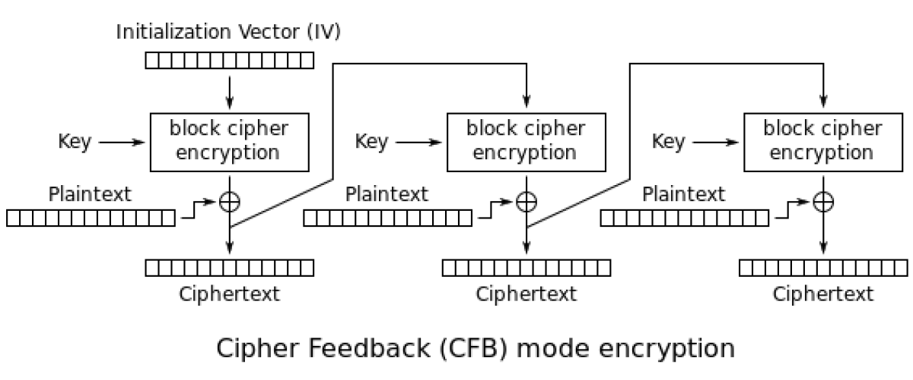

# chapter:08 例子学习

## 8.1 任务管理玩笑
通过修改系统返回的CPU核心数来显示多个CPU的招数。核心要点如下：

* win32 函数 `GetSystemInfo()` 返回系统信息，但是程序里未使用此函数
* 另一个不向外公开的函数，`NtQuerySystemInfomation()`函数用在`taskmgr.exe`里
* 在**IDA**里找到调用此函数的地方
* 同过查看代码`g_cProcessors`全局变量用来存放CPU个数
* 通过修改`NtQuerySystemInfomation()`返回值来修改`g_cProcessors`

### 8.1.1 使用LEA加载值

`LEA` 相对 `MOV`的优势如下：

* 指令长度短
* 原地址可以进行运算

## 8.2 相同颜色小球连线游戏
游戏下载地址为：[连线游戏](http://go.yurichev.com/17311)。

修改思路如下：

* 通过找到函数`_rand`调用的地方
* 反向推理游戏每次生成小球颜色的函数
* 将随机数返回值变为固定值 

## 8.3 扫雷(Windows XP)

修改思路如下：

* 找到 `_rand` 函数
* 找到调用`_rand`函数的地方
* 查找调用随机函数的索引
* 找到生成游戏地图的数组
* 通过 *OllyDbg* 得到地雷和数字的标识 

### 8.3.1 自动查询地图
通过以下思路来添加扫雷开图外挂：

* 进程管理器找到扫雷的进程 id
* 通过Windows api `OpenProcess`打开进程
* 通过Windows api `ReadProcessMemory` 打开指定进程，指定地址，指定长度的内存数据
* 然后将扫雷地图按照地雷标识和数字表示打印出来

但是每个版本的扫雷地图地址不一致，所以改良版就是遍历整个进程内存，通过地图特征码来找到对应地址。

## 8.4 Hacking Windows 表
让windows 钟表逆时针旋转：

* 首先英语好，要搜索`drawHand` `drawLine` 这些函数
* 通过对应函数的索引找到绘制时钟的指针
* 然后找到绘制时钟通过索引一张表
* 然后将表里的数值罗列出来，这时候体现出归一化的好处了

## 8.5 Dongles
核心思想如下：

* 通过提示字符串反向找到调用的地方
* 修改调用检测程序的指令

## 8.6 "QR9" 加密
主要展示了如何将汇编转换为正常代码。

以及加密文件的一种方式：

* 读取文件内容为字符串
* 获取字符串长度，然后对齐
* 申请需要加密字符串的长度内存
* 然后按照固定长度加密字符串
* 加密字符串有三种方式，通过字符串长度对3求余即可获取一种方式
* 最后将加密标记"QR9"放入文件头，然后是原始文件长度(int32)，最后将整个加密后的字符串写入文件

解密过程：
* 读取文件到内存
* 读取前三个字符串是否为“QR9”来验证是否为加密文件
* 读取文件长度为
* 读取加密后的内容
* 将加密后的内容通过解密函数解密
* 然后将解密后的字符串，按照读取到的文件实际长度写入到文件

## 8.7 加密数据库示例1

### 8.7.1 Base64 和 熵
此处要解密的文件是一个 xml，文件内容如下(部分)：

```XML
<?xml version = "1.0" encoding = "UTF-8"?>
<Orders>
	<Order>
		<OrderID>1</OrderID>
		<Data>yjmxhXUbhB/5MV45chPsXZWAJwIh1S0aD9lFn3XuJMSxJ3/E+UE3hsnH</Data>
	</Order>
	<Order>
		<OrderID>2</OrderID>
		<Data>0KGe/wnypFBjsy+U0C2P9fC5nDZP3XDZLMPCRaiBw9OjIk6Tu5U=</Data>
	</Order>
	<Order>
		<OrderID>3</OrderID>
		<Data>mqkXfdzvQKvEArdzh+zD9oETVGBFvcTBLs2ph1b5bYddExzp</Data>
	</Order>
	<Order>
		<OrderID>4</OrderID>
		<Data>FCx6JhIDqnESyT3HAepyE1BJ3cJd7wCk+APCRUeuNtZdpCvQ2MR/7kLXtfUHuA==</Data>
	</Order>
	<Order>
		<OrderID>5</OrderID>
		<Data>2bLecSRgE02JXV4W5wiCRCgRWZPkhadm9kL/00Lh9AgOa63sL9Y=</Data>
	</Order>
</xml>
```

首先通过字符串是有字符，数字，以及 `+ /`，还有末尾的`=`或 `==` 判断为base64编码。

然后通过使用工具**Wolfram Mathematica** 分析如下：

* 加载xml内容，并获取到所有Data值
* 将获取到字符串使用*Base64* 解析为二进制字符串
* 计算二进制字符串每个字符熵(entropy)
* 计算所有字符熵的方差(variance)
* 通过方差得到字符熵分布比较平均，分布在[5.0, 5.4]
* 通过熵的分布，得出数据应给是加密或压缩过的

### 8.7.2 数据是压缩的吗？
不是压缩数据的原因如下：

* 大多数压缩后的数据会有自己的头信息，以及签名
* 自己动手实现压缩算法难，容易出错，几乎适用库，或开源算法
* 通常自己实现算法加密比较常见，因为简单

### 8.7.3 数据是加密的吗？
通用数据加密算法按照块来加密数据。*DES*-8字节，*AES*-16字节。如果数据不是对齐的，会使用零补齐。

使用**Wolfram Mathematica** 分析得到块的长度并不固定，但全是偶数字节。那可能适用了单字节，或位为块来加密。

### 8.7.4 CryptoPP
整个程序使用.net 编写，由于混淆过了，但是引用了dll，在里面发现了字符串*CryptoPP*，*CryptoPP* 是非常出名的开源库。

分析如下：
* 通过*CryptoPP* 得到加密函数 `CryptoPP::Rijindael::Enc::AdvancedProcessBlocks`
* 将要解密的字符串准备好，后续调用函数结果后来对比
* 搞清楚具体处理字符串的函数`CryptoPP::Rijindael::Enc::ProcessAndXorBlock` 参数
* 调用*tracer* 来查看函数调用后的参数(解密后的字符串)
* 对比解密前后解密后的字符串，得出结论，有一些字节相同，这不符合*AES* 加密的结果，反而像解密结果

### 8.7.5 Cipher Feedback mode
Cipher Feedback(CFP)就是答案，在这种模式下，*AES* 算法不是作为加密算法，而是用来生成秘钥。真正的加密使用`XOR`操作。

加密算法如下：



解密算法如下：


通过算法得知：*AES* 加密操作生成16字节(128bit)随机数据用来`XOR`操作。16字节也不需要全部使用，需要加密的字符串长度为多少就加密多少，这也是**CFB**的特性，长度为多少都可以加密解密，不需要对齐。

解密流程如下：

* 首先需要找到*IV(Initialization vector)*，这里的**IV**是函数 `CryptoPP::Rijindael::Enc::ProcessAndXorBlock` 首次调用后得到，这里的**IV**是加密过的
* 通过函数`Rijndael::Base::UncheckedSetKey` 找到秘钥
* 通过密文，秘钥，以及加密后的**IV** 解密出明文

解析后的明文，前十六个字节看上去不对。

### 8.7.6 Initailizing Vector
通过算法得知前十六个字节被**IV**影响，后续的字节加密解密都是依赖前序的密文。

通过*tracer*得出如下结论：

* 每个加密字符串首次解密时，第一个和第五个字节不一样
* 通过仔细观察发现前四字节为*OrderID*，第二个四字节为*OrderID*的负数，其他八个字节不变

为啥加密算法的程序员选择*CFB*：

* 可能是 *CryptoPP* wiki 上首个例子使用 *CFB* 模式
* 也可能是不需要对齐，任意长度字符串加解密更加简单
* *IV* 每次变可能是*CryptoPP* 例子如此，此加密算法的作者可能并不理解*IV*只影响前十六字节

### 8.7.7 缓存的结构
前三个解密后的字符串如下：

```
00000000: 0D 00 FF FE 46 00 52 00  41 00 4E 00 4B 00 49 00  ....F.R.A.N.K.I.
00000010: 45 00 20 00 4A 00 4F 00  48 00 4E 00 53 00 66 66  E. .J.O.H.N.S.ff
00000020: 66 66 66 9E 61 40 D4 07  06 01                    fff.a@....

00000000: 0B 00 FF FE 4C 00 4F 00  52 00 49 00 20 00 42 00  ....L.O.R.I. .B.
00000010: 41 00 52 00 52 00 4F 00  4E 00 CD CC CC CC CC CC  A.R.R.O.N.......
00000020: 1B 40 D4 07 06 01                                 .@....

00000000: 0A 00 FF FE 47 00 41 00  52 00 59 00 20 00 42 00  ....G.A.R.Y. .B.
00000010: 49 00 47 00 47 00 53 00  00 00 00 00 00 C0 65 40  I.G.G.S.......e@
00000020: D4 07 06 01                                       ....

00000000: 0F 00 FF FE 4D 00 45 00  4C 00 49 00 4E 00 44 00  ....M.E.L.I.N.D.
00000010: 41 00 20 00 44 00 4F 00  48 00 45 00 52 00 54 00  A. .D.O.H.E.R.T.
00000020: 59 00 48 E1 7A 14 AE FF  68 40 D4 07 06 02        Y.H.z...h@....
```

通过观察，这是 UTF-16字符串，*FF FE* 为 Unicode的 *BOM*。第一个字(16-bit)为字符串长度。名字后面还有12个字符。

通过程序筛选出前12个字节如下：

```
dennis@...:$ python decrypt.py encrypted.xml | shuf | head -20
00000000: 48 E1 7A 14 AE 5F 62 40  DD 07 05 08              H.z.._b@....
00000000: 00 00 00 00 00 40 5A 40  DC 07 08 18              .....@Z@....
00000000: 00 00 00 00 00 80 56 40  D7 07 0B 04              ......V@....
00000000: 00 00 00 00 00 60 61 40  D7 07 0C 1C              ......a@....
00000000: 00 00 00 00 00 20 63 40  D9 07 05 18              ..... c@....
00000000: 3D 0A D7 A3 70 FD 34 40  D7 07 07 11              =...p.4@....
00000000: 00 00 00 00 00 A0 63 40  D5 07 05 19              ......c@....
00000000: CD CC CC CC CC 3C 5C 40  D7 07 08 11              .......@....
00000000: 66 66 66 66 66 FE 62 40  D4 07 06 05              fffff.b@....
00000000: 1F 85 EB 51 B8 FE 40 40  D6 07 09 1E              ...Q..@@....
00000000: 00 00 00 00 00 40 5F 40  DC 07 02 18              .....@_@....
00000000: 48 E1 7A 14 AE 9F 67 40  D8 07 05 12              H.z...g@....
00000000: CD CC CC CC CC 3C 5E 40  DC 07 01 07              ......^@....
00000000: 00 00 00 00 00 00 67 40  D4 07 0B 0E              ......g@....
00000000: 00 00 00 00 00 40 51 40  DC 07 04 0B              .....@Q@....
00000000: 00 00 00 00 00 40 56 40  D7 07 07 0A              .....@V@....
00000000: 8F C2 F5 28 5C 7F 55 40  DB 07 01 16              ...(..U@....
00000000: 00 00 00 00 00 00 32 40  DB 07 06 09              ......2@....
00000000: 66 66 66 66 66 7E 66 40  D9 07 0A 06              fffff~f@....
00000000: 48 E1 7A 14 AE DF 68 40  D5 07 07 16              H.z...h@....
```

通过上面的字节文本，观察结果如下：

* 这些字节都包含 `0x40` 和 `0x07`
* 最后一个字节范围为 `[0x1, 0x1F]` ，十进制`[1,31]`
* 倒数第二个字节范围为 `[0x1,0xC]`，十进制`[1, 12]`
* 很像日期，将后4字节当做日期，解析出来后合情合理
* 前面还有八字节，如果这是订单的话，很可能是双进度计数，解析结果确实为某种计数

最终整个字符串解析完成。

### 8.7.8 字符串结尾的噪音
在解密后的字符串有几字节的无用字节，通过观察上下解密字符串，发现是上一个字符串留下的尾巴。这可能是使用内存前未初始化内存值遗留的噪音。

### 8.7.9 结论
总结：每个熟练的逆向工程师需要熟悉主流加密算法和解密模式。

## 8.8 超频矿机
通过提示的字符串找到对应判断的代码，将判断代码改为不判断来实现超频锁定。

## 8.9 解密简单加密后的可执行文件
本节介绍了一种解密文件的思路。

### 8.9.1 如何加密的
文件被二次加密，首次加密将每个字节加了一个值，对用Python代码描述如下：

```Python
#!/usr/bin/evn python
def e(i, k):
	return chr((ord(i) + k) % 256)
```
再将文件按照16字节使用 *Propagating Cipher Block Chaining-PCBC* 加密算法：


### 8.9.2 如何解密
因为二进制文件中最常出现的字节统计意义上基本保持不变，作者利用这种特性，解密16自己的*Initialization Vector -IV*，最常用字节表如下：

| 指令  | 字节码 | 统计百分比 | 原因                                                                               |
| :---: | :----: | :--------: | :--------------------------------------------------------------------------------- |
|       |  0x00  |    10%     | 当操作数大于127的时候，使用32位整数，但大多数整数很少超过0x10000，因此高位有很多零 |
|  mov  |  0x8B  |     %5     | 最常用的指令                                                                       |
|       |  0xFF  |     %5     | 负数使用FF，以及跳转指令的向前跳转                                                 |

*PCBC*解密算法如下：


理论知识准备好后，解密流程如下：

* 读取文件内容
* 将文件内容拆分成每段长度为16字节的段 
* 将每个段的每个字节组成字符串
* 将1-16字节位的每个字节使用[1-256]的字节解密
* 解密后的结果和 `0x00,0x8B,0xFF` 对比，排名最高的则为正确的*IV*字节

### 8.9.3
如果解密失败，可能需要加入更多的字节统计。

## 8.10 SAP
### 8.10.1 SAP 客户端网络通信压缩
此次分析的是称作*SAPGUI*的客户端 和 *SAP*的服务器之间的通信。两者通信消息没有加密，但是使用了压缩，通过修改环境变量`TDW_NOCOMPRESS` 来关闭网络包压缩，但是会弹出提示框。本节的目标就是去除弹出提示框。

当前已知的信息为：

1. 环境变量`TDW_NOCOMPRESS` 在 *SAPGUI* 中已经打开
2. 字符串 `"data compression switched off"` 被包含在程序中

使用 **FAR file manager** 这两个字符串在 `SAPguilib.dll` 文件中。

首先找到`TDW_NOCOMPRESS`的代码引用处，函数运行说明如下：
1. 此字符串传递到函数 `chk_env` 中，被函数修改后作为参数返回
2. 返回的字符串被`atoi()`函数转换为整数，存储在 `edi+15h`地址

对于 `chk_evn()`函数，解析如下：

1. `chk_env()` 函数调用 `getevn_s()` 获取到`TDW_NOCOMPRESS`的值

然后查找到字符串 `"data compression switched off"` 在函数`CDwsGui::PrepareInfoWindow()`里。说明如下：

1. 类名和函数名是通过代码里的日志函数引用的字符串得知
2. 代码 `cmp tye ptr [esi+3Dh], 0` 判断是否要加入字符串`"data compression switched off"`
3. 代码 `mov eax, [esi+20h] test eax, eax` 来判断是否要加入字符串 `"data record mode switched on\n"`
4. 最终发现`cmp [ebp + var_10], ebx` 来判断是否弹出窗口，这里可以取消弹出窗口

现在探索在`CDwsGui::PrepareInfoWindows` 中的变量`[this+3Dh]`  和 在 `load_command_line()` 中赋值到地址 `[edi+0x15h]`中的值是否是一个值。

首先搜索 `0x15`:

1. 找到在函数`CDwsGui::CopyOptions` 中引用：`mov al, [edi+15h] mov [esi+15h], al`，函数名字通过函数里用来打印日志的字符串得到
2. 然后发现`CDwsGui::CopyOptions` 在函数`CDwsGui::Init()`中调用：`lea eax, [esi+28h] push eax call CDwsGui__CopyOptions`
3. 得到结论`0x15 + 0x28 = 0x3d`

再来搜索 `0x3d`:

1. 在函数`Gui::SapguiRun` 函数中找到，用来设置`TDW_NOCOMPRESS` 变量
2. 通过将`setz al`替换为`xor eax, eax / nop` 指令，验证了这里设置`TDW_NOCOMPRESS`环境变量
3. 然后发现此变量传递到了函数`CConnectionContext::CreateNetwork`，在此函数中参数传递到了`CNetwork::CNetwork`构造函数
4. 在构造函数里得知`CNetwork`对象将压缩标志存储在`this + 0x3A4`位置

然后挖掘*SAPguilib.dll* 中的 `0x3A4`：

1. 在`CDwsGui::OnClientMessageWrite` 中发现`0x3A4`
2. 这里找到了客户端压缩数据的函数

```asm
cmp dword ptr [ecx+3A4h], 1
jnz comression_flag_is_zero
```

### 8.10.2 SAP 6.0 密码检查函数
用户登录客户端提示：*“Password logon no longer possible-too many failed attempts”*。绕过流程如下：

1. 程序提供了PDB文件
2. 使用[工具](http://www.debuginfo.com/tools/typeinfodump.html)将PDB文件转换为可读取和可筛选文件
3. 通过查找关键字为`password`的函数，以及`password`为关键字的字符串，找出函数为`chckpass()`
4. 使用*tracer*工具找出函数调用堆栈，并得到函数返回值为`0x35`
5. 使用*tracer*工具将函数返回值修改为`0x0`，绕过密码检查

## 8.11 Oracle RDBMS

### 8.11.1 在Oracle RDBMS 里的 V$VERSION表
作者首先抛出一个问题，执行以下sql 语句，程序从哪里获取到执行结果：

```sql
SQL> select * from V$VERSION
BANNER
--------------------------------------------------------
Oracle Database 11g Enterprise Edition Release 11.2.0.1.0 - Production
PL/SQL Release 11.2.0.1.0 - Production
CORE 11.2.0.1.0 Production
TNS for 32-bit Windows: Version 11.2.0.1.0 - Production
NLSRTL Version 11.2.0.1.0 - Production
```
字符串`V$VERSION` windwos 版本很容易从 *oracle.exe* 文件里找到。Linux版本在*kqf.o*文件中找到，此object文件包含在Oracle库文件 *libserver11.a* 中。在这里还发现了引用此字符串的*kqfview*表。

有可能表*kqfview* 包含了大多数(甚至所有)以`V$`开头的视图(views)，这些都是*固定视图(fixed views)*，一直存在的视图。从汇编代码里统计得知，每个表元素有12个32位字段。Oracle有1023个表元素，也就是说，可能有1023个固定视图。

同时我们知道所有的固定视图可以从 `V$FiXED_VIEW_DEFINITION` 中获取(此信息从kqfview 和 kqfview 表中获知)。从词表中查询`V$VERSION`信息：

```sql
SQL> select * from V$FIXED_VIEW_DEFINITION  where view_name=`V$VERSION`;

VIEW_NAME
-----------------------------------
VIEW_DEFINITION
-----------------------------------

V$VERSION
select BANNER from GV$VERSION where inst_id = USERENV(`Instance`)
```

所以`V$VERSION`是其他是视图的混淆视图，名字叫`GV$VERSION`，查询结果如下：

```sql
SQL> select * from V$FIXED_VIEW_DEFINITION  where view_name=`GV$VERSION`;

VIEW_NAME
-----------------------------------
VIEW_DEFINITION
-----------------------------------

GV$VERSION
select inst_id,banner from  x$version
```

以`X$`开头的Oracle RDBMS表是服务表，是不公开的表，用户修改不了，系统自己刷新。

如果查询字符串`select BANNER from GV\$VERSION where inst\_id = USEREVN(`Instance`)`，在*kqf.o* 文件里的表*kqfvip* 表里发现。

## 8.12 手写汇编代码
一个.COM 文件用来测试病毒软件。在MS-DOS上运行，并打印出字符串`"EICAR-STANDARD-ANTIVIRUS-TEST-FILE!"`。

这个文件重要特性就是包含所有可打印的ASCII字符，此文件内容为：

```
X50!P%@AP[4\PXX54(P^)7CC)7}$EICAR-STANDARD-ANTIVIRUS-TEST-FILE!$H+H*
```

反编译为汇编代码，核心如下：

```asm
B4 09		MOV AH, 9
BA 1C 01	MOV DX, 11Ch
CD 21		INT 21h
CD 20		INT 20h
```

## 8.13 分形(Demos)
主要涉及到数学部分，暂时略过