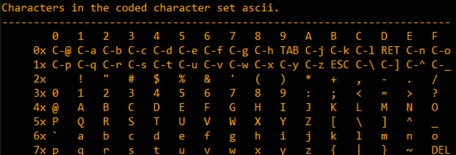

# Chapter09:逆向常见文件格式

## 9.1 初级 XOR 加密
通过和数字3异或来加密字符，换句话说就是将字符的最低两位翻转。使用Python 实现如下：

```Python
#!/usr/bin/python
msg = "Hello, world!"
print "".join(map(lambda x: char(ord(x)^ 3), msg))
```
这是非常有趣的加密方式（或混淆方式），因为有如下两个重要特性：

1. 一个函数实现加密和解密
2. 加密后的字符仍然可打印，因此所有的字符可以用在源代码里而不必使用转义字符

特性2的理论依据是可打印的字符都在范围[0x2x-0x7x] 范围内，所以翻转了最低的两位，还是在这个范围。



### 9.1.2 Norton Guide: 最简单的1字节XOR加密
Norton Guide's 数据库使用.ng当做文件后缀，文件内容不可读。

如何判断是加密的而不是压缩的？在文件里大量出现`0x1A`字节，这不应给出现在压缩文件里。

使用`0x1A`执行异或操作后得到了正确结果，如果不是`0x1A`，可以尝试 0..255范围内的字符，也不是很大的运算量。

#### 熵
通过使用工具`Wolfram Mathematica`计算加密和解密后的文件得到熵一致，并且使用工具提供的日常英语字符串的熵也非常接近。

但是这只适用于单字节的异或加密。

需要注意的是`Wolfram Mathematica` 使用底数`e` 计算熵，`Unix ent utility`使用底数`2`计算熵。

### 9.1.3 最简单的4字节异或加密
如果使用更长XOR加密模式，例如4字节模式，通常也容易识别。主要原因是文件中总会包含大量的零，所以四字节模式很容易发现。

### 9.1.4 使用XOR遮罩(XOR MASK)加密
一个游戏加密文件，目测熵不高，有重复数据，所以大概推测不是压缩文件，也不像主流加密算法。分析解密如下：

* 发现文件中`0x51`出现频次很高，根据文件内存尺寸`1658961`可以被`0x51(81)`整除，得出文件可能按`81`为块加密
* 作者使用*Mathematica* 分析是否有重复内容并且内容长度为81字节的块
* 统计后重复内容块出现的次数为：1739，1422，1012，377。。。，出现一次的都排在后面
* 然后比较排名第一和第二的块，发现只有第二个字节不同(使用`XOR`指令比较)
* 比较第一和第三的块，也是第二个字节不同
* 使用第一的块解密前四个出现一次的块，发现前四个中的第一个和第三个不可打印，第二个和第四个大部分是可识别的英文词汇
* 将整个文件使用第一个块解析，发现两个问题，首先是单词大小写不对(首字母大写，其他字母小写)，然后是单词不对，比如**"eHE"** ，正确的应给是 **"tHE"**
* 当前分析解密的key，和被解析块的第二个字节发现：`2 xor 103 = 101`，101是ASCII码"e"，字符"T"的ASCII码为`116`所以反向得到key的第二字节为`2 xor 116 = 118`
* 将key的第二字节替换为`118`后，再次解密文件，所有首字母变正常了
* 对于字符大小写不对的问题，通过观察ASCII表，以及前序章节学习内容得知大小写字符的差异为：第六位，所以对字符进行异或操作即可转换大小写：`char xor 32`

### 9.1.5 简单加密使用XOR遮罩加密二
另一个加密文件，使用Linux工具`ent`得到每字节的熵为`~7.5bit`，这比普通的文本`4.7`高很多，非常像压缩文件或正式加密文件。但仍然看到一些范式，这里有一些块长度为17字节，并且能看到一些阶梯，在每个16字节线移动1字节。并且知道解密后的文本是英语文本。

现在假设此文本使用17字节的秘钥通过`XOR`来加密。

尝试如下：

* 以17字节为块，统计相同内容的块，结果是没有相同的
* 使用暴力破解，不可行因为`17^256`太大了
* 如果挨个尝试17字节的每个字节

算法如下：

* 使用256字节来尝试秘钥的首个字节
* 解密所有以17字节为块的首个字符
* 所有解密的字节是可打印的吗？使用表格统计
* 对所有的17字节进行此操作

使用代码如下：

```Python
each_Nth_byte = [""] * KEY_LEN

content = read_file(sys.args[1])

# split input by 17-byte chunks:
all_chunks=chunks(content, KEY_LEN)
for c in all_chunks:
    for i in range(KEY_LEN):
        each_Nth_byte[i]=each_Nth_byte[i] + c[i]

# try each byte of key
for N in range(KEY_LEN):
    print "N=", N
    possible_keys = []
    for i in range(256):
        tmp_key=chr(i)*len(each_Nth_byte[N])
        tmp=xor_strings(tmp_key,each_Nth_byte[N])
        # are all characters in tmp[] are printable?
        if is_string_printable(tmp)==False:
            continue
        possible_keys.append(i)
    print possible_keys, "len=", len(possible_keys)
```

通过代码每个字节有二个或三个字节，这里大概有一百种组合。

还有一个信息，此文本是英语文本。英语文本有两个特性：

* 自然语言
* 英语文本

对于自然语言，作者统计了*莎士比亚*的文章，统计空格大概是`~4.3`个字符使用一个空格。然后修改程序，统计平均空格数，得到了唯一的秘钥字节，解密成功。

#### 需要考虑的问题

如果统计空格失败，还有以下值的试的点子：

* 小写字母的使用频率高于大写字母
* 字符使用频率统计
* 另一个技术是统计语言里常用单词，比如英语最常用的”the“和”tha“。其他语言也有自己的特性

## 9.2 信息熵
为简单化，信息熵是一种方法，来衡量一片数据信息压缩的紧密度。例如，通常不可能压缩已经压缩过的文件，因此这样的文件有更高的熵。换句话说，1MiB的零字节可以被压缩为很小的输出文件。事实上，使用日常英语，一百万的零字节可以被描述为“文件内容是一百万零字节”。压缩文件通常是一系列的解压指令，比如：“放1000个零，然后0x23字节，然后0x45字节，然后将10字节大小的块放置到500字节，以及其他。”

自然语言写的文本也可以被压缩的更加紧密，因为自然语言有许多的冗余(除此以外，一个微小的错字总是导致误解，就如压缩文件中有倒置了的位将会导致解压缩失败)，一些文字非常常用。在每天的说话里，有可能去掉一半的字，仍然可以识别。

CPU的代码也可以压缩，因为一些ISA(Instruction Set Architecture)指令比其他指令使用的频次高。在x86平台，最多使用的指令是`MOV/PUSH/CALL`。

数据压缩器和加密趋向于产生非常高熵的结果。好的PRNG(伪随机发生器)也产生不可压缩的数据(通常可以通过标记来衡量它们的质量)。

因此，换句话说，熵是一种方式可以帮助衡量未知数据块内容的紧密度。

### 9.2.1 在Mathematica 里分析熵
本节讨论了使用Mathematica 分析数据文件的熵，因为文件可能很大，所以需要将文件划分成块。熵值为纵坐标，文件块索引为横坐标。通过熵的变化，得知不同文件内容区域大致内容类型。

通常有一些经验值可以参考，汇编代码熵值大概是6左右，英语文本大概是 4.5左右，加密或压缩内容大概是 8 左右。熵值可以通过组成信息的单元个数来计算，比如英语文本有26个字母组成，所以熵为:`log26`，底值为2。

计算熵的工具有Linux下的*ent*，还有在线熵值工具[binvis](http://binvis.io)。

## 9.3 游戏存档
通过游戏不同时间的存档对比，得出游戏存储资源的数值位置，然后就可以任意修改了。

## 9.4 fortune 程序索引文件
fortune运行一次打印一句话。程序运行的原理是先随机一个索引值，然后到对应的数据文件中读取一段字符串，字符串以百分号结尾，最后打印出来。

程序由三个文件组成：运行程序fortune，索引文件 fortune.dat， 以及文本文件 fortune.text

整个文件分析流程如下：

* 通过十六进制打开索引，每行16字节，观察字节内容规律
* 使用*Mathematica* 将文件内容转换为4字节长度的无符号整数
* 发现整数都非常大，低位为0，怀疑是大端
* 使用大端编码打开文件，数字变的正常了
* 随机选择中间一个数`3066`，到文本文件定位到对应位置，验证了是一句话的起始位置
* 使用*Mathematica*得到数值之间的差值，发现从第六个值以后开始递升，最后一个值不清楚干啥的
* 通过统计百分号得知有`432`个句子
* 可以看到索引文件的第二个元素为`431`

前六个元素，第二个元素为最后一个句子的索引，作者又打印出其他几个索引文件的值，发现只有第二个元素不同，其他几个元素猜测如下：

* 文件标识
* 文件版本
* checksum
* 其他标识
* 语言标识
* 时间戳，当用户修改文本文件，程序重新生成索引文件，但一般都使用32位无符号整形来存储时间

最后程序**fortune** 的工作流程如下：

* 从第二个元素得到最后一句话的索引值
* 在零到最后索引值区间随机一个索引值
* 通过随机到的索引值，索引到对应的文本文件偏移值
* 使用偏移值读取文本文件内容，直到百分号停止，输出文本

## 9.5 Oracle RDBMS: .SYM-files
Oracle 数据库运行异常时会将堆栈写入日志，日志文件里有函数名信息。本节分析对应的文件*orawtc8.sym*。

通过对比多个 **.sym** 文件得到如下结论：

* **OSYM**总在文件头和文件尾出现
* 文件内容格式为：OSYM + 二进制数据 + 使用零分割的字符串 + OSYM

查看字符串个数为66(0x42)，在OSYM标记后面：

```asm
$ hexdump -C orawtc8.sym
00000000 4f 53 59 4d 42 00 00 00 00 10 00 10 80 10 00 10 |OSYMB...........|
00000010 f0 10 00 10 50 11 00 10 60 11 00 10 c0 11 00 10 |....P...`.......|
00000020 d0 11 00 10 70 13 00 10 40 15 00 10 50 15 00 10 |....p...@...P...|
00000030 60 15 00 10 80 15 00 10 a0 15 00 10 a6 15 00 10 |`...............|
```

作者分析了0x42是32位整数，首先是根据经验推测，依据是Oracle是个大型项目，然后通过查看 *oracle.sym* 的字符串个数为 0x3A38E(238478)，大于16-bit最大值。

分析二进制部分，使用Hiew打开后，很快发现16进制32位整形模式：

* 从0到0x104的位置，整数格式都为 `0x1000xxxx`
* 从0x108开始，整数格式为 `0x0000xxxx`

然后将内存里的16进制数转换为16进制32位整数格式，这里总共有 `132`个值，`132=66*2`。也许每个符号使用两个32位整数，或者是两列数组？

`0x1000`也许是地址，毕竟 *.sym* 供 *dll* 文件使用，并且win32 DLLs 默认的基础地址是 `0x10000000`，代码总是从`0x10001000`开始。

当使用 IDA 打开 *orawtc8.dll* 文件后，基础地址不一样，但真实地址是一致的，并且在函数里也找到了对应的字符串。验证第二个函数名和地址也对的上。

剩下的66个值的范围是 0-0x3F8，值是递增的。这里依据经验猜测是索引字符串地址。很快验证了，数字就是到真实字符串的偏移量。

后续作者添加了C程序读取 *.sym* 文件，生成 IDA用的替换函数名字的脚本。

## 9.6 Oracle RDBMS: .MSB-files
二进制文件包含错误消息和相关数字。有一些开源的 *.msg* 文件，因此通过这些文件来验证自己解析是否正确。以下是文件 *ORAUS.MSG* 部分内容：

```asm
00000, 00000, "normal, successful completion"
00001, 00000, "unique constraint (%s.%s) violated"
00017, 00000, "session requested to set trace event"
00018, 00000, "maximum number of sessions exceeded"
00019, 00000, "maximum number of session licenses exceeded"
00020, 00000, "session attached to some other process; cannot switch session"
```

首个数字是错误码，第二个是一些标志量。

打开文件 *ORAUS.MSB* 后观察得到以下信息：

* 字符串和二进制变量混合在一起
* 二进制之间被0x200(512)字节分割成块

查看第一个块内容：

* 错误日志字符串之间没有使用零字符隔开，意味着不是使用`null`结尾的C字符串，那必然要记录字符串长度
* 在文件内容里找到错误编号：0，1，17(0x11)，18(0x12)，19(0x13) 。。。，发现错误编号向距 6 字节，这推断出每条消息使用6字节来描述
* 前16位的值(0xA or 10)代表每个块的消息数量，通过查看其它块来验证。因为消息有长短，但块结构固定，所以消息数量是不确定的
* 因为消息不是`null`结尾字符串，因此长度肯定编码在某个地方，首个字符串 *"normal, successful completion"* 为29(0x1D)字节。第二个字符串长度为34(0x22)字节，但在块里找不到
* **RDBMS** 需要将字符串加载到内存必须知道地址，第一个字符串开始位置在0x1444(从文件开头算起)，从块开头算起位置在(0x44)

通过分析得知6字节内容如下：

* 16-bit 错误码
* 16-bit 零 (也许是额外标记)
* 16-bit 当前块字符串起始位置

最后的还有一个虚拟的(dummy)6字节块，错误码为0，以及起始位置超过了最后一个字符串的最后一个字符。这就是获取字符串的长度：

* 读取第`n`个字符信息，获取起始位置
* 继续读取`n+1`个字符串信息，获取起始位置，两个位置的偏移量为第一个字符串长度
