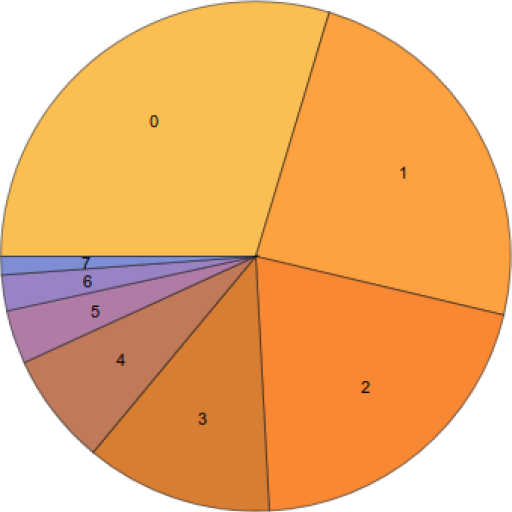

# Chapter11：其他事情

## 11.1 可执行文件打补丁

### 11.1.1 文本字符串
如果C字符串使用十六进制编辑器打开后没有加密，则可以按照长度替换内容。

### 11.1.2 x86 代码
常见补丁任务如下：

* 最常见的工作是禁用一些指令。通常使用字节 `0x90(NOP)` 指令填充
* 条件跳转，有两个操作码比如 `74 xx(JZ)`，可以使用两个 `NOP`代替。也可以将第二个字节替换为0，导致跳转偏移量为0，则继续执行
* 另一常见工作是让条件跳转总是触发，这可以通过`0xEB(JMP)`来代替条件跳转字节
* 通过在函数的开头写入`OxC3(RETN)` 指令到禁用函数执行。这对所有函数生效，包括*stdcall*。但对于 *stdcall* 的函数必须探明参数个数，使用`0xC2(RETN)`以及16位参数
* 有时候，禁用函数后需要返回 0 或 1。这可以通过 `MOV EAX, 0` 或 `MOV EAX, 1`，但有点冗余。更好的方式使用 `XOR EAX, EAX(两字节 0x31 0xCO)` 或 `XOR EAX, EAX / INC EAX(三字节 0x31 0xC 0x40)`

软件可能有防止修改的保护，通常通过读取可执行文件代码然后计算校验和(checksum)。因此代码必须在保护触发之前读。

## 11.2 函数参数数量统计
统计Windows 7 32-bit DLLS 得出函数参数数量：

* 无参数: &#x2248; 29%
* 一参数: &#x2248; 23%
* 二参数: &#x2248; 20%
* 三参数: &#x2248; 11%
* 四参数: &#x2248; 7%
* 五参数: &#x2248; 3%
* 六参数: &#x2248; 2%
* 七参数: &#x2248; 1%

## 11.3 编译器固有函数
编译器自己特有的函数而不不在函数库里。编译器生成特定的机器码而不是调用它。通常是特定CPU指令的伪函数。

例如在C/C++语言里没有环装移动操作(cyclic shift)，但是大多数CPU支持。为了程序员方便，至少 MSVC 有伪函数 `_rotl()` 和 `_rotr()` 直接被编译器转换为 `ROL/ROR` x86指令。

另一个例子是生成 *SSE* 指令。

## 11.4 编译器异常

编译器生成的指令不符合常理，但不影响正常结果，可能是编译器bug导致。

## 11.5 Itanium
本节介绍了Intel Itanium(IA64)架构将指令打包成bundle，然后并行运行的一些规则。

## 11.6 8086 内存模型
本节介绍了8086内存寻址往事。

## 11.7 基础块重排
本节介绍了程序员通过测试统计出函数调用次数，排序找出高频和低频调用的函数，然后将这些信息告知编译器，编译器重排这些函数的位置，因为高频次的函数调用离的近缓存脱靶的概率低，提高效率。

## 11.8 使用 Hex-Rays  2.2.0
作者介绍了使用 Hex-Rays 常见问题。